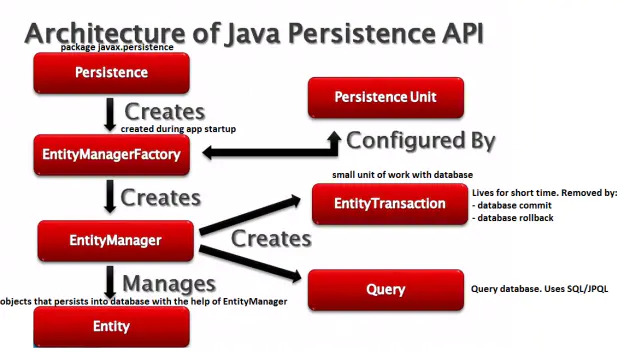

# Spring Data

Spring Data是Spring官方提供的数据库连接框架，其中支持JavaEE标准

其最大的作用是用于简化数据库访问，支持NoSQL和关系数据库存储，其主要目标是将数据库访问变得更加方便快捷

Spring Data项目所支持的NoSQL存储主要有

- MongoDB 文档数据库
- Neo4j 图形数据库
- Redis 键值存储
- Hbase 列族数据库

Spring Data项目所支持的关系数据存储技术

- JDBC
- JPA

## 主要特点

Spring Data的目标是为了对数据访问层的接口统一，即可以通过使用统一的API来实现对数据库访问层的操作，这主要是Spring Commons项目（组件）中实现的

Spring Data Commons在使用关系型或者非关系型数据访问技术时都能基于Spring提供的统一标准，标准包含了CRUD（创建、获取、更新、删除）、查询、排序和分页等相关的操作

### 持久层接口

其中主要依靠的是统一的Repository接口

- `Repository<T, ID extends Serializable, N extends Number & Comparable<N>>` 持久层的统一接口
- `RevisionRepository<T, ID extends Serializable, N extends Number & Comparable<N>>` 基于乐观锁机制
- `CrudRepository<T, ID extends Serializable>` 基本的CRUD操作
- `PagingAndSortRepository<T, ID extends Serializable>` 基本CRUD及分页

### 数据访问模板类

Spring Data中提供了各类数据库访问的模板类，如MongoTemplate、RedisTemplate等

## Spring Data JPA

Spring Data JPA是Spring Data家族的一部分，可以轻松实现基于JPA的存储库。 此模块处理对基于JPA的数据访问层的增强支持。 它使构建使用数据访问技术的Spring驱动应用程序变得更加容易

在相当长的一段时间内，实现应用程序的数据访问层一直很麻烦。 必须编写太多样板代码来执行简单查询以及执行分页和审计。 Spring Data JPA旨在通过减少实际需要的工作量来显著改善数据访问层的实现。 作为开发人员，您编写repository接口，包括自定义查找器方法，Spring将自动提供实现

> 官方文档
>
> [Spring Data JPA](https://spring.io/projects/spring-data-jpa#overview)

### JPA

JPA，Java Persistence API，Java持久化API，本是Sun公司在JDK5.0后提出的Java持久化规范

JPA的出现主要是为简化持久层开发以及整合ORM技术[^1]，结束Hibernate、TopLink、JDO等ORM框架各自为营的局面。JPA实在吸收现有ORM框架的基础上发展来的，易于使用，伸缩性强。其主要包含以下的技术

- ORM映射元数据

  支持XML和注解两种元数据的形式，元数据描述对象和表之间的映射关系

- API

  操作实体对象来执行CRUD操作

- 查询语言

  通过面向对象而非面向数据库的查询语言（JPQL）查询数据，避免程序的SQL语句紧密耦合



> 作者：fulgens
> 链接：https://www.jianshu.com/p/c23c82a8fcfc
> 来源：简书
> 著作权归作者所有。商业转载请联系作者获得授权，非商业转载请注明出处。

#### 使用过程

因为Spring Data JPA是典型的使用了ORM思想的持久层框架，因此其也基本上使用时也与其他ORM框架类似，其底层默认使用的就是Hibernate来实现

1. 编写一个实体类（bean）和数据表进行映射，并且配置好关系

   ```java
   /**
    * 创建一个实体类，其中使用了Java原生的注解@Entity来进行标注
    */
   // 标注此类是与数据表进行交互的类
   @Entity
   @Table(name = "user")
   public class User {
   
       @Id
       // 指定自增主键
       @GeneratedValue(strategy = GenerationType.IDENTITY)
       private long id;
   
       // 使用此注解来标注该属性将会于数据表中的列对应
       // 其中可以使用name属性来指定该字段名
       // 如果省略，就会使用属性名来作为字段名
       @Column(name = "user_name")
       private String userName;
   
       @Column
       private String password;
   }
   ```

2. 编写持久层的接口，用于操作该表，在Spring Data JPA中被称为Repository

   根据之前的简介，如果需要对应的功能，只需要寻找所需的Repository接口来进行实现即可

   ```yml
   spring:
    datasource:
      jpa:
        hibernate:
   #      更新或者创建数据表结构
         ddl-auto: update
   #      将会在控制台显示sql语句
        show-sql: true
   ```

## 缓存

缓存的使用能够<u>加速对系统的访问，提高系统的性能</u>。缓存中通常是存放某些需要<u>经常访问</u>，但又<u>不会经常改变的数据</u>，能够减少对序列化数据的存储（如数据库、文件等）的访问，从而加快系统的访问速度

为了统一缓存的使用规范，JavaEE发布了Java的缓存规范，即JSR-107

### JSR-107

JavaEE的cache规范中，主要定义了5个核心的接口，分别是CachingProvider、CacheManager、Cache、Entry和Expiry

- CachingProvider

  缓存供应者，定义了创建、配置、获取、管理和控制**多个**CacheManager

  一个应用中可以在运行期间访问多个CachingProvider

- CacheManger

  缓存管理器，定义了创建、配置、获取、管理和控制**多个**唯一命名的Cache，这些Cache存在于CacheManager的上下文中

  一个CacheManger仅被一个CachingProvider所拥有

- Cache

  缓存，这是一个类似Map的数据结构并临时存储以Key为索引的值

  一个Cache仅被一个CacheManger所拥有

- Entry

  用于存储Cache中的key-value对，即Cache中的**存储单位**

- Expiry

  用于定义Cache中存储的Entry的有效期

  如果超出时间，条目就会被设定为**过期状态**。一旦过期，条目将被设定为不可访问、更新和删除

  缓存的有有效期也可以使用ExpiryPolicy设置


### Spring的缓存接口

Spring官方从3.1开始，也定义了自身的缓存抽象`org.springframework.cache.Cache`和`org.springframework.cache.CacheManager`用于统一不同的缓存技术，而且也同样<u>支持JavaEE中的JCache，即JSR-107标准的相关注解</u>来简化开发

- Cache接口为缓存的组件规范定义，包含缓存的各种操作集合
- Cache接口下Spring提供了各种针对不同缓存产品的实现，如RedisCache、EhCacheCache、ConcurrentMapCache等

每次调用需要缓存的功能方法时，Spring会检查指定参数的指定目标是否已经被调用过。如果有，就会直接从缓存中获取方法调用后的结果；如果没有，就会调用方法，将结果返回给用户，并将结果存入缓存，方便下次的获取

使用Spring缓存接口时，需要注意以下两点

1. 确定方法结果需要存入缓存，并确定其存入缓存的策略
2. 从缓存中读取之前缓存中存储的数据


#### 重点概念

###### Cache

缓存的接口，用于直接于缓存进行操作，其中的具体实现，如RedisCache、EhCacheCache、ConcurrentMapCache等

###### CacheManager

缓存管理器，用于管理各个Cache组件

#### 缓存注解

Spring中缓存相关的注解

###### @Cacheable

用于表示该方法或该类中的所有方法支持缓存，其方法执行之后的结果，会被存放到Spring Cache中，从而保证下次的方法的调用传入相同的参数值时，可以直接从缓存中快速获取结果，而不需要再次使用方法

在该注解中，可以指定三个属性，value、key和condition

- value /cacheNames【必须】

  用于指定该方法将被缓存到某个Cache中，其中可以接收数组

- key

  用于指定存入Spring缓存中保存的方法返回值所对应的key值，该属性支持SpEL

  如果没有指定该值，Spring会通过默认策略来生成key

  ```java
  // 此处也可以使用#p参数索引，如此处#p0与#id等效
  @Cacheable(value="users", key="#id")
  public User find(Integer id) {
      returnnull;
  }
  ```

  其中，将所传入的id作为了最终存储的key值

- keyGenerator

  key的生成器，可以指定自定义的组件，用于生成自定义规则的key

  ==如果已经指定了key，就不需要指定keyGenerator。二选一==

- cacheManager/cacheResolver

  缓存管理器，不同的缓存管理器，可以使用不同的NoSQL实现，通过指定不同的缓存管理器，来实现不同缓存之间的转换

  缓存处理器，与管理器效果相同，==二选一==

- condition

  用于指定发生的条件，用于避免某些情况将方法的返回值存入缓存

  该属性同样支持SpringEL，当其中的值为true时，会进行缓存处理；如果为false，就不会进行缓存处理

- unless

  与condition类似，效果相反，如果为true，不会进行缓存处理；如果为false，就会进行缓存处理

  可以与condition一同使用，指定排除其中的某些情况

  > 默认情况下，@Cacheable是在方法之前进行执行
  >
  > condition中无法使用#result，是因为方法执行前，无法获取结果
  >
  > 而unless是在方法之后进行排除操作，因此可以使用#result来获取结果

- sync

  异步模式是否启动，默认为false，不启动

  如果启动异步模式可以提升执行的效率，但是会增加服务器压力，而且**<u>异步与unless不能一同使用</u>**


###### @CachePut

同样是用于声明方法支持缓存功能，但是每次调用时不会检查容器中是否已经有结果缓存，而是**<u>每次都会调用方法</u>**，并将方法保存到缓存中

该注解中的属性与`@Cacheable`中的属性一致

其逻辑与`@Cacheable`并不相同，该**<u>注解会在方法执行之后生效，将结果加入缓存</u>**；而`@Cacheable`默认在方法之前进行缓存操作

> 使用场景
>
> 可以在更新数据的操作时使用，将数据直接添加到缓存中，之后的查询操作就不需要再去查询数据库了

==注意：==`@CachePut`是在方法之后进行执行，因此它的condition中可以使用#result来获取结果值

###### @CacheEvict

清空缓存，可以使用在方法上或类上，分别表示调用该方法时清除缓存元素或该类中的所有方法都会执行清除缓存操作

其中，可以指定属性value、key、condition、allEntries和beforeInvocation。此处的，value、key、condition与前面介绍的一致

- allEntries

  表示是否需要清除缓存中的所有属性，其中需要指定的是一个boolean值。默认的值false，表示不需要

- beforeInvocation

  指定清除缓存操作的执行时机。其中需要接收一个boolean值，默认为false，会在该方法执行结束之后触发，而如果方法中抛出了异常，没有成功返回就不会触发清除操作；如果为true表示在方法执行之前进行清除操作，会在调用方法之前清除缓存中的元素

###### @Caching

该注解主要是可以融合之前的三个注解一同使用。效果如下

```java
@Caching(cacheable = @Cacheable("users")
         , evict = { @CacheEvict("cache2"), 
                    @CacheEvict(value = "cache3", 
                                allEntries = true) 
                   }
        )
public User find(Integer id) {
    returnnull;
}
```

###### @CacheConfig

在类上进行标注，可以表示该类中所有方法上缓存的公共配置

```java
/*
用于抽取该类中的公共配置
如，此类中所有的方法的缓存都将存放到名叫test的CacheManager中，通过这个注解，就可以省去每个方法上缓存注解的value/cacheNames属性
*/
@CacheConfig(cacheNames="test")
@Service
public class MyService{

}
```


#### 使用步骤

此处Spring Boot的持久层使用MyBatis框架，缓存使用Spring Boot自带的缓存

1. 开启基于注解的缓存

   在主程序类上使用`@EnableCaching`开启项目的缓存注解扫描

2. 标记缓存注解

   使用`@Cacheable`、`@CachePut`、`@CacheEvict`和`@Caching`注解

#### 原理分析

Spring Boot中，各个组件的使用都是通过自动配置类来进行使用，而缓存相关的自动配置类就是`CacheAutoConfiguration`

在其中，使用`@Import({ CacheConfigurationImportSelector.class, CacheManagerEntityManagerFactoryDependsOnPostProcessor.class })`注解，引入了`CacheConfigurationImportSelector`（CacheAutoConfiguration的内部类）

`CacheConfigurationImportSelector`定义了方法，用于将缓存相关的组件加入容器，方便之后的使用

```java
/* CacheAutoConfiguration的内部类 */
static class CacheConfigurationImportSelector implements ImportSelector {

   @Override
   public String[] selectImports(AnnotationMetadata importingClassMetadata) {
      CacheType[] types = CacheType.values();
      String[] imports = new String[types.length];
      for (int i = 0; i < types.length; i++) {
         imports[i] = CacheConfigurations.getConfigurationClass(types[i]);
      }
      return imports;
   }

}
```

在Spring Boot 2.3.0中，默认情况下，即没有导入相关的缓存中间件（缓存数据库）的情况下，其中存入了10个配置类

0 = "org.springframework.boot.autoconfigure.cache.GenericCacheConfiguration"
1 = "org.springframework.boot.autoconfigure.cache.JCacheCacheConfiguration"
2 = "org.springframework.boot.autoconfigure.cache.EhCacheCacheConfiguration"
3 = "org.springframework.boot.autoconfigure.cache.HazelcastCacheConfiguration"
4 = "org.springframework.boot.autoconfigure.cache.InfinispanCacheConfiguration"
5 = "org.springframework.boot.autoconfigure.cache.CouchbaseCacheConfiguration"
6 = "org.springframework.boot.autoconfigure.cache.RedisCacheConfiguration"
7 = "org.springframework.boot.autoconfigure.cache.CaffeineCacheConfiguration"
8 = "org.springframework.boot.autoconfigure.cache.SimpleCacheConfiguration"
9 = "org.springframework.boot.autoconfigure.cache.NoOpCacheConfiguration"

**<u>而默认使用的配置类</u>**为SimpleCacheConfiguration

在`SimpleCacheConfiguration`中，只是为容器添加了一个缓存管理器（`CacheManager`）的实现类`ConcurrentMapCacheManager`，其中主要实现了`CacheManager`接口的getCache和getCacheNames方法，最终，将数据保存在`ConcurrentMap<String, Cache>`中

> `ConcurrentMap<String, Cache>`中的Cache，是存储的ConcurrentHashMap对象

###### 运行流程

此处以`@Cacheable`，默认情况为例

1. 方法运行之前，首先通过指定的方式来获取对应的key值，通过key值查询缓存组件（Cache）中是否有指定的数据

   通过的是CacheManager来获取相应的缓存

2. 此时如果获取的Cache为null，会自动创建对应的Cache组件；如果非空，会新建一个空Cache并返回

   通过判断Cache为空，调用方法

3. 通过特定的生成key方法，将方法获取到的结果封装到Cache中

#### 使用实例

此处以redis为例，持久层框架使用的是mybatis，而非jpa

1. 导入redis相关的包

   `spring-boot-starter-data-redis`

2. 编写配置文件

   在配置文件中，配置redis的相关基础属性

   ```yml
   spring:
     # 配置使用的缓存类型
     cache:
       type: REDIS
     # 配置redis的相关信息
     redis:
       host: 47.92.163.46
       port: 6379
       client-name: aliyun-docker-redis
       database: 0
   ```

3. 通过RedisAutoConfiguration中自动配置的模板，来操作redis数据库

   默认情况下，为其注册了两个模板，`StringRedisTemplate`和`RedisTemplate<Object, Object>`

   可以通过其中的，opsForValue、opsForSet等方法，来操作数据库

##### 细节补充

1. 在Spring Boot中，redis默认情况下对引用数据类型的存储策略为jdk的序列化策略，会将数据转换为不易读的unicode码，需要通过配置的方法将其修改为json的方法存储

   在Redis的模板创建时，可以通过`setDefaultSerializer()`、`setKeySerializer()`和`setValueSerializer()`方法来配置其对Object的转换策略，原本默认使用的是`JdkSerializationRedisSerializer`，即使用jdk的序列化策略，而此处可以使用`Jackson2JsonRedisSerializer`将Object转为json数据

   详细的配置实例如下

   ```java
   /**
    * Redis默认对引入数据类型使用的存储策略为jdk的序列化机制
    * 在这个配置类中，通过配置的方式调整其中的存储数据为json的数据
    */
   @Configuration
   public class RedisConfiguration {
       /**
        * 覆盖默认的redisTemplate，转而使用自定义的模板，引用数据类型按照json存储
        * @param redisConnectionFactory 传入了redis的连接工厂
        * @return 将自定义的redis模板存入容器
        * @throws UnknownHostException 未知Host的异常
        */
       @Bean
       public RedisTemplate<Object, Object> redisTemplate(RedisConnectionFactory redisConnectionFactory)
               throws UnknownHostException {
           RedisTemplate<Object, Object> template = new RedisTemplate<>();
           template.setConnectionFactory(redisConnectionFactory);
           // 模板的key依然使用普通的字符串来进行存储，如果不进行配置，key会被转换unicode进行存储
           template.setKeySerializer(new StringRedisSerializer());
           // 使用了Redis中自带的json转换，用于值的存储
           template.setValueSerializer(new Jackson2JsonRedisSerializer<Object>(Object.class));
           return template;
       }
   }
   ```

2. Spring Boot 1.x中，Redis默认使用的是Jedis来连接Redis，而在Spring Boot 2.x中，默认使用的是Lettuce来进行连接

   **Jedis** 在实现上是直连 redis server，多线程环境下非线程安全，除非使用连接池，为每个 redis实例增加物理连接。

   ```properties
   ################ Redis 基础配置 ##############
   # Redis数据库索引（默认为0）
   spring.redis.database=0  
   # Redis服务器地址
   spring.redis.host=127.0.0.1
   # Redis服务器连接端口
   spring.redis.port=6379  
   # Redis服务器连接密码（默认为空）
   spring.redis.password=zwqh
   # 链接超时时间 单位 ms（毫秒）
   spring.redis.timeout=3000
   ################ Redis 线程池设置 ##############
   # 连接池最大连接数（使用负值表示没有限制） 默认 8
   spring.redis.jedis.pool.max-active=8
   # 连接池最大阻塞等待时间（使用负值表示没有限制） 默认 -1
   spring.redis.jedis.pool.max-wait=-1
   # 连接池中的最大空闲连接 默认 8
   spring.redis.jedis.pool.max-idle=8
   # 连接池中的最小空闲连接 默认 0
   spring.redis.jedis.pool.min-idle=0
   ```

   **Lettuce** 是 一种可伸缩，线程安全，完全非阻塞的Redis客户端，多个线程可以共享一个RedisConnection,它利用Netty NIO 框架来高效地管理多个连接，从而提供了异步和同步数据访问方式，用于构建非阻塞的反应性应用程序。

   ```properties
   ################ Redis 基础配置 ##############
   # Redis数据库索引（默认为0）
   spring.redis.database=0  
   # Redis服务器地址
   spring.redis.host=127.0.0.1
   # Redis服务器连接端口，默认为6379
   spring.redis.port=6379  
   # Redis服务器连接密码（默认为空）
   spring.redis.password=zwqh
   # 链接超时时间 单位 ms（毫秒）
   spring.redis.timeout=3000
   ################ Redis 线程池设置 ##############
   # 连接池最大连接数（使用负值表示没有限制） 默认 8
   spring.redis.lettuce.pool.max-active=8
   # 连接池最大阻塞等待时间（使用负值表示没有限制） 默认 -1
   spring.redis.lettuce.pool.max-wait=-1
   # 连接池中的最大空闲连接 默认 8
   spring.redis.lettuce.pool.max-idle=8
   # 连接池中的最小空闲连接 默认 0
   spring.redis.lettuce.pool.min-idle=0
   ```

3. 在Spring Boot cache中使用是依然不会直接使用容器中RedisTemplate，而是使用默认的模板，即jdk序列化机制来进行存储

   此时，就需要自定义RedisManager，来修改其存储的策略

   ```java
   @Primary
   @Bean
   public CacheManager cacheManager(RedisConnectionFactory redisConnectionFactory, RedisTemplate<Object, Object> redisTemplate) {
       //缓存配置对象
       RedisCacheConfiguration redisCacheConfiguration = RedisCacheConfiguration.defaultCacheConfig();
   
       redisCacheConfiguration = redisCacheConfiguration.entryTtl(Duration.ofMinutes(30L)) //设置缓存的默认超时时间：30分钟
               .disableCachingNullValues()             //如果是空值，不缓存
               .serializeKeysWith(RedisSerializationContext.SerializationPair.fromSerializer(redisTemplate.getStringSerializer()))         //设置key序列化器
               .serializeValuesWith(RedisSerializationContext.SerializationPair.fromSerializer(redisTemplate.getValueSerializer()));  //设置value序列化器
   
       return RedisCacheManager
               .builder(RedisCacheWriter.nonLockingRedisCacheWriter(redisConnectionFactory))
               .cacheDefaults(redisCacheConfiguration).build();
   }
   ```

## 检索

在应用中，可能会需要使用到检索的功能，此处将使用ElasticSeach来进行介绍

ElasticSearch是开源免费的全文搜索引擎，可以实现快速的存储、搜索和分析海量的数据。同时，ElasticSearch是一个分布式搜索服务，提供了Restful API，底层是基于Lucene，采用多shard（分片）的方式来保证数据的安全，并且提供自动resharding功能，github等大型站点也是采用了ElasticSearch作为其搜索服务

Spring通过Spring Data ElasticSearch将其整合到了Spring中，可以非常便捷的进行使用

==失败了==

> Spring Data中，直到2.3.0，有两个Search引擎
>
> - ElasticSearch
> - Solr
>
> 网上多篇文章都对两者进行了对比，最终ElasticSearch性能可能更优（支持ElasticSearch文章更多），而Solr更加成熟
>
> https://blog.csdn.net/jameshadoop/article/details/44905643
>
> https://www.cnblogs.com/jajian/p/9801154.html

### ElasticSearch快速入门

#### Docker安装

```shell
# 因为默认的运行大小过高，可以通过这样的方式来调整
# 其中默认开启的端口为9200和9300（管理）端口
docker run -d --name myES --network host -e ES_JAVA_OPTS="-Xms500m -Xmx500m" elasticsearch
```

默认情况下，9300端口并没有开启，

> 详细的使用可见官方文档，其中使用了员工索引为例进行了讲解
>
> https://www.elastic.co/guide/cn/elasticsearch/guide/current/_indexing_employee_documents.html

ElasticSearch支持Restful风格接口，具体的内容使用json的格式进行传输

#### 支持的请求方式

- `PUT` 创建/更新

- `GET` 检索（官方文档中，有部分虽然标记的是`GET`但是需要使用请求体，因此使用`POST`也能起到相同的效果）

- `DELETE` 删除

- `HEAD` 查询是否存在对应数据

  如果存在对应的数据，返回200响应码；不存在，返回404响应码

#### 简单检索

##### 添加/更新数据

请求的url，在本实例中，为其中添加数据使用`PUT`到ElasticSearch的`/megacorp/employee/1`路径，表示在`megacorp`中存入了名为`employee`类型的数据，该数据的`id`为`1`

 `/megacorp/employee/1` 包含了三部分的信息

- **`megacorp`**

  索引名称

- **`employee`**

  类型名称

- **`1`**

  特定雇员的ID

如果成功，会放回成功的json数据

```json
{
    "_index": "megacorp",
    "_type": "employee",
    "_id": "1",
    "_version": 1,
    "result": "created",
    "_shards": {
        "total": 2,
        "successful": 1,
        "failed": 0
    },
    "created": true
}
```

如果需要对某条数据进行更新，只需要再次使用PUT，发送数据到相同的id即可，返回的信息中，`result`会从`created`变为`updated`，同时`version`会叠加

##### 简单获取数据

检索数据时使用`GET`发送到ElasticSearch的`/megacorp/employee/1`，因为刚才已经存入了对应的数据，会通过json返回所查询的值

```json
{
    "_index" :   "megacorp",
    "_type" :    "employee",
    "_id" :      "1",
    "_version" : 1,
    "found" :    true,
    "_source" :  {
        "first_name" :  "John",
        "last_name" :   "Smith",
        "age" :         25,
        "about" :       "I love to go rock climbing",
        "interests":  [ "sports", "music" ]
    }
}
```

其中的`_source`就是最终的数据

##### 获取相关所有数据

直接一次性获取索引名称下的同类型所有数据，使用`GET`发送到ElasticSearch的`/megacorp/employee/_search`路径

返回的json中，会携带`megacorp`下的所有`employee`类型的数据，每个单独的数据会存放到其中的`hits`数组中

```json
{
    "took": 4,
    "timed_out": false,
    "_shards": {
        "total": 5,
        "successful": 5,
        "skipped": 0,
        "failed": 0
    },
    "hits": {
        "total": 3,
        "max_score": 1.0,
        "hits": [
            {
                "_index": "megacorp",
                "_type": "employee",
                "_id": "2",
                "_score": 1.0,
                "_source": {
                    "first_name": "Jane",
                    "last_name": "Smith",
                    "age": 32,
                    "about": "I like to collect rock albums",
                    "interests": [
                        "music"
                    ]
                }
            },
            {
                "_index": "megacorp",
                "_type": "employee",
                "_id": "1",
                "_score": 1.0,
                "_source": {
                    "first_name": "John",
                    "last_name": "Smith",
                    "age": 25,
                    "about": "I love to go rock climbing",
                    "interests": [
                        "sports",
                        "music"
                    ]
                }
            },
            {
                "_index": "megacorp",
                "_type": "employee",
                "_id": "3",
                "_score": 1.0,
                "_source": {
                    "first_name": "Douglas",
                    "last_name": "Fir",
                    "age": 35,
                    "about": "I like to build cabinets",
                    "interests": [
                        "forestry"
                    ]
                }
            }
        ]
    }
}
```

##### 简单检索数据

在本实例中，搜索`megacorp`下的所有`employee`中符合条件的数据，如，使用`GET`发送到`/megacorp/employee/_search?q=last_name:Smith`，查询其中符合`last_name`含有`Smith`的数据

返回的数据格式基本上与刚才的**获取相关所有数据相同**，其中的`_score`表示的是数据符合索引的程度

```json
{
    "took": 11,
    "timed_out": false,
    "_shards": {
        "total": 5,
        "successful": 5,
        "skipped": 0,
        "failed": 0
    },
    "hits": {
        "total": 2,
        "max_score": 0.2876821,
        "hits": [
            {
                "_index": "megacorp",
                "_type": "employee",
                "_id": "2",
                "_score": 0.2876821,
                "_source": {
                    "first_name": "Jane",
                    "last_name": "Smith",
                    "age": 32,
                    "about": "I like to collect rock albums",
                    "interests": [
                        "music"
                    ]
                }
            },
            {
                "_index": "megacorp",
                "_type": "employee",
                "_id": "1",
                "_score": 0.2876821,
                "_source": {
                    "first_name": "John",
                    "last_name": "Smith",
                    "age": 25,
                    "about": "I love to go rock climbing",
                    "interests": [
                        "sports",
                        "music"
                    ]
                }
            }
        ]
    }
}
```

这个请求还可以通过查询表达式的方式来进行获取。在官方文档中，标记的是使用`GET`请求，但是理论上`GET`请求不会有请求体，因此，使用`POST`请求可以实现相同的功能，此处==推荐使用`POST`请求==

```json
POST /megacorp/employee/_search
{
    "query" : {
        "match" : {
            "last_name" : "Smith"
        }
    }
}
```

#### 复杂索引数据

##### 复杂条件检索

ElasticSearch还支持更加复杂的索引方式，以此来获取更加精确的数据

现在尝试下更复杂的搜索。 同样<u>搜索姓氏为 Smith 的员工</u>，但这次<u>只需要年龄大于 30 的</u>。查询需要稍作调整，使用过滤器 *filter* ，它支持高效地执行一个结构化查询

```json
POST /megacorp/employee/_search
{
    "query" : {
        "bool": {
            "must": {
                "match" : {
                    "last_name" : "smith" 
                }
            },
            "filter": {
                "range" : {
                    "age" : { "gt" : 30 } 
                }
            }
        }
    }
}
```

其中使用了`filter`过滤器，用来规定一个范围，使用`gt`表示大于30的值，最终只找到一条数据

```json
{
    "took": 21,
    "timed_out": false,
    "_shards": {
        "total": 5,
        "successful": 5,
        "skipped": 0,
        "failed": 0
    },
    "hits": {
        "total": 1,
        "max_score": 0.2876821,
        "hits": [
            {
                "_index": "megacorp",
                "_type": "employee",
                "_id": "2",
                "_score": 0.2876821,
                "_source": {
                    "first_name": "Jane",
                    "last_name": "Smith",
                    "age": 32,
                    "about": "I like to collect rock albums",
                    "interests": [
                        "music"
                    ]
                }
            }
        ]
    }
}
```

##### 全文检索

截止目前的搜索相对都很简单：单个姓名，通过年龄过滤。现在尝试下稍微高级点儿的**<u>全文搜索</u>**，一项传统数据库确实很难搞定的任务。

搜索下所有喜欢攀岩（rock climbing）的员工

```json
POST /megacorp/employee/_search
{
    "query" : {
        "match" : {
            "about" : "rock climbing"
        }
    }
}
```

最终返回数据

```json
{
    "took": 4,
    "timed_out": false,
    "_shards": {
        "total": 5,
        "successful": 5,
        "skipped": 0,
        "failed": 0
    },
    "hits": {
        "total": 2,
        "max_score": 0.53484553,
        "hits": [
            {
                "_index": "megacorp",
                "_type": "employee",
                "_id": "1",
                "_score": 0.53484553,
                "_source": {
                    "first_name": "John",
                    "last_name": "Smith",
                    "age": 25,
                    "about": "I love to go rock climbing",
                    "interests": [
                        "sports",
                        "music"
                    ]
                }
            },
            {
                "_index": "megacorp",
                "_type": "employee",
                "_id": "2",
                "_score": 0.26742277,
                "_source": {
                    "first_name": "Jane",
                    "last_name": "Smith",
                    "age": 32,
                    "about": "I like to collect rock albums",
                    "interests": [
                        "music"
                    ]
                }
            }
        ]
    }
}
```

通过本次的结果可知，其默认按照其数据的相似程度`_score`进行排序

##### 短语搜索

通过全文检索之后，如果希望获取到的是更加具体的数据，而非模糊的匹配，就可使用短语搜索

如，在本实例中，希望获取到的是明确包含`rock`和`climbing`单词，且两个单词一同组成短语`rock climbing`，可以理解为一个整体进行查询的结果，就不应该使用之前的`match`进行查询，而是使用`match_phrase`来进行查询

```json
POST /megacorp/employee/_search
{
    "query" : {
        "match_phrase" : {
            "about" : "rock climbing"
        }
    }
}
```

结果返回只有John Smith的数据（官方术语为文档），结果略，基本上与上一个结果一致，但是只检索出了一条数据

#### 总结

通过上诉的实例，可以看出，具体使用时，基本上就是通过修改查询表达式，就能获取到所需的数据

具体的查询表达式可以查看[官方文档](https://www.elastic.co/guide/cn/elasticsearch/guide/current/index.html)，目录的**深入探索**中，会有大量的使用讲解

### 整合使用

Spring官方在Spring Data中，提供了便利的使用ElasticSearch的依赖，试得能够更方便得使用ElasticSearch帮助开发

#### 使用步骤

此处依然是以Spring Boot整合为例，使用Spring Initializer快速创建项目

1. 导入依赖

   为了方便测试，依然先导入Web模块

   之后，选择NoSQL中的Spring Data ElasticSearch模块

2. 配置

   在Spring Boot 1.x和2.x中各有不同，此处以2.3.0为例，使用了ElasticSearch官方推荐的Rest clients

   

##### 细节补充

###### 版本适配

在Spring Boot的默认导入版本可能出现与本身使用的ElasticSearch版本一致

> ElasticSearch可以通过查看其9200接口获取
>
> version > number 这个数字代表的就是ElasticSearch的版本

需要手动进行修改，可以查看其父依赖（早期Spring Boot的做法）或`<dependencyManagement>`中导入的开发包，查看其中定义的ElasticSearch客户端版本

使用父依赖的修改方法

```xml
<elasticsearch.version>5.6.12</elasticsearch.version>
```

使用依赖管理器（dependencyManagement）

```xml
<dependencyManagement>
    <dependencies>
        <dependency>
            <groupId>org.springframework.boot</groupId>
            <artifactId>spring-boot-dependencies</artifactId>
            <version>${spring-boot.version}</version>
            <type>pom</type>
            <scope>import</scope>
        </dependency>
        <!-- 添加指定自定义的版本 -->
        <dependency>
            <groupId>org.elasticsearch.client</groupId>
            <artifactId>elasticsearch-rest-high-level-client</artifactId>
            <version>${elasticsearch}</version>
        </dependency>
        <dependency>
            <groupId>org.elasticsearch.plugin</groupId>
            <artifactId>transport-netty4-client</artifactId>
            <version>${elasticsearch}</version>
        </dependency>
    </dependencies>
</dependencyManagement>
```

==修改成对应的版本之后才能正确连接，特别注意==

###### 多种支持

在Spring Boot中，通过查看autoconfiguration包可知，其中不止提供了一种支持

在1.x版本中，明确可以看出，其中有Spring Data的ElasticSearch和REST客户端Jest的ElasticSearch

在2.x版本中，并未明确支持其对Jest的ElasticSearch支持，而是在文件中标注，是使用了REST风格的客户端支持  ~~Jest应该是被废除了（大概，但是网上似乎还有使用）~~

> 网上的文章中指出Spring Boot继承ElasticSearch有4种方式
>
> 1. REST Client
> 2. Jest
> 3. Spring Data
> 4. Spring Data Elasticsearch Repositories
>
> 转自 https://www.cnblogs.com/cjsblog/p/9756978.html

> **<u>目前可信度较高的是存在一下三种方式</u>**
>
> 第一种 :spring date es ,这种方式简单,多用于一些简单业务,但因为方法都帮你封装好了,灵活度不高!(复杂业务不推荐)
>
> 第二种 :transportClient ,这种方式，官方已经明确表示在ES 7.0版本中将弃用TransportClient客户端，且在8.0版本中完全移除它
>
> 第三种 :REST Client 这种方式是基于http 与 es 通信,方便(官网推荐),主要有restHighLevelClient 和restlowLevelClient俩版本,这里也是我是选用的方式.
>
> 转自 https://blog.csdn.net/weixin_43174967/article/details/90673517

默认情况下，使用都是Spring Data中对ElasticSearch的自动配置，之后还需要使用`elasticsearch-rest-client`依赖


[^1]: Object Relational Mapping，对象关系映射思想