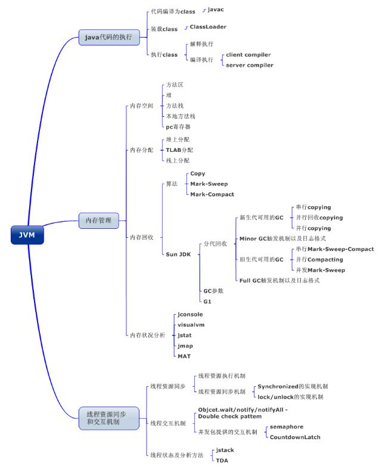
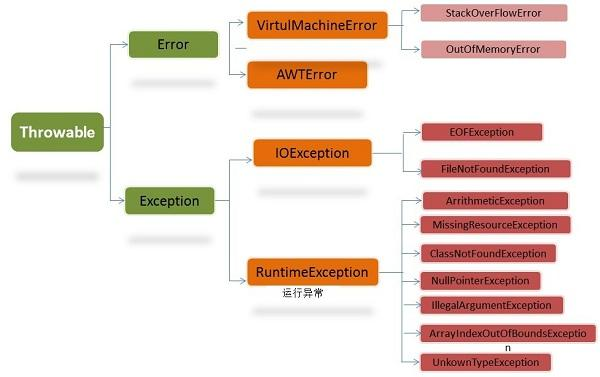

# Java基础

> 完 2020/6/28

### 面对对象的三大特征

​	封装性，继承性，多态性

- ##### 封装性:

  ​	把对象的成员属性和方法结合成一个独立的相同单位，并尽可能隐蔽对象的内部细节.
  ​	主要体现是private 和 方法

- ##### 继承性:
  
   子（类）可以继承父（类）的所有（可继承）内容，同时可以在在这之上进行扩展.（用于解决冗余代码）
    	继承是多态的前提，如果没有继承，就没有多态.
 	子类的构造方法中，会自动创建父类对象"最优先"，因此永远是先有父类，后有子类.（自动生成的情况只发生在父类有存在无参函数的情况.在将父类的构造方法重写称为有参构造之后，就不会自动添加，所以会报错）
  
- ##### 多态性：
  
   继承（extend）或者实现（implements）是多态性的前提.（方法的向上转型）
    	对象能够同时体现多种形态（属性/方法；此处指某个对象能够同时体现父类的特点，以及子类的特点），那么这就是具有多态性.在代码中具体的体现，父类引用子类对象（父类名称 对象名 = new 子类名称（）；接口同理）

##### 注意:

​	多态创建的父类对象方法，会被子类方法（对应方法如果存在）覆写；但是，父类成员变量，不会因为使用多态创建所以被子类的成员变量覆盖.
​	利用多态性创建的父类对象，其中的方法，一般优先考虑子类，如果子类没有创建对应方法则使用父类.成员变量无法继承，因此直接调用使用父类. 

### Java虚拟机

#### 基本概念

Java虚拟机，简称JVM（Java Virtual Machine），试运行所有java程序的理想计算机，是java程序的运行环境，是java最具吸引力的特性之一，我们编写的java代码，都运行在JVM上。JVM是运行在操作系统上的，它与硬件没有直接的交互。

```
跨平台：所有软件的运行都必须运行在操作系统上，而且我们用java辨析的软件可以运行任何的操作系统上，这种特性称为java语言的跨平台特性。该特性是由JVM实现的，我们编写的程序运行在JVM上，而JVM运行在操作系统上。
```




#### 运行过程

我们都知道Java源文件，通过编译器，能够生成相应的`.class`文件，也就是**字节码文件**，而字节码文件又通过Java虚拟机中的解释器，编译成特定机器上的<u>机器码</u>。

- Java源文件 --> 编译器 -->字节码文件
- 字节码文件 --> JVM --> 机器码

每个平台的**解释器**是<u>不同</u>的，但是实现的**虚拟机**是<u>相同</u>的，这就是Java为什么能够跨平台的原因，当一个程序开始运行，虚拟机就已经开始实例化了，多个<u>程序</u>启动就会存在多个虚拟机实例。程序退出或者关闭，则虚拟机实例消亡，多个虚拟机实例之间数据不能共享。


### Java的内存划分

1. ##### 栈（Stack）

   存放的都是方法的局部变量 "方法在栈中运行"
   局部变量：方法的参数，或者是方法{}内部的变量
   作用域：一点超出作用域，立刻从栈内存中消失
   
2. ##### 堆（Heap）

   	凡是new出来的东西，都在堆中
      	堆内存里面的东西都有一个地址值:16进制
      	堆内存里面的数据，都有默认值.规则:
      	    整数		0
      	    浮点数		0.0
      	    字符		'\u0000'
      	    布尔		false
      	    引用		null

3. ##### 方法区（Method Area）

   存放.class相关信息，包括方法的信息。可以理解为，其中存放为一个类的图纸，具体的类对象将根据此处的内容得到，但是在这其中不会真正存放类的内容。

   - JVM规范中（最早之前），将其划分进入**堆**内存中，叫做**永久代**，但是实际的实现中并没有被划分进入堆空间（别名Non-Heap）；在JDK8之后，改名**元空间**

4. ##### 本地方法区（Native Method Stack）

   ```
   与操作系统相关
   ```

5. ##### 寄存器（PC Register）

   ```
   与CPU相关
   ```

补充：

- **字符串常量池**存放在**堆**中
  - JDK6之前，JVM运行常量池在方法区中
  - JDK7移动到了堆中
  - JDK8移动回了方法区（此时方法区改名元空间）【可能性更高】/依然存在老年代中【有疑问，待定】
- **静态区**存放在**方法区**中

##### 过程举例

```java
class test{
	public static void test（）{
        int[] i = new int{1， 2， 3}；
    }
    public static void main（String[] args）{
      	test（）；
    }
}
```

1. 在调用开始运行后，这个class中的内容（经过省略）就会被存入**方法区**中，用作标记
  
   - 方法会生成地址值，如果“堆”中new了这个类的对象，就会存入方法的对应地址值，***方法中的具体内容会存入栈中***。
   
2. 在“栈”中为方法开辟了空间，用于存放方法体
  
   - 在**栈**中采用***先进后出***形式存储，因此，最先进入的方法（主方法）就会被压在最下，通过运行会不断有其他的方法进栈或出栈，当主方法出栈意味着运行结束。
   
3. 在**堆**中存放方法中使用new创建的所有内容（包括数组和所有引用数据类型），根据所需开辟空间，同时生成地址值（会创建一个具体的对象，包括类的成员变量和方法的对应地址值，方法体的创建在**栈**中）

   - 多次创建（new）类时，**堆**调用的方法地址（**堆**中的方法与**方法区**的方法对应的地址）是相同的，但是具体的方法的地址是不同的，因为此处的前提是多次创建
   - 每次new的类地址是不同的（每次new操作都会在**堆**中生成一个新的类）

   总结：系统的运行跟随**栈**中运行的顺序，之后每次想要调用方法，就会去**方法区**中查找（具体的顺序应该是**栈** → **堆** →  **方法区**），在**堆**存放具体的对象以及数组的值。


- 注1：**局部变量**创建后存储与**栈**内存；**成员变量**位于**堆**内存.
  - 局部变量会随着方法创建而进栈，方法结束后出栈（结束生命周期）
  - 成员变量会随着对象的创建而诞生，随着对象被垃圾回收而消失（结束生命周期）
- 注2：**静态变量**会直接存储在**方法区**，而不会进入**堆**中，因此之后的调用也完全和对象没有关系（对象存储在**堆**中，类存放在**方法区**中）

### 方法重载

​	多个方法的名称相同，但是参数列表不同	

- ##### 方法重载与以下有关：
  
  1. 参数的数量
  2. 参数的类型
  3. 不同类型参数的顺序
- ##### 方法重载与以下无关：
  
  1. 参数的名称无关（只会关心参数的类型，不关心名称）
  2. 与方法的返回值类型无关

### 接口

接口，interface，是一种引用数据类型，它的核心是其中的方法（抽象）.（接口是一种**<u>标准</u>**）

##### 内容

- java7（以及之前）：常量，抽象方法
  - **常量**：接口以及接口实现类中都能使用的常量.固定的修饰public static final（可省略）
    - 注：常量必须赋值，且不能再改（如果是早期版本没有构造方法，必须在成员变量定义处就赋值；有了构造方法之后，需要在每个构造方法中都有对其赋值的方法即可）
  - **抽象方法**（所有版本都可用）
    - 默认修饰为public abstract（和其他地方的方法默认访问限制不同）
- java8：默认方法（default），静态方法（static）
  - **默认方法**：可以解决接口升级的问题，例，实现类已经发布（或者有很多其他类中正在使用），想在接口中添加新的方法，之前所有引用的类中都会报错.在使用了默认方法之后，就能避免这个问题
  - **静态方法**： 与类中的静态方法<u>不同</u>，接口的实现类的对象不能调用接口的静态方法（因为接口可以继承多个，如果调用接口的静态方法，就无法识别具体哪个方法）
    - 调用： 接口名.静态方法名（参数）
- java9：私有方法
  - **私有方法**： 因为默认方法和静态方法的加入（可以创建方法体），可能会出现需要抽取出方法中的重复代码的情况，而此时的提取出来的方法**不希望被实现类使用**，就应该使用私有方法。下方列举出了私有方法的两个分类。
    - 普通私有方法：解决多个<u>默认</u>方法之间的重复代码问题
    - 静态私有方法：解决多个<u>静态</u>方法中的重复代码问题

##### 注意：

此处主要是接口的多继承可能出现的情况

多个父接口当中的抽象方法如果重复，没有影响；但是，多个父接口当中的**默认方法**重复，那么子接口<u>**必须**</u>对默认方法进行重写。

### 方法的向上/下转型

##### 向上转型:

利用多态性，使用子类创建父类对象。一定是**安全的**，小范围转向大范围.

- 弊端:

  向上转型为父类，就无法调用子类特有的方法.而此时，可以使用对象的向下转型来还原.

##### 向下转型

用于还原向上转型的过程，重新将利用子类创建的父类对象还原为对应的子类对象.[还原]

- 格式:

  子类名称 对象名 = （子类名称）父类名称；（类似格式的强制转换）

- ###### 注意

  必须是对应的子类才能实现向下转型，才能实现还原过程；否则，报错（ClassCastException）。
  **不安全**，必须是对应的子类才能进行还原操作（解决方法，可以使用instanceof）

### static关键字

如果一个类的成员变量使用了static关键字，那么这个类就不再属于对象自己，而是数据所在的类，多个对象共享同一个数据。

如果使用static修饰了成员方法，那么这个方法就是静态方法。这个方法不再属于这个对象，而是属于这个类.

- 静态对象：需要创建（new）对象，通过对象来调用
- 静态方法:**推荐**直接类名称来调用，但也可以使用对象来调用

##### **注意**

1. 静态方法只能直接访问静态（方法/成员变量），不能直接访问非静态

   原因：在内存中，先创建静态内容，后创建非静态内容

2. 静态方法中不能使用this
   		原因:this代表当前对象，通过谁调用的方法，谁就是对象，然而静态内容属于类，不属于具体的对象

- 静态代码块（类中）
  	当首次执行内类时，静态代码块会执行唯一一次。可以用于一次性的对静态成员变量进行赋值

```java
static {
	//静态代码块的内容 
}
```

##### 补充

- **构造方法**本质上也是static（因为不能被重写），但是此处的static是隐式的

### final关键字

代表最终的，不可改变的。

##### 用法

1. 修饰类
   当前这个类，不能有任何的子类(太监类)。一个final类，那么其中的所有方法都不能在进行覆盖和重写
2. 修饰方法
   使用final修饰的方法叫做最终方法，不能被覆盖重写
   - 小结:对于类和方法来说，final和abstract关键字不能同时使用【**矛盾**】
3. 修饰局部变量
4. 修饰成员变量
   - 变量使用final关键字后，这个变量就不能在改变.成员变量原本会存在默认值，如果使用final之后传递进入一个默认值，那这个常数就没有任何意义，因此，成员变量在添加了final关键字后，就不会再给其添加默认值，必须手动赋值。
   - 此处的手动赋值方法有两种:
     1. 直接赋值
     2. 使用构造方法赋值
        必须所有的构造方法中都能够对这个成员变量进行赋值.
        		

##### 总结

​	对于变量来说，一旦使用final进行修饰，那么变量在最初进行初始化之后，就不能在改变.
​	其中，基础类型指的是变量的值不可再改变；而引用类型指的是变量中的**地址**不能在改变（引用类型存放的是一个地址值）

### Java中常用的类和方法

#### 字符串

##### String

final类，不能再向下继承，其中使用数组进行存储（在JDK8之前使用char数组，在14已经是byte数组）。其中的值不能改变，每次修改都是重新创建了一个字符串。

字符串连接操作也是在内存中（使用双引号的模式是默认加入字符串常量池中，new的方式不会默认加入，但是可以使用intern方法将字符串加入常量池），重新创建一个连接之后的字符串。

- String intern()
  返回字符串对象的规范化表示形式。 一个初始为空的字符串池，它由类 String 私有地维护。 
  当调用 intern 方法时，如果池已经包含一个等于此 String 对象的字符串（用equals(Object) 方法确定），则返回池中的字符串。否则，将此 String 对象添加到池中，并返回此 String 对象的引用。 
  它遵循以下规则：对于任意两个字符串 s 和 t，当且仅当 s.equals(t) 为 true 时，s.intern() == t.intern() 才为 true。 
  所有**字面值字符串**和字**符串赋值常量表达式**都使用 intern 方法进行操作。（使用引号创建的字符串默认调用这个方法）

**注意**
**能够进入常量池的赋值方式，右侧（提供侧）不能存在变量/变量名！**
**使用final修饰之后的变量会变成常量**

- String toLowerCase() 转小写
- String toupperCase() 转大写
- String trim() 删除首位空白
- String replace(char oldChar, char newChar)
- String replaceAll(String regex, String replacement) 使用这正表达式，进行替换
- boolean matches(String regex) 判断字符串是否满足给定正则表达式
- String split(String regex, int limit) 字符串切分，如果超过`limit`就将剩余的部分全部放入最后一个元素中

##### StringBuffer和StringBuilder

- StringBuffer
  final类，不能再向下继承，底层使用数组存储（在AbstractStringBuilder中声明了成员变量value，不再是final，可变），线程安全，使用了同步方法解决了线程安全问题。
- StringBuilder
  final类，不能向下继承，底层使用数组存储（和StringBuffer一致），没有实现线程安全，提高了效率。

在扩容方法中，同样涉及到数组的复制问题，为了避免复制减低效率，应该尽量避免超出容量（默认构造方法长度为16）。可以在创建时指定长度，来尽量避免扩容的发生。

<u>扩容方法中默认是原容量的2倍加2（(oldCapacity << 1) + 2）</u>

- StringBuilder append([Object]) 提供了各种append方法，用于字符串的拼接
- StringBuilder delete（int start, int end) 删除指定位置的值
- StringBuilder replace(int start, int end, String str) 把[start, end)位置**替换给**str
- StringBuilder insert(int offset, XX) 在指定位置插入XX
- StringBuilder reverse() 把当前字符串序列反转
- int indexOf(String str) 子串在字符串中的位置，没有则返回-1
- String substring(int start, int end) 返回一个子串（左闭右开）【不会改变本身的值】
- void setCharAt(int n, char ch) 修改某个指定位置的字符

##### 三种字符串的比较

String：不可变字符序列

StringBuffer：可变字符序列；线程安全，效率低

StringBuilder：可变字符序列；线程不安全，效率高

##### 转换

- String 转化 StringBuffer/StringBuilder：调用StringBuffer/StringBuilder构造器，直接可以传入String作为参数
- StringBuffer/StringBuilder 转换 String：
  - 调用String构造器，可以直接将两者作为参数传入
  - 调用StringBuffer/StringBuilder的`toString`方法

#### 时间

##### 时间戳

System类下的currentTimeMillis()方法。返回当前时间与1970年1月1日0:0:0的时间差，单位是毫秒，返回值为long型。

##### Date

表示特定的瞬间，精确到毫秒。

- java.util.Date
  - java.sql.Date（对应数据库中日期类型的变量，对java.util.Date进行了简单的封装）

Date() 创建当前系统时间的对象。

Date(long date) 创建对应时间戳的时间对象

void toString() 显示Date的年月日，日分秒。把此 `Date` 对象转换为以下形式的 `String`： dow mon dd hh:mm:ss zzz  yyyy 其中： `dow` 是一周中的某一天 (`Sun, Mon, Tue, Wed, Thu, Fri, Sat`)。

long getTime() 返回自 1970 年 1 月 1 日 00:00:00 GMT 以来此 `Date` 对象表示的毫秒数。（时间戳）

<u>如果直接使用构造方法中想指定时间，存在偏移量，需要设置年-1900，月-1</u>**【存在偏移量】**

###### 转换

java.sql.Date转java.util.Date：利用多态的性质

java.util.Date转java.sql.Date：可以借助getTime方法返回的时间戳，来创建一个java.sql.Date对象。

##### SimpleDateFormat

Date类的API<u>不易于国际化，大部分被废弃了</u>。java.text.SimpleDateFormat类是一个不与语言环境有关的方式来<u>格式化</u>和<u>解析</u>**日期**的<u>具体类</u>。

他允许进行格式化：**日期**到**文本、解析**；**文本**到**日期**

- **格式化**
  - SimpleDateFormat()：默认的模式和语言环境创建对象
  - SimpleDateFormat(String pattern)：该构造方法可以使用<u>参数pattern</u>指定一个格式创建对象，该对象调用。
  - String format(Date date)：方法格式化时间对象date
- **解析**
  - Date parse(String source)：从给定字符串解析文本，生成一个日期对象。

##### Calendar

Calendar，日期类，是一个<u>抽象类</u>，用于完成日期字段之间相互操作的功能。

- **实例化方法**
  - Calendar.getInstance()方法的内部实现就是调用了子类来创建
  - 调用子类GregorianCalendar()
- **常用方法**
  - int get(int field) 返回给定日期字段的值
    其中的field是类中定义的常量，由于表示指定的某项字段的编号。
  - void set(int field, int value) 将给定的日历字段设置为给定值。
  - void add(int field, int amount) 根据日历的规则，为给定的日历字段添加或减去（传入负数）指定的时间量。
  - final Date getTime() 返回一个表示此 `Calendar` 时间值（从历元至现在的毫秒偏移量）的  `Date` 对象。对应时间的Date对象。
  - final void setTime(Date date) 使用给定的 `Date` 设置此 Calendar 的时间。


> <u>**Joda-Time（JDK8之后加入的时间类，原本是某个开源jar包）**</u>
>
> 其中包括本地日期LocalDate、本地时间LocalTime、本地日期时间LocalDateTime、时区ZonedDateTime和持续时间Duration的类。
>
> 解决了时间类的以下问题
>
> - 可变性：时间和日期这样的类应该不可变
> - 偏移量：Date中的年份是从1900年开始的，月是从0开始的
> - 格式化：格式化只对Date有用，Calendar则不行
> - 线程不安全；而且不能处理闰秒（因为地球自转不均匀等原因，可能导致每年的时间会有细微变化，需要每年进行调整时间）

##### LocalDate、LocalTime、LocalDateTime

final类，不可继承。分别可以用来表示日期（年月日）、时间（时分秒）和日期+时间。

<u>类似Calendar</u>

- **常用方法**
  - static LocalDate now([ZoneId zone]) 根据当前时间床架你对象/指定时区的对象。
  - static LocalDate of([可以填入年月日等变量]) 根据指定日期/时间创建对象（没有偏移量）
  - int getDayOfMonth()/getDayOfYear() 获取月份的天数（1~31）/获取年份天数（1~366）
  - DayOfWeek getDayOfWeek() 获取时间具体的星期（返回一个DayOfWeek的枚举值）
  - Month getMonth() 获取月份，返回一个Month的枚举值
  - int getMonthValue()/getYear() 获取月份（1~12）/年份
  - int getHour()/getMinute()/getSecond() 获取当前对象对应的小时、分钟、秒
  - LocalDate withDayofMonth()/withDayOfYear()/withMonth()/withYear() 将月份天数、年份天数、月份、年份修改为指定的值，并放回对象**（这些方法中有参数）**
  - LocalDate plusHours() /plusDays()/plusWeeks()/plusMonths()/plusYears()向当前对象添加几小时/天/周/月/年**（这些方法中有参数）**
  - LocalDate minusHours()/minusDays()/minusWeeks()/minusMonths()/minusYears() 向当前对象减少几小时/天/周/月/年**（这些方法中有参数）**

##### Instant

获取一个瞬间，使用一个数来表示。

<u>与Date类似</u>

- **常用方法**
  - static Instant now() 静态方法，返回数默认为UTC时区的Instant类的对象
  - static Instant ofEpochSecond(long epochSecond) 返回在1970-01-01 00:00:00基础上加指定毫秒数之后的Instant类的对象（通过给定的时间戳，实例化对象）
  - OffsetDateTime at offset(ZoneOffSet offset) 结合即时的偏移来创建一个OffsetDateTime
  - long toEpochMilli() 返回1970-01-01 00:00:00作为起始的毫秒数，即时间戳

##### DateTimeFormatter

提供了格式化时间的方法

<u>与SimpleDateFormat类似</u>

- **三种格式化方法**

  - 预设的标准格式：

    ISO_LOCAL_DATE_TIME;ISO_LOCAL_DATE;ISO_LOCAL_TIME

  - 本地相关的格式：

    ofLocalizedDateTime(FormatStyle.LONG)/ofLocalizedDate()

    其中传FormatStyle.[具体格式]

    - ofLocalizedDateTime

      LONG/MEDIUM/SHORT

    - ofLocalizedDate

      FULL/LONG/MEDIUM/SHORT

  - 自定义的格式：

    ofPattern("yyyy-MM-dd HH:mm:ss E")

- **常用方法**
  - static DateTimeFormatter ofPattern(String pattern) 返回一个指定字符串格式的DateTimeFormatter
  - String format(TemporalAccessor temporal) 格式化一个日期、时间，返回字符串
  - TemporalAccessor parse(CharSequence text) 将指定格式的字符序列解析为一个日期、时间

> 如果需要如String转LocalDate、LocalTime、LocalDateTime，可以使用对应类中的静态方法parse([转入的字符串], [使用哪个格式转换对象])
>
> ```java
> public static LocalDateTime parse(CharSequence text, DateTimeFormatter formatter) {
>     Objects.requireNonNull(formatter, "formatter");
>     return formatter.parse(text, LocalDateTime::from);
> }
> ```

##### 新旧转换

- ###### Instant和Date/Timestamp
  - Date.from([instant对象])
  - date.toIntant

- ###### GregorianCalendar（日期类的实现类）和ZonedDateTime

  - GregorianCalendar.from([zonedDateTime对象])
  - calendar.toZonedDateTime()

- ###### java.sql.Time和java.time.LocalDate/LocalTime/LocalDateTime

  - Date.valueOf(localDate/localTime/localDateTime)
  - date.toLocalDate()/toLocalTime()/toLocalDateTIme()

- ###### DateTimeFormatter和DateFormat

  - 转到DateFormat：formatter.toFormat()
  - 没有转到DateTimeFormatter的方法

#### 比较大小

引用对象类型需要比较大小，需要借助比较大小的接口来实现。

##### Comparable

**自然排序**。此**接口**强行对实现它的每个类的对象进行整体排序。这种排序被称为类的*自然排序*，类的 `compareTo`  方法被称为它的*自然比较方法*。

实现此接口的对象列表（和数组）可以通过 `Collections.sort`（和  `Arrays.sort`）进行自动排序。实现此接口的对象可以用作有序映射中的键或有序集合中的元素，无需指定比较器。

- int compareTo(T o) 【核心】

  比较此对象与指定对象的顺序。如果该对象<u>小于、等于或大于</u>指定对象，则分别返回<u>负整数、零或正整数</u>。 
  实现类必须确保对于所有的 x 和 y 都存在 sgn(x.compareTo(y)) == -sgn(y.compareTo(x)) 的关系。（这意味着如果 y.compareTo(x) 抛出一个异常，则 x.compareTo(y) 也要抛出一个异常。） 

  实现类还必须确保关系是可传递的：(x.compareTo(y)>0 && y.compareTo(z)>0) 意味着 x.compareTo(z)>0。 

  最后，实现者必须确保 `x.compareTo(y)==0` 意味着对于所有的 z，都存在 `sgn(x.compareTo(z)) == sgn(y.compareTo(z))`。 强烈推荐 `(x.compareTo(y)==0) == (x.equals(y)) `这种做法，但并不是 严格要求这样做。一般来说，任何实现 Comparable 接口和违背此条件的类都应该清楚地指出这一事实。推荐如此阐述：“注意：此类具有与 equals 不一致的自然排序。” 

##### Comparator

**定制排序**。强行对某个对象 **collection** 进行*整体排序* 的比较函数。可以将 Comparator 传递给 sort 方法（如 `Collections.sort`  或 `Arrays.sort`），从而允许在排序顺序上实现精确控制。还可以使用  Comparator 来控制某些数据结构（如`有序 set`或`有序映射`）的顺序，或者为那些没有`自然顺序`的对象 collection  提供排序，还能解决某些实现了Comparable接口但是又需要那一种排序方法无法灵活满足需求时。

#### 系统类

##### System

System类代表系统，很多系统属性和控制方法都放置在该类中。该类在java.lang包下（不需要导入）

由于该类的构造器时private的，所有无法创建该类的对象，也就是无法实例化该类。其内部的成员变量和成员方法都是static的，所有可以直接通过类名调用其中的方法。

- 成员变量
  - System类内部包含in、out和err三个成员变量，分别代表标准输入流（键盘输入），标准输出流（显示器）和标准错误输出流（显示器）。
- 成员方法
  - native long currentTimeMillis() 获取当前系统时间所对应的时间戳（GMT时间，格林威治时间）
  - void exit(int status) 退出程序，其中status的值为0代表正常退出，非0表示异常退出。使用该方法可以在图形界面编程中实现程序的退出功能。
  - void gc() 运行垃圾回收器。请求垃圾回收器，治愈系统是否真的立即回收，七绝与系统中的垃圾回收算法的实现以及系统执行时的情况。
  - String getProperty(String key) 该方法的作用时获得系统中属性名为key的属性对应的值。系统中常见的属性名如下：
    - java.version  java运行时环境版本
    - java.home  java安装目录
    - os.name  操作系统的名称
    - os.version  操作系统的版本
    - user.name  用户的账户名称
    - user.home  用户的主目录
    - user.dir  用户的当前工作目录

#### 数学

##### Math

java.lang.Math工具类，提供了一系列静态方法用于数据运算。其方法的参数和返回值都为double型。

- abs     绝对值
- acos， asin， atan， cos， sin， tan   三角函数
- sqrt    平方根
- pow(double a, double b)  a的b次幂
- log    自然对数
- exp   e为底指数
- max/min(double a, double b)  比大小
- random()   返回0.0到1.0的随机数
- long round(double a)  double转long型（四舍五入）
- toDegrees(double angrad)/toRadians(double angdeg)    弧度转角度/角度转弧度

#### 大数据型（长数据型）

##### BigInteger和BigDecimal

Integer类作为int的包装类，能存储的最大整型为$2^{31}-1$，Long类的长度也是有限的，最大为$2^{63}-1$。如果要表示再大的数，不管是基本数据类型还是他们的包装类都无能为力，更不用说运算。

java.math包中的BigInteger可以表示不可表的任意精度的整数。BigInteger提供所有Java基本整数操作符的对应物，并提供java.lang.Math的所有相关方法。另外，BigInteger还提供以下运算：模运算、GCD运算、指数测试、素数生成、位操作以及一些其他操作。

<u>BigInteger对应整型，BigDecimal对应浮点型。</u>

- **构造器**

  - BigInteger(String val) 提供字符串构造BigInteger对象
  - BigDecimal(double val)/(String val)

- **常用方法**

  - [BigDecimal中]divide(BigDecimal divisor, int scale, RoundingMode roundingMode)
    divisor：被除数；scale：保留多少位效数点；roundingMode：舍入规则

    如：BigDecimal.ROUND_HALF_UP，四舍五入


### 内部类

#### 定义

类的嵌套，一个类中包含另外一个类(一般针对一个类不能单独出现，或独立运行的情况)

#### 分类

##### 成员内部类

作为外部类的成员变量存在.

调用成员内部类的方法

  1. 间接方式
      外部类的方法中，使用内部类获取值或方法，再调用外部类的方法
  
  2. 直接方式
     创建一个内部对象.
      外部类名称.内部类名称 对象名 = new 外部类名称().new 内部类名称();
  
     ```
     Body.Heart heart = new Body().new Heart();
     ```
##### 局部内部类（**包括匿名内部类**）

在外部类的方法中存在，只有本方法可以调用，其他地方都不能再调用这个方法。
如果希望调用所在方法的局部变量，必须保证这个变量是**有效final**的（大概的意思是，有没有添加final关键字，只要在创建之后没有修改过它的值，就可以判断通过）[不需要添加final关键字是java8添加的特性，之前必须添加final关键字]

- 原因
  局部内部类存储的地方是**堆**中（所有new出来的对象都存在'堆'中），而局部变量存放在**栈**中.因此，局部变量会随着方法运行结束而消失，但是new出来的局部内部类只会因为java的垃圾回收机制才消失。
  如果此时的局部内部类希望访问局部变量，就不能保证变量是否还存在。就需要变量满足<u>有效final</u>的前提，才能将它的值复制进入局部内部类中来使用。


- ##### 匿名内部类
  
  用于只需要运行一次的某些类的方法重写和引用.

  ```java
  接口名称 对象名 = new 接口名称(){
      //覆盖重写的方法
  };
  ```

  - 格式:
    1. new 代表创建了一个对象
    2. 根据new的类名称或接口名称，得到的就是匿名内部类需要实例化的对象
    3. {...} 大括号中的内容就是是匿名内部类的内容（省略类的名称，所创建的类的具体内容就是这个大括号中的内容）

- ###### 注意

  1. 匿名内部类，在创建对象的时候，只能使用唯一一次（如果需要多次使用，就应该创建实现类）

  2. 匿名对象，在调用对象的时候只能使用唯一一次（如果需要多次调用，就需要给对象一个名称）

  3. 匿名内部类是省略的[实现类/子类]；而匿名对象省略了[对象名称]

     **所以，匿名内部类和匿名对象不是一个东西!!**			

### 异常



主要需要分成为两大类，Error和Exception

- `Error`

  是程序无法处理的错误，表示运行应用程序中较严重问题。大多数错误与代码编写者执行的操作无关，而表示代码运行时 JVM（Java 虚拟机）出现的问题。例如，Java虚拟机运行错误（Virtual MachineError），当 JVM 不再有继续执行操作所需的内存资源时，将出现 OutOfMemoryError。这些异常发生时，Java虚拟机（JVM）一般会选择线程终止。

- `Exception`

  是程序本身可以处理的异常。

  Exception 类有一个重要的子类 RuntimeException。RuntimeException 类及其子类表示“JVM 常用操作”引发的错误。例如，若试图使用空值对象引用、除数为零或数组越界，则分别引发运行时异常（NullPointerException、ArithmeticException）和 ArrayIndexOutOfBoundException。

**注意**：异常和错误的区别是异常能被程序本身可以处理，错误是无法处理。

主要需要注意的是`Exception`中的两大类，运行时异常和非运行时异常

##### 运行时异常

运行时异常，表示的都是`RuntimeException`类及其子类异常，如`NullPointerException`(空指针异常)、`IndexOutOfBoundsException`(下标越界异常)等，这些异常是不检查异常，<u>程序中可以选择捕获处理，也可以不处理</u>。这些异常一般是由程序逻辑错误引起的，程序应该从逻辑角度尽可能避免这类异常的发生。

<u>运行时异常的特点是Java编译器不会检查它</u>，也就是说，当程序中可能出现这类异常，<u>即使没有用try-catch语句捕获它，也没有用throws子句声明抛出它，也会编译通过</u>。

##### 非运行时异常

非运行时异常，或者编译异常，是`RuntimeException`以外的异常，类型上都属于`Exception`类及其子类。从程序语法角度讲是必须进行处理的异常，如果不处理，程序就不能编译通过。如`IOException`、`SQLException`等以及用户自定义的`Exception`异常，<u>一般情况下不自定义检查异常</u>。

### 类的权限修饰符

1. 外部类（所有正常的，在最外层的类）：public/(default)
2. 成员内部类：public/protected/(default)/private
3. 局部内部类：什么都不能写(效果和default并不相同)

##### 注意

内用外，随意访问;外用内，需要借助内部对象。
内部类中调用外部类的变量（重名的情况下）

```java
外部类名称.this.变量名
Body.this.[变量名称]
```

（补充知识：内部类的编译，会生成两个文件，分别代表外部类和内部类，其中内部类的名称为"外部类名称$内部类名称.class"，例:Class01$Class02.class，表示Class02为Class01的内部类）

### 泛型

Java 泛型（generics）是 JDK 5 中引入的一个新特性, 泛型提供了编译时类型安全检测机制，该机制允许开发者在编译时检测到非法的类型。

泛型的本质是**参数化类型**，也就是说<u>所操作的数据类型被指定为一个参数</u>。

##### 泛型带来的好处

在没有泛型的情况的下，通过对类型 Object 的引用来实现参数的“任意化”，“任意化”带来的缺点是要做显式的强制类型转换，而这种转换是要求开发者对实际参数类型可以预知的情况下进行的。对于强制类型转换错误的情况，编译器可能不提示错误，在运行的时候才出现异常，这是本身就是一个安全隐患。


那么泛型的好处就是在**编译的时候**能够检查类型安全，并且所有的强制转换都是自动和隐式的。

```java
public class GlmapperGeneric<T> {
	private T t;
    public void set(T t) { this.t = t; }
    public T get() { return t; }

    public static void main(String[] args) {
        // do nothing
    }

    /**
        不指定类型
    */
    public void noSpecifyType(){
        GlmapperGeneric glmapperGeneric = new GlmapperGeneric();
        glmapperGeneric.set("test");
        // 需要强制类型转换
        String test = (String) glmapperGeneric.get();
        System.out.println(test);
    }

    /**
	    指定类型
    */
    public void specifyType(){
        GlmapperGeneric<String> glmapperGeneric = new 		GlmapperGeneric();
        glmapperGeneric.set("test");
        // 不需要强制类型转换
        String test = glmapperGeneric.get();
        System.out.println(test);
    }
}
```

​	上面这段代码中的 specifyType 方法中 省去了强制转换，可以在编译时候检查类型安全，可以用在类，方法，接口上。

##### 泛型通配符

- **常见的通配符：T，E，K，V，？**
  本质上这些个都是通配符，没啥区别，只不过是编码时的一种约定俗成的东西。比如上述代码中的 T ，我们可以换成 A-Z 之间的任何一个 字母都可以，并不会影响程序的正常运行，但是如果换成其他的字母代替 T ，在可读性上可能会弱一些。通常情况下，T，E，K，V，？ 是这样约定的：

  - ？ 表示不确定的 java 类型
  - T (type) 表示具体的一个java类型
  - K V (key value) 分别代表java键值中的Key Value
  - E (element) 代表Element

- **？无界通配符**
  对于不确定或不关心实际操作的类型，就可以使用无限制通配符（在尖括号中放一个问号，即<?>），可以表示任意的类型，而不用关心具体的类型是什么。

  <u>使用？修饰的的对象，不能进行添加除`null`以外的任何数据。</u>
  
- **<? extend E>上界通配符**
  上届：用 extends 关键字声明，表示参数化的类型可能是所指定的类型，或者是此类型的子类。

  在类型参数中使用 extends 表示这个泛型中的参数必须是 E 或者 E 的子类，这样有两个好处：

  - 如果传入的类型不是 E 或者 E 的子类，编译不成功
  - 泛型中可以使用 E 的方法，要不然还得强转成 E 才能使用

  ```java
  private <K extends A, E extends B> E test(K arg1, E arg2){
      E result = arg2;
      arg2.compareTo(arg1);
      //.....
      return result;
  }
  ```

  类型参数列表中如果有多个类型阐述上限，需要用逗号隔开。

- **<? super E>下界通配符**
  下界: 用 super 进行声明，表示参数化的类型可能是所指定的类型，或者是此类型的父类型，直至 Object。

##### ? 和 T 的区别

? 和 T 都表示不确定的类型，区别在于我们可以对于T及逆行操作，但是对 ? 不行，比如：

```java
// 可以
T t = operate();

// 不可以
？ car = operate();
```

- 简单总结：
  T 是一个 确定的 类型，通常用于泛型类和泛型方法的定义，？是一个 不确定 的类型，通常用于泛型方法的调用代码和形参，不能用于定义类和泛型方法。

> 转自：https://juejin.im/post/5d5789d26fb9a06ad0056bd9

### 集合框架

##### 简介

Java中的集合，又叫做容器，将其他对象作为元素进行存取的一种特殊对象。是用于简单地用于存储、检索、操作和统计一组元素。

Java Collections Framework（JCF）为Java开发者提供了通用的容器，其初始于JDK1.2，其中主要带来的遍历有：

- 降低了编程的难度
- 提高程序的性能
- 提高API间的互操作性
- 降低学习难度
- 降低设计和实现相关API的难度
- 增加程序的重用性

*Java容器中只能存放对象，对于基础数据类型，需要将其**装箱**操作转化为包装类之后才能存放到容器中。*

##### 结构

为了规范容器的行为，统一管理，JCF中定义了14种接口容器（collection interfaces），它们的关系图如下：


> 转自：https://www.cnblogs.com/CarpenterLee/p/5414253.html

Map接口没有继承自Collection接口，但是Java提供了从Map转换到Collection的方法，可以方便得将Map切换到集合视图。

上图中提供了Queue接口，却没有看到Stack，这是因为Stack的功能已经被JDK1.6引入的Deque取代。


##### 实现

上述的接口的通用实现见下图


JCF主要包含了Set、List、Queue、Map的4个接口。其详细描述如下

<u>Collection与Map同级，包括Set、List、Queue</u>

#### Set

- 注重**独一无二**的性质，该体系即可可以得知元素是否已经存在，**拒绝重复元素**。
- 存入的元素不存在索引（不能使用普通的for循环遍历，不包括foreach循环）。
- 元素的相等性
  - 当多个Set引用到**堆**上的相同对象，使用hashCode方法将得到相同的值或者说地址将相同
    （hashCode方法：获取对象特有的序号，序号的依据是对象的内存地址计算得出的）

*继承自Collection*

##### HashSet

此类实现 **Set** 接口，由哈希表（实际上是一个 `HashMap` 实例）支持。它不保证 set  的迭代顺序；特别是它不保证该顺序恒久不变。此类允许使用 `null` 元素。 

**注意，此实现不是同步的。**如果多个线程同时访问一个哈希 set，而其中至少一个线程修改了该 set，那么它*必须*  保持外部同步。这通常是通过对自然封装该 set 的对象执行同步操作来完成的。如果不存在这样的对象，则应该使用 `Collections.synchronizedSet`  方法来“包装”set。

<u>HashSet实现独一无二的性质，是借助**HashMap**的性质。例，在add传入新的元素时，实际的操作是将元素的值作为HashMap的key值进行存储，因此可以判定是否有重复值。</u>

##### TreeSet

基于 `TreeMap` 的 `NavigableSet`  实现。使用元素的**自然顺序**对元素进行排序，或者根据创建 set 时提供的 `Comparator`  进行排序，具体取决于使用的构造方法。 

此实现为基本操作（`add`、`remove` 和 `contains`）提供受保证的  log(n) 时间开销。 

**注意，此实现不是同步的。**于HashSet一致。

<u>利用TreeMap的NavigableSet实现了排序，插入时比较，实际上是创建一个**红黑树**。</u>

> 具体内容可以参见 [TreeMap](#TreeMap)

##### LinkedHashSet

具有可预知迭代顺序的 `Set` 接口的哈希表和链接列表实现。此实现与 `HashSet`  的不同之外在于，后者维护着一个运行于所有条目的双重链接列表。此链接列表定义了**迭代顺序**，即按照将元素插入到 set  中的顺序（*插入顺序*）进行迭代。注意，插入顺序*不* 受在 set 中*重新插入的* 元素的影响。（如果在  `s.contains(e)` 返回 `true` 后立即调用 `s.add(e)`，则元素 `e`  会被重新插入到 set `s` 中。） 

此实现可以让编程者免遭未指定的、由 `HashSet`  提供的通常杂乱无章的排序工作，而又不致引起与 `TreeSet`  关联的成本增加。使用它可以生成一个与原来顺序相同的 set 副本，并且与原 set 的实现无关： 

```java
void foo(Set s) {
    Set copy = new LinkedHashSet(s);
    ...
}
```

如果模块通过输入得到一个 set，复制这个  set，然后返回由此副本决定了顺序的结果，这种情况下这项技术特别有用。（客户通常期望内容返回的顺序与它们出现的顺序相同。） 

此类提供所有可选的 `Set` 操作，并且允许 null 元素。

<u>继承自`HashSet`，构造方法全部调用父类同一构造方法（无参对无参，有参对有参）。底层使用的是`LinkedHashMap`，使用的父类`HashSet`中的构造方法，用来创建的`LinkedHashMap`。</u>

```java
 /**
     * Constructs a new, empty linked hash set.  (This package private
     * constructor is only used by LinkedHashSet.) The backing
     * HashMap instance is a LinkedHashMap with the specified initial
     * capacity and the specified load factor.
     *
     * @param      initialCapacity   the initial capacity of the hash map
     * @param      loadFactor        the load factor of the hash map
     * @param      dummy             ignored (distinguishes this
     *             constructor from other int, float constructor.)
     * @throws     IllegalArgumentException if the initial capacity is less
     *             than zero, or if the load factor is nonpositive
     */
HashSet(int initialCapacity, float loadFactor, boolean dummy) {
    map = new LinkedHashMap<>(initialCapacity, loadFactor);
}
```

#### List

- 不强调元素的唯一性，允许添加重复元素
- 其中元素存在索引，与数组类型，可以通过简单for循环来遍历。

*继承了Collection*

##### ArrayList

实现了`List`接口，是顺序容器，即存入数据的顺序于添加的顺序相同，允许存放`null`元素，底层使用数组来实现。ArrayList存在一个固定的容量， 用来表示底层数组的实际大小，存储该元素的个数不能大于当前容量。让向容器中添加元素时，如果容量不足，容器会自动增大底层数组的大小。（底层使用`Object数组`，以便能够容纳任何类型的对象。


size()，isEmpty()，get()，set()方法均能够在常数时间内完成，add()方法的时间开销与插入位置有关，addAll()方法的时间开销跟添加元素的个数成正比。其余方法都是线性时间。

为了追求效率，ArrayList没有实现同步（synchronized），如果需要多线程并发访问，需要手动实现同步，也可以使用Vector替代。

<u>其本质的操作是每次操作之后重新将原来的值进行复制，重新构建新的数组。（存在初始空间个数，可能大于其中值的数量，如果此时使用了增加方法，就可以不去重新申请空间进行数组复制，而是直接将新的数据添加到最后）</u>


##### LinkedList

LinkedList同时实现了List接口和Deque接口，可以说它既可以看作是一个顺序容器，又可以啊看做一个队列（Queue），同时也可以看作一个栈（Stack）。（在LinkedList之上还有一个ArrayDeque，是作为栈与队列使用的最优选，它在作为栈和队列使用时比LinkedList有更好的性能）


LinkedList底层是通过**双线链表**实现，其中的每个节点使用内部类Node表示。LinkedList通过`first`和`last`引用分别指向链表的第一个和最后一个元素。<u>当链表为空时`first`和`last`都指向`null`。</u>

```java
//Node内部类
private static class Node<E> {
    E item;
    Node<E> next;
    Node<E> prev;
    Node(Node<E> prev, E element, Node<E> next) {
        this.item = element;
        this.next = next;
        this.prev = prev;
    }
}
```

*LinkedList*的实现方式决定了所有跟下标相关的操作都是线性时间，而在首段或者末尾删除元素只需要常数时间。为追求效率*LinkedList*没有实现同步（synchronized），如果需要多个线程并发访问，可以先采用`Collections.synchronizedList()`方法对其进行包装。

add()方法有两个版本，一个是`add(E e)`，该方法在\*LinkedList*的末尾插入元素，因为有`last`指向链表末尾，在末尾插入元素的花费是常数时间。只需要简单修改几个相关引用即可；另一个是`add(int index, E element)`，该方法是在指定下表处插入元素，需要先通过线性查找找到具体位置，然后修改相关引用完成插入操作。


结合上图，可以看出`add(E e)`的逻辑非常简单。

```java
//add(E e)
public boolean add(E e) {
    final Node<E> l = last;
    final Node<E> newNode = new Node<>(l, e, null);
    last = newNode;
    if (l == null)
        first = newNode;//原来链表为空，这是插入的第一个元素
    else
        l.next = newNode;
    size++;
    return true;
}
```

`add(int index, E element)`的逻辑稍显复杂，可以分成两部分，1.先根据index找到要插入的位置；2.修改引用，完成插入操作。

```java
//add(int index, E element)
 public void add(int index, E element) {
        checkPositionIndex(index);//index >= 0 && index <= size;
        if (index == size)//插入位置是末尾，包括列表为空的情况
            add(element);
        else {
            Node<E> succ = node(index);//1.先根据index找到要插入的位置
            //2.修改引用，完成插入操作。
            final Node<E> pred = succ.prev;
            final Node<E> newNode = new Node<>(pred, e, succ);
            succ.prev = newNode;
            if (pred == null)//插入位置为0
                first = newNode;
            else
                pred.next = newNode;
            size++;
        }
    }
```

<u>上面代码中的`node(int index)`函数有一点小小的trick，因为链表双向的，可以从开始往后找，也可以从结尾往前找，具体朝那个方向找取决于条件`index < (size >> 1)`，也即是index是靠近前端还是后端。</u>

#### Queue（Stack）

Java里有一个叫做`Stack`的类，却没有叫做`Queue`的类（它是一个**接口**）。当需要使用**栈**时，Java已经不推荐使用Stack，而是推荐使用更加高效的`ArrayDeque`；既然Queue只是一个接口，当需要使用队列就应该使用`ArrayDeque`了（次选是`LinkedList`）。

##### Deque

Deque，double ended queue，即双端队列，它既可以当作栈使用，也可以作为队列使用。下表为Deque与Queue相对应的接口。

| Queue Method | Equivalent Deque Method | 说明                                   |
| ------------ | ----------------------- | -------------------------------------- |
| `add(e)`     | `addLast(e)`            | 向队尾插入元素，失败则抛出异常         |
| `offer(e)`   | `offerLast(e)`          | 向队尾插入元素，失败则返回`false`      |
| `remove()`   | `removeFirst()`         | 获取并删除队首元素，失败则抛出异常     |
| `poll()`     | `pollFirst()`           | 获取并删除队首元素，失败则返回`null`   |
| `element()`  | `getFirst()`            | 获取但不删除队首元素，失败则抛出异常   |
| `peek()`     | `peekFirst()`           | 获取但不删除队首元素，失败则返回`null` |

下表列出了*Deque*与*Stack*对应的接口：

| Stack Method | Equivalent Deque Method | 说明                                   |
| ------------ | ----------------------- | -------------------------------------- |
| `push(e)`    | `addFirst(e)`           | 向栈顶插入元素，失败则抛出异常         |
| 无           | `offerFirst(e)`         | 向栈顶插入元素，失败则返回`false`      |
| `pop()`      | `removeFirst()`         | 获取并删除栈顶元素，失败则抛出异常     |
| 无           | `pollFirst()`           | 获取并删除栈顶元素，失败则返回`null`   |
| `peek()`     | `peekFirst()`           | 获取但不删除栈顶元素，失败则抛出异常   |
| 无           | `peekFirst()`           | 获取但不删除栈顶元素，失败则返回`null` |

上面两个表共定义了*Deque*的12个接口。添加，删除，取值都有两套接口，它们功能相同，区别是对失败情况的处理不同。**一套接口遇到失败就会抛出异常，另一套遇到失败会返回特殊值（`false`或`null`）**。除非某种实现对容量有限制，大多数情况下，添加操作是不会失败的。**虽然\*Deque\*的接口有12个之多，但无非就是对容器的两端进行操作，或添加，或删除，或查看**。

*ArrayDeque*和*LinkedList*是*Deque*的两个通用实现，由于官方更推荐使用*ArrayDeque*用作栈和队列。

##### ArrayDeque

ArrayDeque底层通过数组实现，为了满足同时在数组两端插入或者删除元素的需求，该数组还必须是循环的，即**循环数组（circular array）**，也就是说数组的任何一个点就可以被看作起点或终点。ArrayDeque为了提升效率，没有实现线程同步，即**非线程安全**的（not thread-safe），当多个线程同时使用的时候，需要程序员手动同步；同时，该容器不允许放入`null`元素。


由上图可知，**`head`指向首端第一个有效元素，`tail`指向尾端第一个可以插入元素的空位。**因为是循环数组，所以`head`不一定总等于0，`tail`也不一定总是比`head`大。


`addFirst(E e)`的作用是在*Deque*的首端插入元素，也就是在`head`的前面插入元素，在空间足够且下标没有越界的情况下，只需要将`elements[--head] = e`即可。

实际需要考虑：1.空间是否够用，以及2.下标是否越界的问题。上图中，如果`head`为`0`之后接着调用`addFirst()`，虽然空余空间还够用，但`head`为`-1`，下标越界了。下列代码很好的解决了这两个问题。

```java
//addFirst(E e)
public void addFirst(E e) {
    if (e == null)//不允许放入null
        throw new NullPointerException();
    elements[head = (head - 1) & (elements.length - 1)] = e;//2.下标是否越界
    if (head == tail)//1.空间是否够用
        doubleCapacity();//扩容
}
```

上述代码我们看到，**空间问题是在插入之后解决的**，因为`tail`总是指向下一个可插入的空位，也就意味着`elements`数组至少有一个空位，所以插入元素的时候不用考虑空间问题。

下标越界的处理解决起来非常简单，`head = (head - 1) & (elements.length - 1)`就可以了，**这段代码相当于取余，同时解决了`head`为负值的情况**。因为`elements.length`必需是`2`的指数倍，`elements - 1`就是二进制低位全`1`，跟`head - 1`相与之后就起到了取模的作用，如果`head - 1`为负数（其实只可能是-1），则相当于对其取相对于`elements.length`的补码。

下面再说说扩容函数`doubleCapacity()`，其逻辑是申请一个更大的数组（原数组的两倍），然后将原数组复制过去。过程如下图所示：


图中我们看到，复制分两次进行，第一次复制`head`右边的元素，第二次复制`head`左边的元素。

```java
//doubleCapacity()
private void doubleCapacity() {
    assert head == tail;
    int p = head;
    int n = elements.length;
    int r = n - p; // head右边元素的个数
    int newCapacity = n << 1;//原空间的2倍
    if (newCapacity < 0)
        throw new IllegalStateException("Sorry, deque too big");
    Object[] a = new Object[newCapacity];
    System.arraycopy(elements, p, a, 0, r);//复制右半部分，对应上图中绿色部分
    System.arraycopy(elements, 0, a, r, p);//复制左半部分，对应上图中灰色部分
    elements = (E[])a;
    head = 0;
    tail = n;
}
```

#### Map

<u>理论上与Collection同级</u>

Map接口中键与值一一映射，可以通过键来获取值。

- 给定一个键和一个值，你可以将该数据存储在一个Map对象。之后可以通过键来访问对应的值。
- 当访问的值不存在的时候，方法就会抛出一个NoSuchElementException异常。
- 当对象的类型和Map里元素类型不兼容的时候，就会抛出一个ClassCastException异常。
- 当在不允许使用null对象的Map中使用null对象，会抛出一个NullPointerException异常。
- 当尝试修改一个只读Map时，会抛出一个UnsupportedOperationException异常。

##### HashMap

`HashMap`是`HashSet`的底层实现，`HashSet`仅仅是`HashMap`的简单包装，即`HashSet`内部直接使用了`HashMap`（**适配器模式**）。

HashMap实现了Map接口，即允许放入`key`为`null`的元素，也允许插入`value`为null的元素；除该类未实现同步外，其余和`HashTable`大致相同；跟`TreeMap`不同，该容器不保证元素顺序，根据需要该容器可能会对元素重新哈希，元素的顺序也会被重新打散，因此不同时代迭代同一个`HashMap`的顺序可能会不同。根据对冲突的处理方式不同，哈希表有两种实现方式，一种开发地址方式（Open addressing），另一种是冲突链表方式（Separate chaining with linked lists）。**HashMap采用的是冲突链表方法。**


从上图容易看出，如果选择合适的哈希函数，`put()`和`get()`方法可以在常数时间内完成。但在对*HashMap*进行迭代时，需要遍历整个table以及后面跟的冲突链表。因此对于迭代比较频繁的场景，不宜将*HashMap*的初始大小设的过大。

有两个参数可以影响*HashMap*的性能：初始容量（inital capacity）和负载系数（load factor）。初始容量指定了初始`table`的大小，负载系数用来指定自动扩容的临界值。当`entry`的数量超过`capacity*load_factor`时，容器将自动扩容并重新哈希。对于插入元素较多的场景，将初始容量设大可以减少重新哈希的次数。

将对象放入到*HashMap*或*HashSet*中时，有两个方法需要特别关心：`hashCode()`和`equals()`。**`hashCode()`方法决定了对象会被放到哪个`bucket`里，当多个对象的哈希值冲突时，`equals()`方法决定了这些对象是否是“同一个对象”**。所以，如果要将自定义的对象放入到`HashMap`或`HashSet`中，需要*@Override*`hashCode()`和`equals()`方法。

##### TreeMap

与`HashMap`类似，`TreeMap`依然与`TreeSet`对应，后者仅仅是将前者进行了简单的包装，同样在内部直接创建了一个`TreeMap`对象（适配器模式）。

*TreeMap*实现了*SortedMap*接口，也就是说会按照`key`的大小顺序对*Map*中的元素进行排序，`key`大小的评判可以通过其本身的自然顺序（natural ordering），也可以通过构造时传入的比较器（Comparator）。

***TreeMap*底层通过红黑树（Red-Black tree）实现**，也就意味着`containsKey()`, `get()`, `put()`, `remove()`都有着`log(n)`的时间复杂度。

出于性能原因，*TreeMap*是非同步的（not synchronized），如果需要在多线程环境使用，需要程序员手动同步；或者通过如下方式将*TreeMap*包装成（wrapped）同步的：

```
SortedMap m = Collections.synchronizedSortedMap(new TreeMap(...));
```

###### 红黑树知识补充

> [史上最清晰的红黑树讲解（上）](https://www.cnblogs.com/CarpenterLee/p/5503882.html)
>
> [史上最清晰的红黑树讲解（下）](https://www.cnblogs.com/CarpenterLee/p/5525688.html)

**红黑树是一种近似平衡的二叉查找树，它能够确保任何一个节点的左右子树的高度差不会超过二者中较低那个的一倍**。具体来说，红黑树是满足如下条件的二叉查找树（binary search tree）：

1. 每个节点要么是红色，要么是黑色。
2. 根节点必须是黑色
3. 红色节点不能连续（也即是，红色节点的孩子和父亲都不能是红色）。
4. 对于每个节点，从该点至`null`（树尾端）的任何路径，都含有相同个数的黑色节点。

在树的结构发生改变时（插入或者删除操作），往往会破坏上述条件3或条件4，需要通过调整使得查找树重新满足红黑树的约束条件。

> 具体实现见：[Red Black Tree](Red Black Tree.md)

##### LinkedHashMap

`LinkedHashMap`是`LinkedHashSet`的底层实现，后者只是前者的简单包装，也就是LinkedHashSet中有一个LinkedHashMap（**适配器模式**）。

*LinkedHashMap*实现了*Map*接口，即允许放入`key`为`null`的元素，也允许插入`value`为`null`的元素。从名字上可以看出该容器是*linked list*和*HashMap*的混合体，也就是说它同时满足*HashMap*和*linked list*的某些特性。**可将*LinkedHashMap*看作采用*linked list*增强的*HashMap*。**


事实上*LinkedHashMap*是*HashMap*的直接子类，**二者唯一的区别是*LinkedHashMap*在*HashMap*的基础上，采用双向链表（doubly-linked list）的形式将所有`entry`连接起来，这样是为保证元素的迭代顺序跟插入顺序相同**。上图给出了*LinkedHashMap*的结构图，主体部分跟*HashMap*完全一样，多了`header`指向双向链表的头部（是一个哑元），**该双向链表的迭代顺序就是`entry`的插入顺序**。

除了可以保迭代历顺序，这种结构还有一个好处：**迭代*LinkedHashMap*时不需要像*HashMap*那样遍历整个`table`，而只需要直接遍历`header`指向的双向链表即可**，也就是说*LinkedHashMap*的迭代时间就只跟`entry`的个数相关，而跟`table`的大小无关。

有两个参数可以影响*LinkedHashMap*的性能：初始容量（inital capacity）和负载系数（load factor）。初始容量指定了初始`table`的大小，负载系数用来指定自动扩容的临界值。当`entry`的数量超过`capacity*load_factor`时，容器将自动扩容并重新哈希。对于插入元素较多的场景，将初始容量设大可以减少重新哈希的次数。

将对象放入到*LinkedHashMap*或*LinkedHashSet*中时，有两个方法需要特别关心：`hashCode()`和`equals()`。**`hashCode()`方法决定了对象会被放到哪个`bucket`里，当多个对象的哈希值冲突时，`equals()`方法决定了这些对象是否是“同一个对象”**。所以，如果要将自定义的对象放入到`LinkedHashMap`或`LinkedHashSet`中，需要*@Override*`hashCode()`和`equals()`方法。

通过如下方式可以得到一个跟源*Map* **迭代顺序**一样的*LinkedHashMap*：

```java
void foo(Map m) {
    Map copy = new LinkedHashMap(m);
    ...
}
```

出于性能原因，*LinkedHashMap*是非同步的（not synchronized），如果需要在多线程环境使用，需要程序员手动同步；或者通过如下方式将*LinkedHashMap*包装成（wrapped）同步的：

```java
Map m = Collections.synchronizedMap(new LinkedHashMap(...));
```

`put(K key, V value)`方法是将指定的`key, value`对添加到`map`里。该方法首先会对`map`做一次查找，看是否包含该元组，如果已经包含则直接返回，查找过程类似于`get()`方法；如果没有找到，则会通过`addEntry(int hash, K key, V value, int bucketIndex)`方法插入新的`entry`。

注意，这里的**插入有两重含义**：

> 1. 从`table`的角度看，新的`entry`需要插入到对应的`bucket`里，当有哈希冲突时，采用头插法将新的`entry`插入到冲突链表的头部。
> 2. 从`header`的角度看，新的`entry`需要插入到双向链表的尾部。


重写了父类的newNode方法。

```java
Node<K,V> newNode(int hash, K key, V value, Node<K,V> e) {
    LinkedHashMap.Entry<K,V> p =
        new LinkedHashMap.Entry<>(hash, key, value, e);
    linkNodeLast(p);
    return p;
}

// link at the end of list
private void linkNodeLast(LinkedHashMap.Entry<K,V> p) {
    LinkedHashMap.Entry<K,V> last = tail;
    tail = p;
    if (last == null)
        head = p;
    else {
        p.before = last;
        last.after = p;
    }
}
```

> 转自：https://github.com/CarpenterLee/JCFInternals

#### Colections工具类

用户操作单列数据类型（Collection）的工具类

- 常用方法
  - void reverse(List) 反转List中的元素
  - void shuffle(List) 对List中的元素进行随机排序
  - void swap(List, int, int) 指定List中位置的元素进行互换
  - Object max(Collection, Comparator)  根据Comparator中指定的顺序，返回最大值
  - Object min(Collection, Comparator) 与max同理
  - int frequency(Collection, Object) 返回集合中指定元素的出现次数
  - void copy(List dest, List src) 将src中的元素，复制到dest中
  - boolean replaceAll(List list, Object oldVal, Object newVal) 在List中，使用新的newVal替换OldVal

### 多线程

多线程（*multithreading*），是指从软件或者硬件上实现<u>多个线程并发执行</u>的技术。 具有<u>多线程能力</u>的计算机因有硬件支持而能够在同一时间执行多于一个线程，进而提升整体处理性能。具有这种能力的系统包括对称多处理机、多核心处理器以及芯片级多处理*Chip-level multithreading*或同时多线程*Simultaneous multithreading*处理器。在一个程序中，这些独立运行的程序片段叫作**线程** *Thread*，利用它编程的概念就叫作**多线程处理**。

同个进程中，希望同时处理多种事务，就需要借助多线程的来解决。

#### 并发与并行

* **并发**：
  指两个或多个事件在**同一个时间段内**发生。拥有处理多个任务的能力，但**不是同时**执行。
* **并行**：
  指两个或多个事件在**同一时刻**发生（同时发生）。有能力**同时**执行多个任务。


在操作系统中，安装了多个程序，并发指的是在一段时间内**宏观**上有多个程序同时运行，这在单 CPU 系统中，每一时刻<u>只能有一道程序</u>执行，即**微观**上这些程序是分时的**交替运行**，只不过是给人的感觉是同时运行，那是因为分时交替运行的时间是非常短的。

而在多个 CPU 系统中，则这些可以并发执行的程序便可以分配到多个处理器上（CPU），实现多任务并行执行，即利用<u>每个处理器来处理一个可以并发执行的程序</u>，这样多个程序便可以同时执行。目前电脑市场上说的多核 CPU，便是多核处理器，核心越多，并行处理的程序越多，能大大的提高电脑运行的效率。

*注意：单核处理器的计算机肯定是不能并行的处理多个任务的，只能是多个任务在单个CPU上并发运行。同理,线程也是一样的，从宏观角度上理解线程是并行运行的，但是从微观角度上分析却是串行运行的，即一个线程一个线程的去运行，当系统只有一个CPU时，线程会以某种顺序执行多个线程，我们把这种情况称之为线程调度。*

##### 补充

###### 线程的同步和异步

- **同步（Sync）**

  所谓同步，就是发出一个功能调用时，在没有得到结果之前，该调用就不返回或继续执行后续操作。
  根据这个定义，Java中所有方法都是同步调用，应为必须要等到结果后才会继续执行。我们在说同步、异步的时候，一般而言是特指那些需要其他端协作或者需要一定时间完成的任务。
  简单来说，同步就是必须一件一件事做，等前一件做完了才能做下一件事。

- **异步（Async）**

  异步与同步相对，当一个异步过程调用发出后，调用者在没有得到结果之前，就可以继续执行后续操作。当这个调用完成后，一般通过状态、通知和回调来通知调用者。对于异步调用，调用的返回并不受调用者控制。

**例**

**同步**：火车站多个窗口卖火车票，假设A窗口当卖第288张时，在这个短暂的过程中，其他窗口都不能卖这张票，也不能继续往下卖，必须这张票处理完其他窗口才能继续卖票。直白点说就是当你看见程序里出现synchronized这个关键字，将任务锁起来，当某个线程进来时，不能让其他线程继续进来，那就代表是同步了。

**异步**：当我们用手机下载某个视频时，我们大多数人都不会一直等着这个视频下载完，而是在下载的过程看看手机里的其他东西，比如用qq或者是微信聊聊天，这种的就是异步，你执行你的，我执行我的，互不干扰。比如上面卖火车票，如果多个窗口之间互不影响，我行我素，A窗口卖到第288张了，B窗口不管A窗口，自己也卖第288张票，那显然会出错了。

#### 线程与进程

##### 进程

一个在内存中运行的应用程序。每个进程都有自己独立的一块内存空间，一个进程可以有多个线程，比如在Windows系统中，一个运行的xx.exe就是一个进程。


##### 线程

进程中的一个执行任务（控制单元），负责当前进程中程序的执行。一个进程至少有一个线程，一个进程可以运行多个线程，多个线程可共享数据。

与进程不同的是同类的多个线程共享进程的堆和方法区资源，但每个线程有自己的程序计数器、虚拟机栈和本地方法栈，所以系统在产生一个线程，或是在各个线程之间作切换工作时，负担要比进程小得多，也正因为如此，线程也被称为轻量级进程。

Java 程序天生就是多线程程序，我们可以通过 [JMX](#JMX) 来看一下一个普通的 Java 程序有哪些线程，代码如下。

```java
public class MultiThread {
	public static void main(String[] args) {
		// 获取 Java 线程管理 MXBean
		ThreadMXBean threadMXBean = ManagementFactory.getThreadMXBean();
		// 不需要获取同步的 monitor 和 synchronizer 信息，仅获取线程和线程堆栈信息
		ThreadInfo[] threadInfos = threadMXBean.dumpAllThreads(false, false);
		// 遍历线程信息，仅打印线程 ID 和线程名称信息
		for (ThreadInfo threadInfo : threadInfos) {
			System.out.println("[" + threadInfo.getThreadId() + "] " + threadInfo.getThreadName());
		}
	}
}
```

上述程序输出如下（输出内容可能不同，不用太纠结下面每个线程的作用，只用知道 main 线程执行 main 方法即可）：

```Java
[6] Monitor Ctrl-Break //监听线程转储或“线程堆栈跟踪”的线程
[5] Attach Listener //负责接收到外部的命令，而对该命令进行执行的并且把结果返回给发送者
[4] Signal Dispatcher // 分发处理给 JVM 信号的线程
[3] Finalizer //在垃圾收集前，调用对象 finalize 方法的线程
[2] Reference Handler //用于处理引用对象本身（软引用、弱引用、虚引用）的垃圾回收的线程
[1] main //main 线程,程序入口
```

从上面的输出内容可以看出：**一个 Java 程序的运行是 main 线程和多个其他线程同时运行**。

###### **线程生命周期**


- **新建**：当一个Thread类或其子类的对象被声明或创建时，新生的线程对象处于新建状态。
- **就绪**：处于新建状态的线程被start()后，将进入线程队列等待CPU时间片，此时它已具备了运行的条件，只是没有分配到CPU资源。
- **运行**：当就绪的线程被调度并获取到CPU资源时，便进入运行状态，run()方法定义了线程的操作和功能。
- **阻塞**：在某种特殊情况下，被认为挂起或执行输入操作时，让出CPU并行中止自己的执行，进入阻塞状态。（不是最终状态）
- **死亡**：线程完成了它的全部工作或者线程被提前强制地中止或者出现异常导致结束。（最终状态）

<u>线程的状态变化是和**方法**有关</u>：

- 用户没有调用方法，状态发生改变，其实是内部自动调用了方法（**回调方法**）
- 主动调用了某种方法，让状态发生了变化（详细方法对应：[生命周期和方法的关系](#生命周期和方法的关系)）

##### 进程与线程的区别总结

线程具有许多传统进程所具有的特征，故又称为<u>轻型进程</u>(Light—Weight Process)或<u>进程元</u>；而把传统的进程称为<u>重型进程</u>(Heavy—Weight Process)，它相当于只有一个线程的任务。在引入了线程的操作系统中，通常一个进程都有若干个线程，<u>至少包含一个线程</u>。

**根本区别：**进程是操作<u>系统资源分配</u>的基本单位，而线程是<u>处理器任务调度和执行</u>的基本单位

**资源开销：**每个进程都有独立的代码和数据空间（程序上下文），程序之间的切换会有较大的开销；线程可以看做轻量级的进程，<u>同一类线程共享代码和数据空间</u>，每个线程都有自己独立的运行栈和程序计数器（PC），线程之间切换的开销小。

**包含关系：**如果一个进程内有多个线程，则执行过程不是一条线的，而是多条线（线程）共同完成的；线程是进程的一部分，所以线程也被称为轻权进程或者轻量级进程。

**内存分配：**同一进程的线程共享本进程的地址空间和资源，而进程之间的地址空间和资源是相互独立的

**影响关系：**一个进程崩溃后，在保护模式下不会对其他进程产生影响，但是一个线程崩溃整个进程都死掉。所以多进程要比多线程健壮。

**执行过程：**每个独立的进程有程序运行的入口、顺序执行序列和程序出口。但是线程不能独立执行，必须依存在应用程序中，由应用程序提供多个线程执行控制，两者均可并发执行

##### 进程与线程之间的关系

【留空】

> 转自：https://blog.csdn.net/ThinkWon/article/details/102021274

#### 创建多线程

- 创建Thread类的子类
- 实现Runnable接口的类
- 通过Lock接口的实现类（ReentrantLock）
- 实现Callable接口
- 线程池

##### 创建Tread类的子类

将类声明为 `Thread` 的子类。该子类应重写 `Thread` 类的  `run` 方法。接下来可以分配并启动该子类的实例。例如，计算大于某一规定值的质数的线程可以写成： 

```java
class PrimeThread extends Thread {
    long minPrime;
    PrimeThread(long minPrime) {
    	this.minPrime = minPrime;
	}

    public void run() {
        // compute primes larger than minPrime
        . . .
    }
}
```

然后，下列代码会创建并启动一个线程： 

```java
PrimeThread p = new PrimeThread(143);
p.start();
```

##### 实现Runnable接口的类

创建线程的另一种方法是声明实现 `Runnable` 接口的类。该类然后实现 `run`  方法。然后可以分配该类的实例，在创建 `Thread` 时作为一个参数来传递并启动。采用这种风格的同一个例子如下所示： 

```java
class PrimeRun implements Runnable {
    long minPrime;
    PrimeRun(long minPrime) {
    	this.minPrime = minPrime;
    }

    public void run() {
        // compute primes larger than minPrime
        . . .
    }
}
```

然后，下列代码会创建并启动一个线程： 

```java
PrimeRun p = new PrimeRun(143);
new Thread(p).start();
```

每个线程都有一个标识名，多个线程可以同名。如果线程创建时没有指定标识名，就会为其生成一个新名称。

##### 通过Lock接口的实现类

先创建Lock对象，使用它的lock()方法，对共享数据的部分代码进行锁定，在之后添加unlock方法进行解锁。

```java
Lock l = new ReentrantLock();//构造方法中可以添加参数fair（true不再使用抢占模式，线程会依次调用；默认false）
l.lock();
try {
	// access the resource protected by this lock
} finally {
	l.unlock();
}
```

##### 实现Callable接口

与`Runnable`类似，但是功能更加强大

- 相比`run()`方法，可以有返回值
- 方法可以抛出异常
- 支持泛型的返回值
- 需要借助FutureTask类，比如获取返回结果

返回结果并且可能抛出异常的任务。实现者定义了一个不带任何参数的叫做 `call` 的方法。

###### Future接口

- 可以对具体Runnable、Callable任务执行的结果进行取消、查询是否完成、获取结果等操作。
- `FutureTask`是`Future`接口的**唯一实现类**
- `FutureTask`**同时实现**了`Runnable`和`Future`接口，它既可以作为Runnable被线程执行，也可以作为Future得到Callable的返回值。

```java
lass MyRunnable implements Runnable{
	@Override
    public void run(){
        // 方法体
    }
}

class MyCallable implements Callable<T>{
    @Override
    public T call throws Exception(){
        // 方法体
    }
}

public class TestMain(){
    private static void main(String[] args){
        // 通过FutureTask来对Runnable创建线程
        MyRunnable myRunnable = new MyRunnable();
        FutureTask fututreRunnable = new FutureTask(myRunnable);
        new Thread(fututreRunnable).start();
        
        // 通过FutureTask来创建线程，同时获取返回值
        MyCallable myCallable = new MyCallable();
        FutureTask futureCallable = new FutureTask(myCallable);
        new Thread(futureCallable).start();
        
        try{
            // get()获取myCallable中call()方法的返回值
            Object obj = futureCallable.get();
        }catch(InterruptedException e){
            e.printStackTrace();
        }catch(ExecutionException e){
            e.printStackTrace();
        }
    }
}
```

##### 线程池

对于某些线程需要<u>频繁创建和销毁</u>，同时<u>使用量特别大</u>的资源，就应该使用线程池技术。

提前创建好多个线程，放入线程池中，使用时直接获取，使用结束后返回池中，可以避免频繁创建和销毁、实现重复利用。（创建线程和销毁线程都需要时间，这样的设计可以大幅缩短重复创建和销毁中的消耗）

- 提高响应速度（减少创建新线程的时间）
- 减低资源消耗（重复利用线程池中线程，不需要每次都创建）
- 便于线程管理

corePoolSize：核心池的大小

maximunPoolSize：最大线程数

keepAliveTime：线程没有任务最长持续多长时间后中止

JDK 5.0提供了线程池相关的API： ExecutorService和Executors。

- ExecutorService：真正的线程池接口。常见子类`ThreadPoolExecutor`
  - void execute(Runnable command)：执行任务/命令，没有返回值，一般用来执行**Runnable**
  - <T> Future<T> submit(Callable<T> task)：执行任务，有返回值，一般用来执行**Callable**
  - void shutdown()：关闭连接池
- Executors：工具类、线程池的工厂类，用于创建并返回不同类型的线程池
  - Executors.newCachedThreadPool()：创建一个可以根据需要创建更新线程的线程池
  - Executors.newFixedThreadPool(n)：创建一个可重用固定线程数的线程池
  - Executors.newSingleThreadExecutor()：创建一个只有一个线程的线程池
  - Executors.newScheduledThreadPool(n)：创建一个线程池，它可以盘排在给定延迟后运行命令或者定期执行

```java
// 提供线程池
ExecutorService service = Executors.newFixedThreadPool(10);
// 执行指定的线程操作。需要提供实例unnable接口或Callable接口实现类的对象
service.execute(new MyRunnable());//适合与Runnable
service.submit(new MyCallable());//适合与Callable
// 关闭线程池
service.shutdown();
```

```java
/**
 * Created with IntelliJ IDEA.
 * 测试学习多线程 Callable接口 的使用
 *
 * @author TMS_H2O
 * @version V1.0
 * @date 2020/8/3
 * @since 1.8
 */
public class MyCallable implements Callable<String> {

    /**
     * 主方法，此处可以理即为主进程
     *
     * @param args 主进程参数（主要是使用java命令运行时可以传入的参数）
     */
    public static void main(String[] args) {
        MyCallable callable = new MyCallable();
        // 创建了线程池
        ExecutorService service = Executors.newCachedThreadPool();
        // 主要是用于封装了其中的结果
        Future<String> future = service.submit(callable);
        System.out.println("future.class = " + future.getClass());
        // 关闭线程
        service.shutdown();

        try {
            Thread.sleep(1000);
        } catch (InterruptedException e) {
            e.printStackTrace();
        }

        System.out.println("main线程 执行……");

        try {
            // 获取call方法的结果，其中get方法可以指定时间，如果超过了时间依然没有获取到结果，会抛出异常
            // System.out.println(future.get(1, TimeUnit.SECONDS));
            // 如果没有指定时间，就会等到进程结束才会执行获取值的方法，阻塞
            System.out.println(future.get());
        } catch (InterruptedException | ExecutionException e) {
            e.printStackTrace();
        }

        System.out.println("全部进程结束");
    }

    /**
     * 实现Callable中的抽象方法
     * 相比Runnable最大的优势，其中可以获取到最终的返回值，同时还能抛出异常
     *
     * @return 方法返回值
     * @throws Exception 线程中出现的异常
     */
    @Override
    public String call() throws Exception {
        System.out.println("call方法 开始执行……");
        for (int i = 0; i < 20; i++) {
            Thread.sleep(100);
            System.out.println("call方法 [" + i + "]");
        }
        // 线程最终的返回值
        return "call方法 返回值";
    }
}
```

#### Thread

*Thread* **类**是程序中的执行线程。Java 虚拟机允许应用程序并发地运行多个执行线程。 

每个线程都有一个<u>优先级</u>，高优先级线程的执行优先于低优先级线程。每个线程都可以或不可以标记为一个守护程序。当某个线程中运行的代码创建一个新  `Thread` 对象时，该新线程的初始优先级被设定为创建线程的优先级，并且当且仅当创建线程是[守护线程](#守护线程)时，新线程才是守护程序。 

当 Java 虚拟机启动时，通常都会有单个<u>非守护线程</u>（它通常会调用某个指定类的 `main` 方法）。Java  虚拟机会继续执行线程，直到下列任一情况出现时为止： 

- 调用了 `Runtime` 类的 `exit` 方法，并且安全管理器允许退出操作发生。 
- 非守护线程的所有线程都已停止运行，无论是通过从对 run 方法的调用中返回，还是通过抛出一个传播到 `run` 方法之外的异常。 

Thread类中的常用方法

- 线程名称
  - String `getName`() 返回线程的名称。
  - static Thread `currentThread`() 返回对当前正在执行的线程对象的引用。
  - void `setName`(String name) 改变线程名称，使之与参数 `name` 相同。

  - 重写构造方法，使用父类构造方法super中传入name

- 线程阻塞

  - static void `sleep`(long millis) 在指定的毫秒数内让当前正在执行的线程**休眠**（暂停执行），此操作受到系统计时器和调度程序精度和准确性的影响。
  - void `join`([long millis], [int nanos]) 等待该线程终止。（可以使用参数millis和nanos，设置最长等待时间）

- 始放当前CPU

  - static void `yield`() 暂停当前正在执行的线程对象，并执行其他线程。

- 强制结束

  - void `stop`() ~~已过时~~ 强制结束当前线程。

- 存活判断

  - boolean `isAlive`() 判断线程是否处于存活状态。

- 线程优先级

  - int `getPriority`() 返回线程的优先级

  - void `setPriority`(int newPriority) 设置线程优先级（增加线程执行的概率，不肯定）

    `MAX_PRIORITY`：10
    `MIN_PRIORITY`：1
    `NORM_PRIORITY`：5（默认优先级）

- ###### 线程通信（Object方法）

  - final void `wait`()  在其他线程调用此对象的 notify() 方法或 notifyAll() 方法前，导致当前线程等待。换句话说，此方法的行为就好像它仅执行 wait(0) 调用一样。 

  - final void `notify`() 唤醒在此对象监视器上等待的单个线程。如果多个，则随即唤醒一个（选择是随机的）

  - final void `notifyAll`() 唤醒在此对象监视器上等待的所有线程。线程通过调用其中一个 wait 方法，在对象的监视器上等待。 

    **注意**：

    1. 这三个方法必须在synchronized中执行（同步代码块或同步方法中）。
    2. 这三个方法的**调用者**是**同步监视器对象**（**锁对象**）
    3. 这三个方法都在`Object`类中

    ###### 比较wait和sleep

    相同：

    - 两个方法都可以让线程进入阻塞状态

    不同：

    - 两个方法的定义位置不同，`sleep`方法是`Thread`类中定义的方法；而`wait`是在`Object`类中定义的。（因为所有的类对象都可以作为同步监视器，所以需要是所有类的父类即`Object`）
    - 调用的范围或要求不同，`sleep`方法可以<u>在任何需要的场景中使用</u>；`wait`方法<u>只能在`synchronized`中</u>。
    - 如果都在`synchronized`中使用，`sleep`<u>不会释放</u>锁，而`wait`会释放锁。

#### Runnable

`Runnable` **接口**应该由那些打算通过某一线程执行其实例的类来实现。类必须定义一个称为 `run`  的无参数方法。 

设计该接口的目的是为希望在活动时执行代码的对象提供一个公共协议。例如，`Thread` 类实现了  `Runnable`。激活的意思是说某个线程已启动并且尚未停止。 

此外，`Runnable` 为非 `Thread` 子类的类提供了一种激活方式。通过实例化某个  `Thread` 实例并将自身作为运行目标，就可以运行实现 `Runnable` 的类而无需创建  `Thread` 的子类。<u>大多数情况下，如果只想重写 `run()` 方法，而不重写其他  `Thread` 方法，那么应使用 `Runnable`  接口</u>。这很重要，因为除非程序员打算修改或增强类的基本行为，否则**不应为该类创建子类**。 

#### Callable

返回结果并且可能抛出异常的任务。实现者定义了一个不带任何参数的叫做 `call` 的方法。 

`Callable` 接口类似于 `Runnable`，两者都是为那些其实例可能被另一个线程执行的类设计的。但是  `Runnable` 不会返回结果，并且无法抛出经过检查的异常。 

`Executors`  类包含一些从其他普通形式转换成 `Callable` 类的实用方法。

#### 比较

##### 使用Thread和Runnable的区别

实现Runnable接口创建多线程的好处：

1. 避免了单继承的局限性
   一个类只能继承一个类（一个人只能有一个亲爹），类在继承了Thread类后就不能再继承其他类。
   Runnable是一个接口，实现之后还可以继承其他的类。
2. 增强了程序的拓展性，降低了程序的耦合性（解耦）
   实现Runnable接口的方式，设置线程任务和开启新线程的分离
   实现类中，重写了run方法，用来设置线程任务
   创建Thread类对象，调用start方法，用来开启新线程

##### Callable与Runnable相比优越在何处

- call()方法可以有返回值
- call()方法可以抛出异常，被外面的操作捕获，获取异常的信息
- Callable支持泛型

### 内存同步

所有 `Lock` 实现都*必须* 实施与内置监视器锁提供的相同内存同步语义，如 The Java Language Specification,  Third Edition (17.4 Memory Model) 中所描述的: 

- 成功的 `lock` 操作与成功的 *Lock* 操作具有同样的内存同步效应。 
- 成功的 `unlock` 操作与成功的 *Unlock* 操作具有同样的内存同步效应。 

不成功的锁定与取消锁定操作以及重入锁定/取消锁定操作都不需要任何内存同步效果。

#### 多线程安全

- 多线程执行的不确定性引起的执行结果不稳定
- 多个线程对数据的共享，会造成操作的不完整性，会破坏数据。

*多线程操作**共享数据**，造成结果不稳定；<u>只有多线程之间存在共享数据的情况才会出现线程安全问题。</u>*

Java通过了三种方式来解决线程安全问题

1. [同步代码块](#同步代码块)
2. [同步方法](#同步方法)
3. [锁对象](#锁对象)

通过同步的方式可以解决线程安全的问题，**代价**是<u>降低了运行的效率</u>（实质上是将多线程**并行**执行转变为了**并发**操作）

##### 同步代码块

同步代码块，`synchronized`。

1. 操作共享数据的代码，即需要同步的代码
2. 共享数据，多个线程共同操作的变量
3. 同步监视器（俗称，**锁**）。任何一个类对象都可以充当。
   注意：多个线程必须共用**同一把锁**。

```java
synchronized(/*同步监视器*/){
	// 需要同步的代码块
}
```

###### 注意

- 继承Thread类的方式实现的时候，`this`是具体的某个对象，因此不能实现同步的效果（具体的实现对象不满足条件中，共用一把锁的前提）；而通过实现Runnable就可以避免这个问题（因为可以创建一个Runnable的实现类对象，然后借助多个不同的Thread类来开启多线程，此时的对象就是实现类的对象，就是相同的）。

##### 同步方法

如果操作共享数据的代码正好在一个方法中，此时可以直接将整个方法声明同步。

```java
private synchronized void testSynchronizedMethod(){
    // 需要同步的代码正好是整个方法体
}
```

- 同步方法仍然涉及到同步监视器，只是<u>不需要我们显式的声明</u>。
- **非静态**的同步方法，同步监视器都是：**this**；
  **静态**的同步方法，同步监视器都是：**当前类本身**(class 对象)

##### 锁对象

*JDK5.0新增*

锁对象实现了`Lock`接口。`Lock` 接口实现提供了比使用 `synchronized`  方法和语句可获得的<u>更广泛的锁定操作</u>。此实现允许更灵活的结构，可以具有差别很大的属性，可以支持多个相关的 `Condition`  对象。 

锁是控制多个线程对共享资源进行访问的工具。通常，锁提供了对共享资源的独占访问。一次只能有一个线程获得锁，对共享资源的所有访问都需要首先获得锁。不过，<u>某些锁可能允许对共享资源并发访问</u>，如  `ReadWriteLock`  的读取锁。 

`synchronized`  方法或语句的使用提供了对与每个对象相关的隐式监视器锁的访问，但却<u>强制所有锁获取和释放均要出现在一个块结构中</u>：当获取了多个锁时，它们必须**以相反的顺序释放，且必须在与所有锁被获取时相同的词法范围内释放所有锁**。 

虽然 `synchronized`  方法和语句的范围机制使得使用监视器锁编程方便了很多，而且还帮助避免了很多涉及到锁的常见编程错误，但有时也需要以更为灵活的方式使用锁。例如，某些遍历并发访问的数据结果的算法要求使用  "hand-over-hand" 或 "chain locking"：获取节点 A 的锁，然后再获取节点 B 的锁，然后释放 A 并获取 C，然后释放 B  并获取 D，依此类推。`Lock` 接口的实现允许锁在**不同的作用范围内获取和释放**，**并允许以任何顺序获取和释放多个锁**，从而支持使用这种技术。 

随着灵活性的增加，也带来了更多的责任。不使用块结构锁就失去了使用 `synchronized`  方法和语句时会出现的锁自动释放功能。在大多数情况下，应该使用以下语句： 

```java
Lock l = ...; 
l.lock();
try {
	// access the resource protected by this lock
} finally {
	l.unlock();
}
```

锁定和取消锁定出现在不同作用范围中时，必须谨慎地确保保持锁定时所执行的所有代码用 try-finally 或 try-catch  加以保护，以确保在必要时释放锁。 

`Lock` 实现提供了使用 `synchronized`  方法和语句所没有的其他功能，包括提供了一个非块结构的获取锁尝试 (`tryLock()`)、一个获取可中断锁的尝试  (`lockInterruptibly()`)  和一个获取超时失效锁的尝试 (`tryLock(long,  TimeUnit)`)。 

`Lock`  类还可以提供与隐式监视器锁完全不同的行为和语义，如保证排序、非重入用法或死锁检测。如果某个实现提供了这样特殊的语义，则该实现必须对这些语义加以记录。 

注意，`Lock` 实例只是普通的对象，其本身可以在 `synchronized` 语句中作为目标使用。获取  `Lock` 实例的监视器锁与调用该实例的任何 `lock()`  方法没有特别的关系。为了避免混淆，建议除了在其自身的实现中之外，决不要以这种方式使用 `Lock` 实例。 

除非另有说明，否则为任何参数传递 `null` 值都将导致抛出 `NullPointerException`。 

##### 比较

##### synchronized和Lock的异同

- 相同点：
  - 都是用来处理线程同步问题的
- 不同点：
  - `synchronized`会在采用代码块的方式，会在代码块执行前锁定，执行结束后自动解锁，整个过程比较呆板。
  - `Lock`**需要手动的启动同步以及结束同步**，整个过程比较灵活，但是存在隐患（如果没有解锁之后就会变成单线程模式执行）

##### 总结

使用的顺序：Lock --> 同步代码块（已经进入方法体，分配了相应资源） --> 同步方法（在方法体外） 

#### 死锁问题

- 不同的线程分别占用对方需要的资源不放弃，同时都在等待对方放弃自己需要的资源，就形成了线程的死锁
- 出现死锁后，不会出现异常，不会出现提示，只是所有的线程都处于阻塞状态，无法继续

#### 线程通信

> 见：[wait、notify和notifyAll方法](#线程通信（Object方法）)

### 枚举类

类的对象有限个，确定的。

<u>当需要定义一组常量时，强烈建议使用枚举类。</u>

<u>如果枚举类中只有一个对象，则可以作为单例模式的实现方式。</u>

- **定义**

  - jdk5.0之前，自定义枚举类

  ```java
  // 自定义枚举类
  class Season{
      // 1.声明Season对象的属性：使用private final修饰
      private final String seasonName;
      private final String seasonDesc;
      
      // 2.使用私有的类构造器，并给对象赋值
      private Season(String seasonName, String seasonDesc){
          this.seasonName = seasonName;
          this.seasonDesc = seasonDesc;
      }
      
      // 3.提供当前枚举类的多个对象：使用public static final修饰（直接使用类来调用）
      private static final Season SPRING = new Season("春天", "春暖花开");
      private static final Season SUMMER = new Season("夏天", "夏日炎炎");
      private static final Season AUTUMN = new Season("秋天", "秋高气爽");
      private static final Season WINTER = new Season("冬天", "冰天雪地");
      
      // 4.其他诉求：获取枚举类的属性（get方法和toString方法）
  }
  ```

  - jdk5.0时，使用enum关键字定义枚举类

  ```java
  enum Season{
      // 1.提供枚举类的对象，多个对象之间用逗号(，)隔开。
      SPRING("春天", "春暖花开"),
      SUMMER("夏天", "夏日炎炎"),
      AUTUMN("秋天", "秋高气爽"),
      WINTER("冬天", "冰天雪地");
      
      // 2.声明Season对象的属性：private final
      private final String seasonName;
      private final String seasonDesc;
      
      // 3.使用私有的类构造器，并给对象赋值
      private Season(String seasonName, String seasonDesc){
          this.seasonName = seasonName;
          this.seasonDesc = seasonDesc;
      }
      
  }
  ```

enum定义的枚举类，默认继承的是Enum类，不是Object（从toString可以看出，不是Object中的输出地址值）

- 常用方法
  - value() 返回枚举类型的对象数组。该方法可以很方便的遍历所有枚举值。
  - valueOf(String str) 可以把一个字符串转化为对应的枚举类对象，要求字符串必须是枚举对象的“名字”。如果不是，会有运行时异常：IllegalArgumentException。
  - toString() 返回当前枚举类对象常量的名称

使用enum关键字定义的枚举类，实现接口的情况

1. 在这个抽象类中直接实现接口中的方法
2. 枚举类中每一个对象都去实现这个接口的方法


### 注解

注解，Annotation。从jdk5.0开始，Java增加了对元数据（MetaData）的支持，也就是Annotation。

Annotation其实就是代码里的**特殊标记**，这些标记可以在编译、类加载、运行时被读取，并执行对应的处理。通过使用Annotation，程序员可以<u>在不改变原有逻辑的情况下，在原文件中嵌入一些补充信息</u>。代码分析工具、发开工具和部署工具可以通过某些补充信息进行验证或者部署。

Annotation可以像修饰符一样使用，用于修饰<u>包、类、构造器、方法、成员变量、参数和局部变量</u>的声明，这些信息都被保存在Annotation的“name=value”对中。

在JavaSE中，注解的使用目的比较简单，例如标记过时的功能，忽略警告等。在JavaEE/Android中注解占据了重要的角色，例如用来配置应用程序的任何切面，代替javaEE旧版中所一六的繁冗代码和XML配置等。

#### 实例

- 生成文档相关的注解（类和方法）

  @author 标明开发该类模板的作者，多个作者之间使用，分割

  @version 表明该类的版本

  @see 参考转向，也就是相关主题

  @since 从那个版本开始添加

  @param  对方法中的参数进行说明，没有参数就不写

  @return 方法返回值的说明，void就不写

  @exception 对方法可能抛出的异常进行说明，如果方法没有用throws显示抛出异常就不能写

- 在编译时进行格式检查（jdk内置的三个基本注解）

  @Override 限定重写父类方法，该注解只能用于方法

  @Deprecated 用于表示所修饰的元素（类或方法等）已过时。通常是淫纹所修饰的结构危险或存在更好的选择

  @SuppressWarnings 抑制编译器警告

- 跟踪代码依赖性，实现替代配置文件的功能

  例如，Servlet3.0提供的注解，能够直接在类的上方添加@WebServlet，就可以不再去web.xml文件中配置Servlet部署

  Spring中的也可以在需要的beans上添加注解，就无需在配置文件中进行设置

#### 如何自定义自定义注解

可以参照SuppressWarnings进行定义，使用**@interface**进行定义。继承自java.lang.annotation.Annotation接口。

Annotation中定义的是成员变量（虽然很像方法，因为有括号，实际上是成员变量），以无参的方式来声明。其中方法名和返回值定义了该成员的名字和类型。可以将其称为**配置参数**。类型只能是有<u>八种基础数据类型、String、Class、enum和Annotation</u>。

可以在定义Annotation的成员变量时，指定起初值，指定成员变量的初始值。

没有定义配置参数的注解，可以将其称为**标记**。

<u>如果只有一个成员变量，最好使用`value`。</u>

```java
@interface MyAnnotation {
    // 配置参数后需要小括号，如果希望可以一次输入多个值，可以使用数组
    String value();
    // 如果注解中没有成员，说明这就是一个标记
}
```

#### 注解中功能的实现

自定义注解必须配上注解的信息处理流程才有意义。其中需要借助**反射**的方式，获取到注解的值，来进行之后的操作。

#### jdk提供的元注解

jdk的元注解用于修饰其他Annotation定义（修饰注解的注解）

jdk5提供了4个标准的meta-annotation类型，分别是

- **Retention** 指明被修饰的Annotation的生命周期**【重要】**
  - RetentionPolicy.SOURCE 在源文件中有效（即源文件保留），编译直接丢弃这种策略的注释。（.java -> .class)
  - RetentionPolicy.CLASS 在class文件中有效（即class保留），当运行java程序时，JVM不会保留注解**【默认值】**(.class -> 运行)
  - RetentionPolicy.RUNTIME 在运行时有效，当运行java程序时，JVM会保留注释。<u>程序可以通过反射获取该注解。</u>（一直都存在）


- **Targe** 用于指定注解能够用于修饰哪些元素**【重要】**

  使用ElementType作为配置参数，其中具体包括

  - TYPE 用来表示类、接口或者枚举类
  - FIELD 成员变量
  - METHOD 方法
  - PARAMETER 方法参数
  - CONSTRUCTOR 构造器
  - LOCAL_VARIABLE 局部变量
  - ANNOTATION_TYPE 注解类型
  - PACKAGE 包
  - TYPE_PARAMETER 【jdk8加入】泛型注解
  - TYPE_USE 【jdk8加入】类型注解（类型修饰符String之类的 ，甚至是throws出的异常处）

- **Documented** 用于指定被该元注解修饰的Annotation类将被javadoc工具提取成文档。默认情况下，javadoc是不包括注解的

  定义成Documented的注解必须将Retention设置为RUNTIME

- **Inherited** 被修饰的注解将获得**继承性**。如果一个**类**使用了这个<u>元注解修饰后的注解</u>，那么这个类所对应的**子类**中对应的位置也会自动使用<u>被修饰的注解</u>。

> 元数据：对<u>现有数据</u>进行修饰的数据，就是**元数据**
>
> ​	String name = "test" 此处的“test”字符串是最重要的数据，而“String”和“name”就是对其进行修饰的数据，可以叫做元数据。

#### jdk8 中注解的新特性

##### 可重复注解

一个注解可以在对同一目标使用多次

jdk8之前，没有这样的设置，就需要在定义一个注解，用于接收多个注解

```java
// jdk8之前
@interface MyAnnotations {
	MyAnnotation[] value();
}

@MyAnnotations(value={@MyAnnotation="h1", @MyAnnotation="h2"})
class testAnnotation1{
	// 类中省略
}

// jdk8
@Repeatable(MyAnnotations.class)
@interface MyAnnotation {
    String value();
}

@MyAnnotation("h1")
@MyAnnotation("h2")
class testAnnotation2{
	// 类中省略
}
```

<u>此处的MyAnnotations必须和MyAnnotation的作用范围、生命周期都一致（其他同理）</u>

##### 类型注解

见上方jdk提供的元注解中Target里的特别标记。[跳转](#jdk提供的元注解)

------

### I/O

输入输出操作，用于处理**设备**之间的数据传输，没有特指内存之内的操作。

#### File

文件类，File类，代表一个文件或者一个文件目录（文件夹）。

##### 构造器

- File(String filePath) filePath可以使用相对路径也可以使用绝对路径（之后可以使用反射的文件路径，解决发布之后资源文件位置变动的问题）
- File(String  parentPath, String childPath) 分别指定父级目录以及在父级目录下的一个文件或者路径（文件夹）
- File(File parentFile, String childPath) 与上类似

##### 常用方法

- 获取

  - public String getAbsolutePath() 获取绝对路径

  - public String getPath() 获取路径

  - public String getname()  获取名称

  - public String getParent() 获取上层文件目录。若无，则返回null

  - public long length() 获取文件长度，即**字节数**。不能获取目录的长度

  - public long lastModified() 获取最后一次修改的时间，毫秒值（时间戳）

    ------

    <u>下面的方法只适用于文件目录</u>

  - public String[] list() 获取指定目录下的所有文件或者文件目录的名称数组

  - public File[] listFiles() 获取指定目录下的所有文件或者文件目录的File数组

- 重命名

  - public boolean renameTo(File dest) 重新命名此抽象路径名表示的文件

    renameTo方法执行成功的前提，是<u>调用的对象文件存在</u>，且<u>目标（参数文件）不存在</u>。最后的效果为<u>调用对象文件消失，而且目标文件出现，内容为调用文件的内容</u>。

- 判断

  - public boolean isDirectory() 判断是否是文件目录
  - public boolean isFile() 判断是否是文件
  - public boolean exists() 判断是否存在
  - public boolean canRead() 判断是否可读
  - public boolean canWrite() 判断是否可写
  - public boolean isHidden() 判断是否隐藏

- 创建

  - public boolean createNewFile() 创建文件，若文件已经存在，则不会创建，返回false

  - public boolean mkdir() 创建文件目录。如果此文件目录已经存在，就不在创建，返回false；反之，创建一个新的目录。

  - public boolean mkdirs() 创建文件目录。如果上层文件目录不存在，就一并创建

    注意：如果传概念文件或者文件目录没有写盘符路径，就是使用相对路径，从项目路根路径开始。

- 删除

  - public boolean delete() 删除文件或者文件夹

    注意：java的删除文件不会出现在回收站中。

------

File对象不一定是在内存中实际存在的文件，可以仅仅是一个对象，那么其中的属性都会是默认值；相对的，如果虚拟路径所表示的文件/目录存在，就会修改为目标的属性。

###### 补充知识

路劲分隔符和系统有关

- windows和DOS系统默认使用**“ \ ”**来表示
- UNIX和URL使用**“ / ”**来表示

<u>java为了实现软件的可移植性，可以使用File类中定义的常量`separator`来代表分隔符。</u>

> 此时，File对象却不能实现文件的修改功能，此时，如果希望修改文件的内容，就需要借助I/O流来实现。
>
> File对象一般用作参数，来指明I/O流的所操作的对象

------

#### I/O流

Java程序中，对于数据的输入/输出操作以**“流Stream”**的方式进行。

java.io包下提供了各种**”流”**类和接口，用于获取不同种类的数据，并通过<u>标准的方法</u>输入（`read`）或者输出（`write`）数据。

输入和输出其实是一个相对的概念，相对于程序而言

- **输入input**

  读取外部数据（磁盘、光盘等存储设备的数据）到程序（内存）中

- **输出output**

  将程序（内存）数据输出到磁盘、光盘等存储设备中

###### 流的分类

- 操作数据单位不同

  字节流（8bit），字符流（16bit）

- 数据流的流向不同

  输入流，输出流

- 流的角色的不同

  节点流，处理流


Java的I/O流共涉及40多个类，实际上非常规范，都是从上方4个抽象基类派生的。

由这四个类派生出来的<u>子类名</u>都是其<u>父类名</u>作为子类名的**后缀**。


抽象基类是实现的模板，而之后的具体实现类，又可以分为**节点流**，在这之上，又可以有很多的**处理流**。其中节点流是<u>核心</u>，其他的处理流是在其基础之上进行加强。


在上方的表中可以再对其进行重要程度的划分

- **节点流**

  可以从或向特定的地方（节点）读写数据

  `FileInputStream`、`FileOutputStream`、`FileReader`、`FileWriter`

- **处理流**

  作用域其他流之上的流，就叫做处理流（不一定时作用于节点流）

  - 缓冲流

    是对一个已存在的流的连接和封装，通过所封装的流的功能调用实现数据读写。通常显示出的特点是，<u>接收其他的流对象，并对其进行多次的封装</u>。默认大小8k（8192）

    **提高流的读取、写入的速度**

    `BufferedInputStream`、`BufferedOutputStream`、`BufferedRead`、`BufferedWriter`、`InputStreamReader`、`OutputStreamWriter`、`ObjectInputStream`、`ObjectOutputStream`

  - 转换流

    提供字节流与字符流之间的转换，将InputStream转换为Reader，Writer转换为OutputStream。

    `InputStreamReader` 字节输入流转换字符输入流（byte 》 char）

    `OutputStreamWriter` 字符输出流转换字节输出流（char 》 byte）

  - 标准输入、输出流

    System.in 键盘输入 》 转换流 》 BufferedReader中的`readLine`方法。

    System.out 控制台输出

  - 打印流

    <u>System.out返回的就是PrintStream的实例</u>

    提供了一系列的`print`和`println`

    `PrintStream`和`PrintWriter`

  - 数据流

    为了更方便地操作Java语言的基本数据类型和String的数据，可以使用数据流

    `DataInputStream`和`DataOutputStream`。用于读取或写出基本数据类型的变量或字符串。

    DataInputStream中的方法

    readBoolean、readByte、readChar、readFloat、readDouble、readShort、readLong、readInt、readUTF（字符串）、readFully(byte[] b)（操作字节数组）

    DataOutputStream中的方法

    将DataInputStream中的方法read变为write即可。<u>写入时，使用flush方法，就可以将缓冲中的数据存入文件。</u>

    <u>使用数据流方法写入文件，就必须使用数据流方法来读取，且**读取的顺序必须和写入的顺序相同**。</u>

  - 对象流

    用于存储和读取**基本数据类型数据**或**对象**的处理流。能够把对象写入数据源中，也能把对象从数据源中读取出来。
    
    ObjectInputStream、ObjectOutputStream
    
    涉及到<u>序列化与反序列化</u>。
    
  - 随机存取文件流
  
    RandomAccessFile声明在java.io下，直接继承Object类，同时还实现了DataInput、DataOutput两个接口，意味着此类可以同时实现读写操作。
  
    支持“随机访问”的方式，程序可以直接跳转到文件的任意位置来读、写文件
  
    - 支持只访问文件的部分内容
    - 可以向已存在的文件追加内容
  
    RandomAccessFile对象包含一个记录指针，用于标识当前读写的位置。RandomAccessFile类对象可以自由移动指针：
  
    - long getFilePointer()：获取文件记录指针当前的位置
    - void seek(long pos)：将文件记录指针定位到pos位置
  
    <u>此类很特殊，之前都说所有的流都是继承自那四个抽象基类，然而它是特例。同时，在进行写入操作时，它可以实现在原有的基础上进行覆盖，而非完全重新创建一个文件。</u>
  
    构造器
  
    - public RandomAccessFile(File file, String mode)
    - public RandomAccessFile(String name, String mode)
  
    其中`mode`包括：”r”只读；“rw”读写；“rwd”读写，同步文件内容的更新；“rws”读写，同步文件内容和元数据的更新


**缓冲流**：能够加速读取、写入的原因，内部提供缓冲区，减少了与文件交互的次数。

**标准输入、输出流**：可以进行重定向，通过setIn、setOut方法对默认设备进行改变，例如借助InputStream、PrintStream。

<u>通过System.setOut(new PrintStream(new File([文件路径])))，就能改变原本控制台的输出，到文件输出。</u>

###### 操作模式

1. File类的实例化，生成一个需要操作的文件所对应的对象
2. I/O流对象的实例化
3. 读/写操作
4. 关闭操作，释放资源

###### 对象序列化

对象的序列化级制，允许内存中的<u>java对象</u>转换成平台无关的<u>二进制流</u>，从而允许把这种二进制流持久地保存在硬盘上，或通过网络将这种二进制流传送到另一个网络节点，当其他程序获取了这种二进制流，就可以恢复成原来的Java对象，即对象的反序列化。

序列化的好处在于可以将任何实现了Serializable接口的对象转化为字节数据，使其在保存和传输时可被还原。

序列化时RMI过程参数和返回值都必须实现的机制，而RMI是JavaEE的基础。因此序列化级制是JavaEE平台的基础。

如果需要让某个对象支持序列化级制，则必须让对象所属的类及其属性是可序列化的，为了让某个类是可序列化的，**该类必须实现如下两个接口之一**（否则，会抛出NotSerializableException异常）

- **Serializable**
- Externalizable

其中需要提供一个用于识别数据的原本的对象类的标志，一个常量

`private static final long serialVersionUID`

**如果不写，系统会自动生成一个，但是可能引发一些问题**，例如，此时有一个对象，进行序列化存入了内存中，这个时候进行反序列化没有任何问题，但是如果此时的<u>对象类进行了修改</u>，其中自动生成的serialVersionUID就可能发生变化，如果想取出之前存在系统中的序列化后的对象就会出错。

此外，希望实现序列化，还需要**类的内部所有成员变量都可以进行序列化**（内部类或者其他类作为成员变量时，这些类也需要可序列化）

<u>**补充**：序列化时不会操作static或transient修饰的成员变量。</u>

> NIO
>
> 从JDK1.4开始，出现了一套新的IO API，用于替换标准的Java IO API。NIO与原本的IO有同样的作用和目的，但是使用的方法完全不同，NIO支持面向缓冲区的（IO是面向流的）、基于通道的IO操作。NIO将以更加高效的方式进行文件的读写操作。
>
> Java API中提供了两套NIO，一套是针对标准输入输出的NIO，另一套是网络编程NIO
>
> - java.nio.channels.Channel
>   - FileChannel：处理本地文件
>   - SocketChannel：TCP网络编程的客户端Channel
>   - ServerSocketChannel：TCP网络编程的服务器端的Channel
>   - DatagramChannel：UDP网络编程中发送端和接收端的Channel
>
> 随着JDK7的发布，Java对NIO进行了极大的拓展，增强了对文件处理和文件系统特性的支持，以至于将其称为NIO.2。因为NIO提供的一些功能，NIO已经成为文件处理中越来越重要的部分。

### 网络编程

#### 网络基础

- **计算机网络**

  把分布在不同地理区域的计算机与专门的外部设备用通信线路互连成一个规模大、功能强的网络系统，从而使众多的计算机可以方便地互相传递信息、共享硬件、软件、数据信息等资源。

- **网络编程的目的**

  直接或间接地通过网络协议与其他计算机实现数据交换，进行通讯。

- **网络编程地两大问题**

  - 如何准确的定位网络上一台或多台主机；定位主机上的特定应用
  - 找到主机后如何可靠高效地进行数据传输

#### 网络通信要素

##### IP和端口号

- IP地址（InetAddress）

  <u>唯一</u>的标识Internet上的计算机（通信实体）

  本地回环地址（hostAddress）：127.0.0.1	主机名（hostName）：localhost

  分类方式1：

  - IPv4

    4个字节组成，4个0-255。大概有42亿个，在2011年已经用尽。以点分十进制标识，如192.168.0.1

  - IPv6

    128位（16个字节），写成8个无符号整数，每个整数用四个十六进制位表示，数之间用冒号分隔。

  分类方式2：

  - 公网地址，用于万维网
  - 私有地址，用于局域网，是192.168.0.0-192.168.255.255范围内的就是私有地址。

  **InetAddress类**

  - 常用方法

    InetAddress类没有公共构造器，而是提供了几个静态方法来获取InetAddress实例。

    public static InetAddress getLocalHost()

    public static InetAddress getByName(String host)【常用】

    其中的host可以输入IP地址，或者是还未解析的域名

    ------

    public String getHostAddress()：返回IP地址字符串（以文本表现形式）

    public String getHostName()：获取IP地址的主机名

    public boolean isReachable(int timeout)：测试是否可以连接到该地址（类似ping命名）

- 端口号

  用于标识在计算机上运行的程序（进程），用0-65535范围内的<u>整数</u>表示

  分类：

  - 公认端口

    0~1023，被预先定义的服务通信占用，如HTTP占用端口80，FTP占用端口21，Telnet占用23

  - 注册端口

    1024~49151，分配给用户进程或者应用程序。如，tomcat占用8080，mysql占用3306，oracle占用1521等。

  - 动态/私有端口（或者可以和注册端口统称动态端口）

    49152~65535

------

<u>端口号和IP地址的组合得出一个网络套接字：**Socket**</u>

##### 网络协议

计算机网络中实现通信必须有一些约定，即**通信协议**，对<u>速率、传世代码、代码结构、传输控制步骤、出错控制等制定标准。</u>

但是因为计算机网络通信涉及内容很多，比如指定源地址和目标地址，加密解密，压缩解压缩，差错控制，流量控制，路由控制，如何实现复杂的网络协议，就提出了**通信协议分层**的思想。

在指定协议时，把复杂成分分解成一些简单的成分，再将其组合起来。最常用的复合方式就是层次方式，即<u>同层间可以通信、上层可以调用下层，而与下层不发生关系</u>。各层互不影响，利于系统的开发和扩展。


在传输层有两个非常重要的协议

- 传输控制协议TCP（Transmission Control Protocol）
- 用户数据报协议UDP（User Datagram Protocol）

<u>TCP/IP 将其两个主要的协议：传输控制协议TCP和网络互联协议IP</u>而得名，实际上是一组协议，包括多个具有不同功能且互为关联的协议。

**IP（Internet Protocol）**协议是**网络层**的主要协议，支持网间互联的数据通信。

TCP/IP 协议模型从更实用的角度触发，形成了高效的**四层**体系结构，即<u>物理链路层、IP层、传输层和应用层。</u>

###### TCP协议

- 使用TPC协议前，须先建立TCP连接，形成传输数据通道
- 传输前，采用“三次握手”方式，点对点通信，是**可靠的**
- TCP协议进行通信的三个应用进程：服务端、客户端
- 在连接中可进行**大数据量**的传输
- 传输完毕，<u>需释放已建立的连接，效率低</u>

------

三次握手、四次挥手


###### UDP协议

- 将数据、源、目的封装成数据包，不需要建立连接
- 每个数据包的大小限制在64k内
- 发送不管对方是否准备好，接收方是否受到也不确定，是**不可靠的**
- 可以**广播**发送
- 发送数据结束时，<u>无需释放资源，开销小，速度快</u>

```java
/** TCP
* 服务器端，用于指定接收的端口，等待客户端发送请求或者数据
* 特别注意，如果服务端需要响应客户端信息，会出现一个问题，服务端并不明确客户端是否已经发送完成，之* * 后会因为阻塞而导致两者发生死锁，即双方都在等待对方发送数据
* 需要在客户端发送结束后，手动使用shutdownInput()来表示发送已经结束
*/
public void servers(){
    // 服务器Socket
    ServerSocket serverSocket = null;
    // 将接收的数据先存放在缓冲区中，之后再一并取，防止了乱码
    ByteArrayOutputStream stream = null;
    try {
        // 1.创建服务器端的ServerSocket，指明自己的端口
        serverSocket = new ServerSocket(8080);
        // 2.调用accept方法，接收来自客户端的Socket
        Socket accept = serverSocket.accept();
        // 3.获取输入流
        InputStream inputStream = accept.getInputStream();

        // 4.读取输入流中的数据
        stream = new ByteArrayOutputStream();
        byte[] bytes = new byte[20];
        int len;
        while ((len = inputStream.read()) != -1){
            stream.write(bytes, 0, len);
        }
        // 显示ByteArrayOutputStream缓冲区中的数据
        System.out.println(stream.toString());
    } catch (IOException e) {
        e.printStackTrace();
    } finally {
        // 关闭资源
        try {
            if (stream != null) 
                stream.close();
            if (serverSocket != null)
                serverSocket.close();
        } catch (IOException e) {
            e.printStackTrace();
        }

    }
}

/** TCP
* 客户端，可以发送数据到服务器端
*/
public void client() {
    OutputStream outputStream = null;
    Socket socket = null;
    try {
        socket = new Socket("127.0.0.1", 8080);
        outputStream = socket.getOutputStream();

        outputStream.write("测试中文".getBytes());
    } catch (IOException e) {
        e.printStackTrace();
    } finally {
        try {
            if (outputStream != null) 
                outputStream.close();
            if (socket != null) 
                socket.close();
        } catch (IOException e) {
            e.printStackTrace();
        }
    }
}

/**
* UDP发送端
* 它不会等待接收端确定接收，只在意自己发送
*/
public void send(){
    DatagramSocket datagramSocket = null;
    try {
        // UDP使用的Socket
        datagramSocket = new DatagramSocket();
		// 设置本机作为发送的目标
        InetAddress address = InetAddress.getLocalHost();
        // 发送的数据，使用byte数组
        byte[] str = "测试UDP数据".getBytes();
        // 数据包，指定地址和端口号，同时发送数据
        DatagramPacket packet = new DatagramPacket(str, str.length, address, 8080);
		// 发送
        datagramSocket.send(packet);
    } catch (IOException e) {
        e.printStackTrace();
    } finally {
        // 关闭
        if (datagramSocket != null)
            datagramSocket.close();
    }
}

/**
* UDP接收端
*/
public void receive(){
    DatagramSocket datagramSocket = null;
    try {
        // 接收端，指定接收端口
        datagramSocket = new DatagramSocket(8080);
		// 用于接收数据的byte数组
        byte[] bytes = new byte[1024];
        DatagramPacket packet = new DatagramPacket(bytes, bytes.length);
        // 接收数据
        datagramSocket.receive(packet);
        // 输出数据
        System.out.println(new String(packet.getData(), 0, packet.getLength()));
    } catch (IOException e) {
        e.printStackTrace();
    } finally {
        if (datagramSocket != null)
            datagramSocket.close();
    }
}
```

#### URL编程

**URL（Uniform Resource Locator）**，统一资源定位符，用于标识Internet上的<u>某个</u>资源的地址。

是一种具体的URI，即URL可以用来标识一个资源，而且还指明了如何locate这个资源。

通过URL我们可以访问Internet上的各种网络资源，比如比较常见的www，ftp站点。浏览器通过解析给定的URL可以在网络上查找相应的文件或者其他资源。

URL由5个部分组成：

<传输协议>://<主机名>:<端口号>/<文件名（路径）>#[字段名]?[参数列表]

如：

http://192.168.1.100:8080/helloworld/index.jsp#a?username=shkstart&password=123

- <u>字段名：即锚点，如看小说时，定位的章节</u>

------

**构造器**

- public URL(String spec) 通过一个表示URL地址的字符串可以构造一个URL对象。
- public URL(URL context, String spec) 基于URL和相对URL构造一个URL对象。
- public URL(String protocol, String host, String file)
  如：new URL("https",  "www.baidu.com", "index.html")
- public URL(String protocol, String host, int port, String file)
  如：new URL("https", "www.baidu.com", 443, "index.html")

URL类的构造器都会抛出异常，需要用try-catch捕获。

**常见方法**

- String getProtocol() 获取该URL的协议名

- String getHost() 获取该URL的主机名

- String getPort() 获取该URL的端口号

- String getPath() 获取该URL的文件路径

- String getFile() 获取该URL的文件名

- String getQuery() 获取该URL的查询名

- ------

  URLConnection openConnection() 获取连接，可以通过该方法，获取连接，得到InputStream等对象。

  【连接对象还需要使用`connect`方法来连接上数据】

### 反射机制

反射，Reflection是被视为**动态语言[^动态语言和静态语言]**的关键，反射机制允许程序在执行期间借助Reflection API获取任何类的内部信息，并能直接操作任意对象的内部属性和方法。

加载完类之后，堆内部的方法区中就产生了一个Class类型的对象（一个类只有一个Class对象），这个对象就包括了完整的类的结构信息。可以通过这个对象看到类的结构。<u>这个对象就像是一面镜子，通过这个镜子可以看到类的结构，因此得名为**反射**。</u>

- 正常方式：引入需要的“包类”名称 》 通过new实例化 》 取得实例化对象
- 反射方式：实例化对象 》 getClass()方法 》 得到完整的“包类”名称

#### 反射的主要功能

- 在运行时判断任意一个对象所属的类
- 在运行时构造任意一个类的对象
- 在运行时判断任意一个类所具有的成员变量和方法
- 在运行时获取泛型信息
- 在运行时调用任意一个对象的成员变量和方法
- 在运行时处理注解
- 生成动态代理

#### 主要API

- **java.lang.Class**：代表一个类
- java.lang.reflect.Method：代表类的方法
- java.lang.reflect.Field：代表类的成员变量
- java.lang.reflect.Constructor：代表类的构造器

```java
Person{
    private String name;
    public int age;
    Person(){
    }
    Person(String name, int age){
        this.name = name;
        this.age = age;
    }
    // getter、setter方法
    // toString方法
    public void show(){
        System.out.println("show"+toString());
    }
    private String personNation(String nation(){
        System.out.println("我是"+nation+"人");
    }
}
// 在使用反射之前
public void test1(){
	Person p = new Person("Tom", 10);
    System.out.println(p);
    p.age = 20;
    System.out.println(p);
    p.show();
    // 不能调用访问修饰符为私有的属性
}                                
// 在使用了反射之后
public void test2(){
    Class person = Person.class;
    // 利用反射机制，调用了类中指定的构造方法
    Constructor cons = person.getConstructor(String.class, int.class);
    Person p1 = cons.newInstance("Tom", 12);
    System.out.println(p1);
    // 利用反射机制，调用了类中指定的属性
    Field age = person.getDeclaredField("age");
    age.set(p1, 19);
    System.out.println(p1);
    // 利用反射机制，调用了类中指定的方法
    Method show = person.getDeclaredMethod("show");
    show.invoke(p);
    // 甚至，反射还能调用类中的私有方法
    // 只需要在创建类指定的构造方法、属性或者方法的对象之后，使用setAccessible方法，设置为true即可。
}
```

##### java.lang.Class

对Class类，需要借助类的加载过程来理解。

###### 类的加载过程

我们编辑的java文件，在经过javac的命令之后，会被编译为.class文件

这之后，我们会使用java命令，对生成的.class文件进行解释运行，将其加载到内存中，相当于将字节码文件加载到内存中。这个过程就是<u>类的加载</u>，此时加载到内存中的类，就是**运行时类**，而每一个运行时类就是Class类的一个具体的实例。

因此，Class的实例就是对应的一个运行时类。

> 加载到内存中的运行时类，会缓存一段时间，在此时间内，都可以使用不同的方式获取运行时类。

此处所说的运行时类，包括但不限于类，还有基本数据类型、接口、枚举、数组、注解。void等都能作为Class的实例。

> 其中，数组只要元素类型和维度相同，就是同一个Class实例。

###### 获取Class实例的方式

1. 调用运行时类的属性class。某个类使用.class之后，就会生成一个Class类的对象

   ```java
   Class<Person> person = Person.class;
   ```

2. 通过运行时类的对象

   ```java
   Person p1 = new Person();
   Class<Person> person = p1.getClass();
   ```

3. 调用Class类的静态方法

   ```java
   // 此处必须是类的具体路径，即全限定类名
   Class.forName("com.tms.test.Person"); // 会抛出异常
   ```

4. 使用类加载器

   ```java
   // 此处利用自定义类获取到了系统类加载器，其实使用其他的自定义类也可以，但是注意，核心的类所使用的类加载器是最底层的C++编写，无法获取
   ClassLoader classLoader = RefiectionTest.getClassLoader();
   Class<Person> person = classLoader.loadClass("com.tms.test.Person");
   ```

使用以上方法，实际上都是调用的同一个运行时类，最后生成的Class实例地址值相同。只要指定的运行时类没有被内存回收，理论上在内存中应该是唯一的。

<u>类加载器相对较少</u>

###### 类的加载【了解】


1. 加载

   将Class文件字节码内容加载到内存中，并将这些静态数据转换为方法区的运行时数据结构，然后生成一个代表这个类的java.lang.Class对象，作为方法区中类数据的访问入口（即引用地址）。所有需要访问和使用类数据只能通过这个Class对象。这个加载的过程需要类加载器的参与。

2. 链接

   将Java类的二进制代码合并到JVM的运行状态之中的过程

   - 验证：确保加载的类信息符合JVM规范
   - 准备：正式为类变量（静态变量，static）分配内存并设置类变量默认初始值的阶段，这些内存都将在方法去中进行分配
   - 解析：在虚拟机常量池内的符号引用（常量名）替换为直接引用（地址）的过程。

3. 初始化

   执行**类构造器**`<clinit>()`方法的过程。<u>类构造器方法是由编译期自动搜集类中所有类变量的赋值动作和静态代码块中的语句合并产生的。</u>（类构造器是构造类信息的，不是构造该类对象的构造器）

   当初始化一个类的时候，如果发现其父类还没有初始化，则需要先出发其父类的初始化。

   虚拟机会保证一个类的类构造器`<clinit>()`方法在多线程环境中被正确加锁和同步。


##### 具体的方法

###### java.lang.Class （类）

- Field[] getFields() 获取当前运行时类及其父类的所有public的属性**属性**

- Field[] getDeclaredFields() 获取当前运行类的所有**属性**，其中包括所有访问权限

- ------

  Method[] getMethods() 获取当前运行时类及其父类中所有的public修饰的**方法**

- Method[] getDeclaredMethods() 获取当前运行时类中的所有**方法**

- ------

  Constructor<?>[] getConstructors() 获取当运行时前类中，public的**构造器**

- Constructor<?>[] getDeclaredConstructors() 获取当前运行时类中，所有的**构造器**

- ------

  Class<? super T> getSusperclass() 获取当前运行时类所继承的**父类**

- Type getGenericSuperclass() 获取当权运行时类的<u>带泛型</u>的**父类**

- ------

  Class<?>[] getInterfaces() 获取运行时类所实现的**接口**

  ------

- Package getPackage() 获取当前运行时类的**包**

- ------

  Annotation[] getAnnotations() 获取运行时类的**注解**

- ------

  T newInstance() 调用默认构造器（无参、public构造器）

  > 在jdk14中不推荐使用，推荐使用java.lang.reflect.Constructor中的newInstance()方法

###### java.lang.reflect.Field （变量）

- int getModifiers() 获取**权限修饰符**，使用int来表示，可以使用<u>Modifier.toString(int mod)方法传入一个代表对应访问修饰符的int数，就能返回访问修饰符名</u>

- Class<?> getType() 获取**数据类型**，可以使用Class对象的getName()方法显示对应的类型名

- String getName() 获取**变量名**

- ------

  void set(Object obj, Object value) 修改属性的值，其中obj指定拥有该属性的对象，value为希望修改的值

- Object get(Object obj) 获取指定对象中的属性的值

###### java.lang.reflect.Method （方法）

- Annotation[] getAnnotations() 获取方法上的所有**注解**【java.lang.reflect.AccessibleObject】

- int getModifiers() 获取**权限修饰符**

- Class<?> getReturnType() 获取**返回值类型**

- String getName() 获取**方法名**

- Parameter[] getParameters() 获取**形参列表**【java.lang.reflect.Executable】

- Class<?>[] getParameterTypes() 获取**形参列表**

- Class<?>[] getExceptionTypes() 获取**方法异常**

- ------

  Object invoke(Object obj, Object... args) 调用方法**执行**，其中的返回值为所调用的方法的原本的返回值**【重要】**

  > 如果是静态方法，此处的obj可以是对应的<u>类对象（类.class）</u>还可以是<u>null</u>。
  >
  > 静态方法已经可以得到对应的静态方法，无需指定所调用的对象。

###### java.lang.reflect.Constructor 构造器

- int getModifiers() 获取**权限修饰符**

- Class<?>[] getParameterTypes() 获取**形参列表**

- Parameter[] getParameters() 获取**形参列表**【java.lang.reflect.Executable】

- ------

  T newInstance(Object ... initargs) 调用默认的无参构造器

###### java.lang.reflect.Type 泛型

- String getTypeName() 获取泛型名

###### 通用方法

- void setAccessible(boolean flag) 调整为可访问，例如，此时是私有属性，使用此方法之后就可以操作【属性、方法等可以设置访问修饰符的那些对象可以使用】

#### 动态代理

使用一个代理将对象包装起来，然后用该代理对象取代原始对象。任何对原始对象的调用都需要通过代理。<u>代理对象</u>决定<u>是否以及合适将方法调用转到原始对象上</u>。

###### 静态代理与动态代理

静态代理是直接编写一个类来实现对原视类的对象封装，在此基础上对原始对象进行加强，决定它的方法何时被调用。但是随着静态代理的使用，会让代码中有太多个代理类出现，其中甚至包含很多重复代码。

动态代理的原理与它相同，但是不会出现大量的代理类，它可以在运行阶段，根据不同的请求动态的创建原始类对象。因此，可以比较通用的实现代理，实现大部分类的代理。

###### 动态代理的实现思路

1. 如何根据加载到内存中的被代理类，动态创建一个代理类的对象
2. 当通过代理类的对象调用方法时，如何动态的去调用被代理类中的方法


### Java8新特性

#### Lambda表达式

Lambda是一种**匿名函数**，可以被认为是**一段可以传递的代码**（将代码像数据一样进行传递）。使用它可以写出更加简洁、更加灵活的代码。作为一种更加紧凑的代码风格，使Java的语言表达能力得到了提升。

Lambda表达式：在Java8语言中引入了一种新的语法元素和操作符。这个操作符为“ **->** ”，该操作符被称为**Lambda操作符**或者**箭头操作符**。操作符分左右两侧：

- 左侧：指定了Lambda表达式需要的**参数列表**
- 右侧：指定了**Lambda体**，是抽象方法的实现逻辑，也即是Lambda表达式要执行的功能。

<u>Lambda的本质，就是生成接口的实例。主要用于函数式接口[^概念]。</u>

###### 具体格式

1. 无参，无返回值

   ```java
   Runnable r1 = () -> {System.out.println("Hello Lambda");}
   ```

2. 1个参数，没有返回值

   ```java
   Consumer<String> con = (String str) -> {System.out.println(str);};
   ```

3. 需要两个或以上的参数，多条语句，并且有返回值

   ```java
   Comparator<Integer> com = (x,y) -> {
       System.out.println("实现函数式接口方法");
       return Integer.compare(x,y);
   }
   ```

4. <u>数据类型可以省略</u>，编译器可以通过推断得出，称为“类型推断”

   ```java
   Consumer<String> con = (str) -> {System.out.println(str);};
   ```

5. 只需要一个参数时，<u>参数的小括号可以省略</u>

   ```java
   Consumer<String> con = str -> {System.out.println(str);};
   ```

6. 当只有一条语句时，return和大括号都可以省略

   ```java
   Comparator<Integer> com = (x,y) -> Integer.compare(x,y);
   ```

#### 函数式接口

只包含一个抽象方法的接口，就被称为**函数式接口**。

可以通过Lambda表达式来创建该接口的对象。（若Lambda表达式抛出一个受检异常，即非运行时异常，那么该异常需要在目标接口的抽象方法上进行声明）。

在接口上，可以使用`@FunctionalIntegerface`注解，可以用于检查该接口是否真的是一个函数式接口（作用与`@Override`类似，只是提示，不会影响你本质是或不是）。同时javadoc也会包含一条声明，说明这个接口式一个函数式接口。

<u>java.util.function包下定义了Java8丰富的函数式接口</u>

###### 含义

Java从诞生之日起就一直倡导”万事万物皆对象“的思想，在Java里面面向对象（OOP）编程是一切。但是随着python、scala等语言的兴起和新技术的挑战，Java不得不做出调整以便支持更加广泛的技术要求，也即<u>Java不但支持面向对象还可以支持**面向函数编程（OOF）**</u>

在函数式编程语言中，函数被当作一等公民对待。在将函数作为一等公民的编程语言中，Lambda表达式的类型是函数。但是在Java中，Lambda表达式依然是作为对象存在，而非函数，它们依附于意类特别的对象类型——**函数式接口**。

因此，Java8中，Lambda表达式就是一个函数式接口的实例。这就是Lambda表达式和函数式接口之间的关系。因此，只要一个对象是函数式接口的实例，那么该对象就可以用Lambda表达式来表示。

<u>所有之前的匿名实现类表达现在都可以用Lambda表达式来写</u>

###### Java内置函数接口

- 四大核心


- 其他接口


#### 方法引用

方法引用，Method References，<u>如果要传递给Lambda体的操作，已经有具体的实现方法了，就可以使用方法引用</u>。（只适用于Lambda体中只需要一个方法的情况，当然链式结构也可以，相当于直接调用其他现有方法来实现函数式接口中的方法）

方法引用可以看作是Lambda表达式深层次的表达。换句话说，<u>方法引用就是Lambda表达式</u>，也就是函数式接口的一个实例，通过方法的名字来指向一个方法，可以认为是Lambda表达式的一个语法糖。

###### 要求

实现接口的抽象方法的参数列表和返回值类型，必须与方法引用的方法参数列表和放回置类型保持一致。【下方具体格式中的情况3有一定的区别】

###### 格式

操作符” **::** “将类（或对象）与方法名隔开

1. 对象::实例方法名
2. 类::静态方法名
3. 类::实例方法名

其中，第3种方式，是将参数列表中的第一个参数作为对象，来调用方法，将之后的参数作为调用方法的参数，（必须是第一个参数能够调用的方法）此时的返回值应该和希望实现的方法返回值相同。

##### 构造器引用

```java
// 没有使用Lambda时
Supplier<Employee> sup1 = new Supplier<Employee> (){
	@Override
    public Employee get(){
        return new Employee();
    }
};
// 使用Lambda
Supplier<Employee> sup2 = () -> new Employee();
// 使用构造器引用
Supplier<Employee> sup3 = Employee::new;

// 如果希望返回的是一个数组，只需要在双冒号左侧指明即可
Function<Integer, String[]> fun = String[]::new;
```

#### Stream API

`java.util.stream包`下定义的Stream API把真正的函数式编程风格引入到Java中。这是目前为止对Java类库最好的补充，因为Stream API可以极大地提供Java程序员的生产力，让程序员写出高效率、干净、简洁的代码。

Stream是Java8中处理集合的关键抽象概念，它可以指定你希望对集合进行的操作，可以执行非常复杂的查找、过滤和映射数据等操作。<u>使用Stream API对集合数据进行操作，就类似于使用SQL执行的数据库查询。</u>也可以使用Stream API来执行操作。简言之，Stream API提供了一种高效且易于使用的处理数据的方法。

实际开发中，项目的很多数据源都来自MySQL、Oracle等，但是现在数据源更多了，有MongDB、Radis等，而这些NoSQL的数据就需要Java层面去处理。

Stream和Collection集合的区别：<u>Collection是一种静态的内存数据结构，而Stream是有关计算的</u>。前者是面向内存的，存储在内存中，后者主要是面向CPU，通过CPU进行计算。

Stream是数据渠道，用于操作数据源（集合、数组等）所生成的元素序列。

**<u>’“集合讲的是数据，Stream讲的是计算”</u>**

> 注意
>
> 1. Stream自己不会存储元素
> 2. Stream不会改变原对象。相反，它们会返回一个持有结果的新的Stream。
> 3. Stream操作是延迟执行的。这意味着它们会等到需要结束的时候才执行。

##### 操作步骤

1. 创建Stream

   一个数据源（如，集合、数组），获取一个流

2. 中间操作

   一个中间操作链，对数据源的数据进行处理

3. 终止操作（终端操作）

   一旦执行终止操作，**就执行中间操作链**，并产生结果。之后不会再被使用。

##### 具体方法

###### 创建

1. 通过集合【Collection对象】

   - `default Stream<E> stream()`  返回一个顺序流
   - `default Stream<E> parallelStream() ` 返回一个并行流

2. 通过数组

   - `static <T> Stream<T> stream(T[] array)` 返回一个流【Arrays中提供的静态方法】

     ------

     重载形式，能处理对应的基础类型的数组

   - `static IntStream stream(int[] array)`

   - `static LongStream stream(long[] array)`

   - `static DoubleStream stream(double[] array)`

3. 通过Stream的of()方法

   - `static<T> Stream<T> of(T... values)` 返回一个流，其中可以传入任意数量的参数

4. 创建无限流

   - `static<T> Stream<T> iterate(final T seed, final UnaryOperator<T> f)` 迭代
   - `static<T> Stream<T> generate(Supplier<T> s)` 生成

   ```java
   public void test2() {
       // 迭代
       Stream<Integer> stream1 = Stream.iterate(0, x -> x + 2);
       stream1.limit(10).forEach(System.out::println);
   
       // 生成
       Stream<Double> stream2 = Stream.generate(Math::random);
       stream2.limit(10).forEach(System.out::println);
   }
   ```

###### 中间操作

多个**中间操作**可以连接起来形成一个<u>流水线</u>，除非流水线上触发终止操作，否则<u>中间操作不会执行任何处理，而是在终止操作时一次性完成全部处理，称为“惰性求值”</u>。

1. 筛选与切片
   - `Stream<T> filter(Predicate<? super T> predicate)` 接收Lambda，从流中排除某些元素
   - `Stream<T> distinct()` 筛选，通过流所生成元素的hashCode()和equals()去除<u>重复</u>元素
   - `Stream<T> limit(long maxSize)` 截断流，使其元素不超过给定数量
   - `Stream<T> skip(long n)` 跳过元素，返回一个扔掉了前n个元素的流。若流中元素不足n个，则返回一个空流。与limit(n)互补。
2. 映射
   - `<R> Stream<R> map(Function<? super T, ? extends R> mapper)` 接收一个函数作为参数，该函数会被应用到每个元素上，并将其映射成一个新的元素。
   - `DoubleStream mapToDouble(ToDoubleFunction<? super T> mapper)` 接收一个函数作为参数，该函数会被应用到每个元素上，产生一个新的DoubleStream
     【此处，`mapToInt`、`mapToLong`方法都与此类似，不再重复】
   - `<R> Stream<R> flatMap(Function<? super T, ? extends Stream<? extends R>> mapper)` 接收一个函数作为参数，将流中的每一个值都换成另一个流，然后把所有流连接成一个流。
3. 排序
   - `Stream<T> sorted()` 残生一个新流，其中按自然顺序排序（需要实现Comparable接口）
   - `Stream<T> sorted(Comparator<? super T> comparator)` 产生一个新流，其中按照比较器顺序排序。

###### 终止操作

终止操作会从流水线生成结果。其结果可以时任何不是流的值，例如：List、Integer，甚至是void

流进行了终止操作之后，不能再使用。

1. 匹配与查找

   - `boolean allMatch(Predicate<? super T> predicate)` 检查是否匹配所有元素
   - `boolean anyMatch(Predicate<? super T> predicate)` 检查是否至少匹配一个元素
   - `boolean noneMatch(Predicate<? super T> predicate)` 检查是否**没有**匹配所有元素。【有返回false，没有返回true】
   - `Optional<T> findFirst()` 返回第一个元素
   - `Optional<T> findAny()` 返回当前流中任意元素
   - `long count() `返回流中元素总数
   - `Optional<T> max(Comparator<? super T> comparator)` 返回流中的最大值
   - `Optional<T> min(Comparator<? super T> comparator)` 返回流中的最小值
   - `void forEach(Consumer<? super T> action)` 内部迭代（使用Collection接口需要用户去做迭代，称为外部迭代。相反，Stream API使用内部迭代，代替实现了迭代工作）

2. 规约

   - `T reduce(T identity, BinaryOperator<T> accumulator)` 将流中元素反复结合起来，得到一个值。返回T

   - `Optional<T> reduce(BinaryOperator<T> accumulator)` 将流中元素反复结合起来，得到一个值，返回`Optional<T>`

     注：map和reduce的连接通常被称为map-reduce模式，因Google用其进行网络搜索而出名

3. 收集

   - `<R, A> R collect(Collector<? super T, A, R> collector)` 将流转换为其他形式。接收一个Collector接口的实现，用于给Stream中元素做汇总的方法。

     Collector接口中方法实现决定了如何对流执行收集的操作（如收集到List、Set、Map）。

     另外，Collectors实用类提供了很多静态的方法，可以方便地创建常见收集器实例，具体方法见下表：

     

     

####  Optional类

到目前为止，臭名昭著的<u>空指针异常</u>是导致Java应用失败的最常见原因。目前，为了坚决空指针异常，Google公司著名的Guava项目引入了Optional类，Guava通过使用检查空值的方式来防止代码污染，它鼓励管理员写更加干净的代码。受此启发，Optional类称为了Java8类库的一部分。

`Optional<T>`类（java.util.Optional）是一个**容器类**，它可以保存类型T的值，代表这个值存在。或者仅仅保存null，表示这个值不存在。原本用null表示一个值不存在，现在Optional可以更好的表达这个概念，并且可以<u>避免空指针异常</u>。

Optional类的javadoc描述如下：这是一个可以为null的容器对象。如果值存在，则`isPresent()`方法会返回true，调用`get()`方法会返回该对象。

Optional提供了很多有用的方法，这样我们就不用显示进行空值检测。

###### 常用方法

- 创建
  - `static <T> Optional<T> of(T value)` 创建一个Optional实例，**t必须非空**
  - `static<T> Optional<T> empty()` 创建一个空的Optional实例
  - `static <T> Optional<T> ofNullable(T value)` 创建一个Optional实例，t可以为空（空时调用empty方法）
- 判断是否包含对象
  - `boolean isPresent()` 判断是否包含对象
  - `void ifPresent(Consumer<? super T> action)` 如果有值，就执行Consumer接口的实现代码，并且该值会作为参数传给它
- 获取对象
  - `T get()` 如果调用对象包含值，返回该值，否则抛出异常
  - `T orElse(T other)` 如果有值则将其返回，否则返回指定的other对象
  - `T orElseGet(Supplier<? extends T> supplier)`  如果有值就将其返回，否则返回由Supplier接口实现提供的对象。
  - `<X extends Throwable> T orElseThrow(Supplier<? extends X> exceptionSupplier) throws X` 如果有值则将其返回，否则抛出由Supplier接口实现提供的异常。

# 小型知识点

#### JavaEE

Java语言在企业级开发中使用的技术规范的总和，一共规范了13项大的规范

1. JDBC
2. EJB
3. Java RMI
4. JNDI
5. JMAPI
6. JMS
7. JTS
8. JMF
9. Annotation
10. JavaBeans
11. JavaFX
12. JMX
13. JPA

#### Java数据类型

1. 基本数据类型

   数据型（整数型、浮点型）；字符型（char）；布尔型（boolean）

2. 引用数据类型
   类（class；常用的String包含在这里）；接口（interface）；数组（[]）

**注意**：强制类型转换只适用于类与类之间

#### API（Application Programming Interface 应用程序编程接口）

​	Java API是一本程序员的字典，是JDK中提供给我们使用类的说明文档。这些类将代码实现封装了起来，我们不需要关新这些类中具体的实现，只需要学习这些类的使用即可，所以我们可以通过查询API的方式，来学习Java提供的类，并得知如何使用。

#### 数据添加特殊标记

- 二进制：数字开头使用0b或者0B
- 八进制：数字开头使用0
- 十六进制：数字开头使用0x或者0X
- 浮点型：数字最后添加f
- 长整型：数字最后添加l

#### Switch注意事项

1. case不能重复
2. Switch的括号中，并不是所有数据类型都可以接收
   - 基本数据类型：byte/short/char/int
   - 引用数据类型：String/enum
3. Switch语句可以实现更加灵活的操作
   - 前后可以颠倒
   - 可以省略break
     匹配case，并从匹配位置一直向下执行，直到遇到break为止

#### 使用开发环境的项目结构

​	项目project 》 模块module 》 [若干个包package]

#### 初始值

​	数组和类的成员变量都有初始值（相当于使用new创建）

#### 字符串常量池

​	在**堆**中存放字符串常量的空间，存放具体的字符串对象，调用时的值用地址值来代替，真正的值依然存在**堆**中。（以byte[]的形式存放）
​	程序中直接使用双引号创建的字符串，就会自动存入**字符串常量池**中。（双引号创建的字符串实际上就是String型变量）

#### 静态区

​	专门用于存放class中的静态数据（静态成员变量/静态方法）
​	**方法区**在存储.class对象时，识别到静态数据就会将其存放进**静态区**中。这就是为什么静态对象创建的比其他对象早。

#### 相等（使用 == 判断的场景）

​	对于基本类型：是进行**数据值**的比较
​	对于引用类型：是进行**地址值**的比较

#### 字符串

​	String > char[] > byte[]
​	String的最底层实现就是byte[]，而char[]存放的就是char[]
​	String不是基础类型，它的类中数据使用byte[]进行存放，而char就是基础类型，因此在**堆**中村存放的就是它本身

#### 重载和重写

​	重载（Overload）*方法重载*：方法的名称相同，但是参数不同
​	重写（Override）*继承类方法*：方法的名称相同，参数也相同

- 注意
  1. 重写中，方法的放回值越往下应该越'小'(子类中重写方法的返回值(范围)应该小于父类原方法的返回值)
     Object > String/int(其他所有数据类型)
  2. 重写中，子类方法的权限必须<u>大于或等于</u>父类方法
     public > protected > （default）（默认不写的情况） > private

#### Java的命名规范

1. 项目名全部小写.
2. 包名全部小写.
3. 类名首字母大写，其余组成词首字母依次大写.
4. 变量名，方法名首字母小写，如果名称由多个单词组成，除首字母外的每个单词的首字母都要大写.
5. 常量名全部大写，每个单词之间使用下划线分隔

所有命名规则必须遵循以下规则

- 名称只能由字母、数字、下划线、$符号组成.
- 不能以数字开头.
- 名称不能使用Java中的关键字（java关键字最大特点是全小写）

> 阿里规范。 [阿里巴巴Java开发手册（纪念版）.pdf](阿里巴巴Java开发手册（纪念版）.pdf) 

#### 调用方法规则

​	先看使用的是谁（属性或方法属于谁）的属性/方法，优先选择适用对象的属性/方法，如果没有，往上查找（父类/接口）

#### instanceof

​	判断对象能否作为某个类的实例化对象。
​	格式
​		对象名 instanceof 类名称

#### 访问修饰符

​	public > protected > (default) > private
​	同一类（我自己）：public/protected/（default）/private
​	同一包（我邻居）：public/protected/（default）
​	不同包子类（我儿子）：public/protected
​	不同包非子类（陌生人）：public

	注:(default)是默认写法，就是留空


#### 继承的原则

​	子类的共性抽取，形成父类/接口

#### 包装类

​	int、char、float等基础数据类型进行包装之后形成的类，就是包装类。
​	将基础数据类型转换为包装类的过程，叫做**装箱**；相对的，包装类转换为基础类型的过程，叫做**拆箱**。

#### JMX

JMX(Java Management Extensions)是一个<u>为应用程序植入管理功能</u>的**框架**。JMX是一套<u>标准的代理和服务</u>，实际上，用户可以在任何Java应用程序中使用这些代理和服务实现管理。这是官方文档上的定义，我看过很多次也无法很好的理解。我个人的理解是JMX让程序有被管理的功能，例如你开发一个WEB网站，它是在24小时不间断运行，那么你肯定会对网站进行监控，如每天的UV、PV是多少；又或者在业务高峰的期间，你想对接口进行限流，就必须去修改接口并发的配置值。

应用场景：中间件软件WebLogic的管理页面就是基于JMX开发的，而JBoss则整个系统都基于JMX构架。

> 转自：https://www.cnblogs.com/dongguacai/p/5900507.html

#### JavaBean

是一种标准的Java类，主要用于封装数据。满足一下的要求

1. 类使用public修饰
2. 必须提供空参构造器
3. 成员变量使用private修饰
4. 提供标准的setter和getter方法

# 知识拓展

### IDE中的文件位置

根据不同的项目，其自动生成的文件夹格式也有所不同

- Java项目

  对于Java项目来说，被设置为源码文件的文件夹，其目录最终会被合并到最终生成项目中，`/bin`目录之下，如果是设定了多个源码文件夹，其中的资源都会被合并到同一个目录之下。

  那些特殊的目录类型（如此处的源码文件夹、资源文件夹、web文件夹等），都不会生成真正的文件夹，其中的文件会被合并整理到其他的预设文件夹之内，如设定了两个源码文件夹`src`和`java`，与其文件夹名名称无关，最终都被合并到项目的根目录`/bin`文件夹下。

  IDEA中的资源文件夹`resources`，最终也会同源码文件夹一起存入到`/bin`文件夹内。

- Web项目

  对于Web项目来说，其主要的内容用于存放的是Web相关的静态资源，主要的动态资源存放到的都是`/WEB-INF`下。

  对于源码文件夹和资源文件夹，会被整理到`/WEB-INF/classes`下存放

  对于web文件夹，则直接存放到的项目的根目录

### 守护线程

在Java中有两类线程：User Thread(用户线程)、Daemon Thread(守护线程) 

用个比较通俗的比如，任何一个守护线程都是整个JVM中所有非守护线程的保姆：

只要当前JVM实例中尚存在任何一个非守护线程没有结束，守护线程就全部工作；只有当最后一个非守护线程结束时，守护线程随着JVM一同结束工作。
Daemon的作用是为其他线程的运行提供便利服务，守护线程最典型的应用就是 GC (垃圾回收器)，它就是一个很称职的守护者。

User和Daemon两者几乎没有区别，唯一的不同之处就在于虚拟机的离开：如果 User Thread已经全部退出运行了，只剩下Daemon Thread存在了，虚拟机也就退出了。 因为没有了被守护者，Daemon也就没有工作可做了，也就没有继续运行程序的必要了。

**守护线程依附于用户线程。**main方法就是一个**用户线程**，其他的GC垃圾回收线程、异常处理线程等就是**守护线程**。

<u>使用Thread.setDaemon(true)就能把用户线程转化为守护线程。</u>

# 面试题

### 集合问题

#### 数组和集合的比较，为什么要使用集合？数组有哪些不足？

集合与数组都是**多个数据进行存储**操作的结构，简称**java容器**。此处的存储，特指的是内存层面的存储，不会涉及到持久的存储。

##### 数组的弊端：

- 一点初始化之后，其长度就不能再改变
- 数组中提供的方法有限，对于<u>添加、删除、插入</u>数据等操作，非常不便，同时效率不高
- 获取数组中<u>实际的元素个数</u>的需求，数组没有现成的属性或者方法可用
- 数组存储数据的特点：有序、重复。对于其他无序、不重复的需求，无法满足。

<u>而以上这些缺点都能够在集合中解决，因此需要使用集合。</u>

#### 集合Collection中存储的如果是自定义类 的对象，需要自定义类重写哪些方法？为什么？

equals方法 【contains/remove/retainsAll等方法中都会使用】

List：equal方法

Set：（HashSet、LinkedHashSet）equals方法、hashCode方法

​			<u>（TreeSet）Comparable中的compareTo(Object obj)（或者Comparator）</u>

#### Collection集合与数组之间的转换

Collection 》 数组

- 对象调用`toArray`方法

数组 》 Collection

- 调用`Arrays`工具类中的`asList`方法，传入需要转换的数组

#### 如何遍历获取Map中的所有key-value值

```java
// 方式一
Set entrySet = map.entrySet();
Interator interator1 = entrySet.interator();
for(interator1.hasNext()){
    Object obj = interator1.next;
    May.Entry entry = (May.Entry) obj;
    System.out.println(entry.getKey() + ": " + entry.getValue());
}

// 方式二
Set KeySet = map.keySet();
Interator interator2 = keySet.interator();
for(interator2.hashNext()){
    Object key = interator2.next();
    Object value = map.get(key);
    System.out.println(key + ": " + value);
}
```


### 多线程问题

#### 对程序、进程和线程的理解？

- **程序（program）**
  是完成特定任务，用某种语言编码编写的一组指令的集合。即**一段静态的代码**，静态对象。
- **进程（process）**
  是程序的一次执行过程，或是**正在运行的一个程序**。是一个动态的过程：有它自身的产生、存在和消亡的过程。（*生命周期*）
  - 程序是静态的，进程的动态的
  - **进程作为资源分配单位**，系统在运行时会为每个内部进程分配不同的内存区域
- **线程（thread）**
  进程的进一步细化就是线程，是一个程序内部的一条执行路径。
  - 若一个进程同时并行执行多个线程，就是支持多线程的。
  - 线程作为调度和执行的单位，每个线程拥有独立的运行**栈**和**程序计数器**（pc），共用内存中的**方法区**和**堆**，线程切换的开销小。
  - 一个进程的多个线程共享相同的内存单元/内存地址空间 ，说明它们从同一堆分配对象，可以访问相同的变量和对象，这就使得线程间通信变得更简便、高效，但多个线程操作共享的系统资源可能带来**安全隐患**。

#### 如果希望开启一个线程，能否直接调用run()方法？

不能，调用run()不能达到开启多线程的要求。

start()方法有两个作用

1. 启动当前线程
2. 调用当前线程的run()方法

#### 如果希望再开启一个一模一样的线程，能否直接使用Thread的子类再次调用start()方法？

不能，必须重新创建一个Thread子类对象，调用此对象的start方法

如果调用两次start方法，会抛出IllegalThreadStateException异常。

#### 生命周期和方法的关系

对于程序来说，状态的变化会导致某些方法的调用；

对于线程来货，某些方法的调用会导致状态的变化。

- 使用start方法，让线程进入了新建状态
- 调用stop和destory方法，使线程进入死亡状态
- 调用join或者wait方法，进入阻塞状态，在规定的时间内可以借助其他线程调用notify或者notifyAll方法来唤醒，重新进入就绪状态
- 调用sleep方法，阻塞
- 调用yield方法，放弃线程的执行，让线程重新进入就绪状态
- 在线程要求某种数据（I/O操作）时，则进入阻塞状态
- 若分配给当前线程的CPU时间片用完，则线程进入就绪状态

#### sleep()和wait()的区别

- sleep方法在Thread中，wait在Object中。
- sleep可以在任意地方使用，wait只能在synchronized中使用
- sleep不会释放锁，wait会始放锁，需要通过其他线程使用notify方法来唤醒（如果设定了时间就是在规定时间内）

> 具体可见：[比较sleep和wait方法](#比较wait和sleep)

#### 释放锁和不释放锁的操作

- **释放锁**
  - 当前线程的同步方法、同步代码块执行结束
  - 当前线程在同步代码块、同步方法中遇到`break`、`return`终止了该代码块、该方法的继续执行
  - 当前线程在同步代码块、同步方法中出现了未处理的`Error`和`Exception`，导致异常结束
  - 当前线程在同步代码块、同步方法中执行了线程对象的`wait`方法，当前线程阻塞，并释放锁
- **不会释放锁**
  - 线程执行同步代码块或同步方法时，程序调用`Thread.sleep()`、`Thread.yield()`方法暂停当前线程的执行
  - 线程执行同步代码块时，其他线程调用了该线程的`suspend`方法，将该线程挂起，该线程不会释放锁（同步监视器）。
    - **应该避免使用`suspend`和`resume`方法来控制线程**

#### 创建多线程的方法

- 继承Thread类
- 实现Runnable接口
- 实现Callable接口
- 线程池（响应速度提高，提高资源的重用率）

#### 解决线程安全问题的方法

1. 同步代码块
2. 同步方法
3. 锁方法

> 具体可见：[内存同步](#内存同步)

#### 编写一个线程安全的单例模式

```java
class Bank {
	private Bank(){}
	
	private static Bank instance = null;
	
	public static Bank getInstance(){
		// 方式一：效率差
        synchronized (Bank.class){
            if(instance == null){
                instance = new Bank();
            }
            return instance;
        }
        
        // 方式二：效率更高（推荐）
        // 第一次判断，如果多个线程同时到，可能会一同进入，但是只要有一个线程完成，后面的线程就不会再进入了
        if(instance == null){
            // 第一次过滤没有过滤掉，一同进入的线程在这里随机进入一个
            synchronized (Bank.class){
                // 再次进行判断，后面第一次过滤没有滤掉的线程，在这里就可以过滤掉
                if(instance == null){
                    instance = new Bank();
                }
            }
        }
        return instance;
	}
}
```

### 反射机制问题

#### 直接new的方式或者反射的方式都可以调用公共的结构，开发中到底应该用哪个

大部分情况，应该使用直接new的方法来使用。

#### 什么时候应该使用反射的方式

当需要利用反射的动态性的时候。即此时并不知道后续可能进行什么操作，需要获取到某个特定的请求的时候才去动态的使用某个类中的方法、对象、属性时。


#### 反射机制与面向对象中的封装性是不是矛盾？应该如何看到这两个技术？

不矛盾。

虽然利用反射机制能够直接调用私用的属性、方法等，不符合封装性的目的，但是封装的最重要的提示效果依然存在，它已经警告过不应该使用其中私用的方法，而是使用其中的共有方法这个目的已经达到了。

同时封装和反射并不是同一个阶段出现的概念，封装实在代码编译阶段的概念，而反射机制是运行阶段的概念，不应该将两者放在一同进行讨论。


# 学习进度

求知堂	p35
黑马	p302
尚硅谷 d29【17】

[^动态语言和静态语言]: 根据其结构所真正决定的时间进行划分。具体内容见最末

1. 动态语言

   在运行时仍然可以改变其结构的语言：例如新的函数、对象、甚至代码可以被引进，已有的函数可以被删除或者是其他结构上的改变。通俗来说就是<u>运行时代码可以根据某些条件改变自身结构。</u>

   主要的动态语言有：Object-C、C#、JavaScript、PHP、Python、Erlang。

2. 静态语言

   与动态语言相对，运行时不可变得就是静态语言。如Java、C、C++。

   <u>Java不是动态语言，但是Java被称为“准动态语言”。即Java具有一定得动态性，我们可以利用反射机制、字节码操作获得类似动态语言的特性，让变成变成变得更加灵活。</u>

[^概念]: 函数式接口主要指的那些只定义了一个方法的接口。