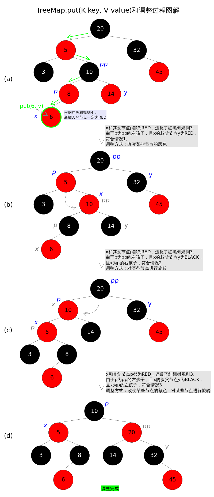

# 红黑树

**红黑树是一种近似平衡的二叉查找树，它能够确保任何一个节点的左右子树的高度差不会超过二者中较低那个的一倍**。具体来说，红黑树是满足如下条件的二叉查找树（binary search tree）：

1. 每个节点要么是红色，要么是黑色。
2. 根节点必须是黑色
3. 红色节点不能连续（也即是，红色节点的孩子和父亲都不能是红色）。
4. 对于每个节点，从该点至`null`（树尾端）的任何路径，都含有相同个数的黑色节点。

在Java中的具体使用在`TreeMap`中。

## 分支情况理解

这里需要注意的是，由于红黑树的性质的限制，对于某些情况的单分支是不可能出现的。

### 可能出现的单分支

.jpg)

因为只有在上面的两种情况下才有可能在单分支的情况下，保持上面的第五条性质(注意nil节点)。而下面的几种情况，都是不能保证第五条性质的单分支情况。

### 不可能出现的单分支

.jpg)

因为上述四中但分支情况下，不能保证性质5。例如前两种，必定会让红色节点->叶子节点(nil)线路的黑色节点数比红色节点->黑色节点线路的黑色节点数少一。所以，我们容易发现，**红黑树种只可能有双分支或黑上红下的单分支情况**。

## 调整

红黑树的条件可能被破坏，需要通过调整使得查找树重新满足红黑树的条件。调整可以分为两类：一类是颜色调整，即改变某个节点的颜色；另一类是结构调整，集改变检索树的结构关系。结构调整过程包含两个基本操作：**左旋（Rotate Left），右旋（RotateRight）**。

### 左旋

左旋的过程是将`x`的右子树绕`x`逆时针旋转，使得`x`的右子树成为`x`的父亲，同时修改相关节点的引用。旋转之后，二叉查找树的属性仍然满足。


TreeMap中的左旋代码如下：

```java
//Rotate Left
private void rotateLeft(Entry<K,V> p) {
    if (p != null) {
        //复制目标节点的右孩子节点，作为操作节点r
        Entry<K,V> r = p.right;
        //将r的左孩子转移到p的右孩子
        p.right = r.left;
        //判断此时所转移的节点是否为null，如果不为null就需要指定它的父节点
        if (r.left != null)
            r.left.parent = p;
        //将原p节点的父节点转交给现在的r
        r.parent = p.parent;
        //如果操作的父节点为null，说明r现在是根节点
        if (p.parent == null)
            root = r;
        //如果不为null，就需要指定目标节点的左/右孩子连接上此时的r节点
        else if (p.parent.left == p)
            p.parent.left = r;
        else
            p.parent.right = r;
        //将现在的p与r节点进行连接
        r.left = p;
        p.parent = r;
    }
}
```

### 右旋

右旋的过程是将`x`的左子树绕`x`顺时针旋转，使得`x`的左子树成为`x`的父亲，同时修改相关节点的引用。旋转之后，二叉查找树的属性仍然满足。


*TreeMap*中右旋代码如下：

```java
//Rotate Right
private void rotateRight(Entry<K,V> p) {
    if (p != null) {
        //与左旋原理一致，但是操作的节点变成了左孩子节点，进行相应的转换
        Entry<K,V> l = p.left;
        p.left = l.right;
        if (l.right != null) 
        	l.right.parent = p;
        l.parent = p.parent;
        if (p.parent == null)
            root = l;
        else if (p.parent.right == p)
            p.parent.right = l;
        else 
            p.parent.left = l;
        l.right = p;
        p.parent = l;
    }
}
```

### 变色规则

已知**根节点**涂为**黑色**，其他节点都是涂红色；如果**插入结点的父节点**为**黑色**，就<u>不需要</u>进行旋转变色调整，其他情况都需要根据实际选择合适的处理策略进行调整，使其符合红黑树性质。最开始调整的时候是将插入结点作为当前节点。

|        | 实际情况                                                     | 处理策略                                                     |
| ------ | ------------------------------------------------------------ | ------------------------------------------------------------ |
| 第一种 | 当前节点的**父节点**是红色，且其祖父节点的另一个子节点（**叔叔节点**，和父亲节点同级）也是红色，祖父节点<u>不是</u>根节点。 | （1）将**父节点**和**叔叔节点**设为黑色。<br />（2）将**祖父节点**设为红色。<br />（3）将**祖父节点**作为新的当前节点（之后可能进行左/右旋操作）。 |
| 第二种 | 当前节点的**父节点**是红色，**叔叔节点**也是红色，且当前节点在最边上（即每行最左边或最右边的节点），**祖父节点**<u>是根节点</u>。 | （1）将**根节点**作为新的当前节点，以根节点为支点进行左旋（插入的是右孩子）或者右旋（左孩子）。<br/>（2）旋转后将新的根节点变黑色，其他节点根据需要变色，只要保证不出现红红连续节点即可。<br/>（3）判断性质5是否已满足，不满足则以当前节点为支点进行一次左旋或右旋，旋转后依旧要保证不出现红红连续节点，否则进行变色。 |
| 第三种 | 其他所有情况，前提是当前节点的父节点是红色。                 | （1）将父节点作为新的当前节点。<br />（2）以新的当前节点为支点进行左旋（插入的是右孩子）或者右旋（左孩子）。 |


## 查询

### 查询节点后续

对于一棵二叉查找树，给定节点t，其后继（树中比**大于t**的**最小**的那个元素）可以通过如下方式找到：

> 1. t的右子树不空，则t的后继是其右子树中最小的那个元素。
> 2. t的右孩子为空，则t的后继是其第一个向左走的祖先。

后继节点在红黑树的删除操作中将会用到。


*TreeMap*中寻找节点后继的代码如下：

```java
// 寻找节点后继函数successor()
static <K,V> TreeMap.Entry<K,V> successor(Entry<K,V> t) {
    if (t == null)
        return null;
    // 1. t的右子树不空，则t的后继是其右子树中最小的那个元素
    else if (t.right != null) {
        Entry<K,V> p = t.right;
        while (p.left != null)
            p = p.left;
        return p;
	// 2. t的右孩子为空，则t的后继是其第一个向左走的祖先
    } else {
        Entry<K,V> p = t.parent;
        Entry<K,V> ch = t;
        while (p != null && ch == p.right) {
            ch = p;
            p = p.parent;
        }
        return p;
    }
}
```

### 查询具体的值

`get(Object key)`方法根据指定的`key`值返回对应的`value`，该方法调用了`getEntry(Object key)`得到相应的`entry`，然后返回`entry.value`。因此`getEntry()`是算法的核心。算法思想是根据`key`的自然顺序（或者比较器顺序）对二叉查找树进行查找，直到找到满足`k.compareTo(p.key) == 0`的`entry`。


具体代码如下：

```
//getEntry()方法
final Entry<K,V> getEntry(Object key) {
    ......
    if (key == null)//不允许key值为null
        throw new NullPointerException();
    Comparable<? super K> k = (Comparable<? super K>) key;//使用元素的自然顺序
    Entry<K,V> p = root;
    while (p != null) {
        int cmp = k.compareTo(p.key);
        if (cmp < 0)//向左找
            p = p.left;
        else if (cmp > 0)//向右找
            p = p.right;
        else
            return p;
    }
    return null;
}
```

## 插入

`put(K key, V value)`方法是将指定的`key`, `value`对添加到`map`里。该方法首先会对`map`做一次查找，看是否包含该元组，如果已经包含则直接返回，查找过程类似于`getEntry()`方法；如果没有找到则会在红黑树中插入新的`entry`，如果插入之后破坏了红黑树的约束条件，还需要进行调整（旋转，改变某些节点的颜色）。

```java
public V put(K key, V value) {
    Entry<K,V> t = root;
	......
    int cmp;
    Entry<K,V> parent;
    if (key == null)
        throw new NullPointerException();
    //使用元素的自然顺序
    Comparable<? super K> k = (Comparable<? super K>) key;
    do {
        parent = t;
        cmp = k.compareTo(t.key);
        //向左找
        if (cmp < 0) t = t.left;
        //向右找
        else if (cmp > 0) t = t.right;
        //如果直接找到key值相同的节点，就会修改对应节点的值
        else return t.setValue(value);
    } while (t != null);
    //没有找到对应的key，创建并插入新的entry
    Entry<K,V> e = new Entry<>(key, value, parent);
    //cmp的值只可能是 <0 或 >0 
    if (cmp < 0) parent.left = e;
    else parent.right = e;
    fixAfterInsertion(e);//调整方法
    size++;//调整存入元素的数量
    return null;
}
```

上述代码的插入部分并不难理解：首先在红黑树上找到合适的位置，然后创建新的`entry`并插入（当然，新插入的节点一定是树的叶子）。难点是调整函数`fixAfterInsertion()`，前面已经说过，调整往往需要：1.改变某些节点的颜色，2.对某些节点进行旋转。



#### 插入调整

调整函数`fixAfterInsertion()`的具体代码如下，其中用到了上文中提到的`rotateLeft()`和`rotateRight()`函数。通过代码我们能够看到，情况2其实是落在情况3内的。情况4～情况6跟前三种情况是对称的，因此图解中并没有画出后三种情况，读者可以参考代码自行理解。

```java
//红黑树调整函数fixAfterInsertion()
private void fixAfterInsertion(Entry<K,V> x) {
    //插入节点为红色
    x.color = RED;
    //循环往上处理，如果父节点也是红色（冲突境况）
    while (x != null && x != root && x.parent.color == RED) {
        //判断父节点是祖父节点的左孩子还是右孩子
        if (parentOf(x) == leftOf(parentOf(parentOf(x)))) {
            Entry<K,V> y = rightOf(parentOf(parentOf(x)));
            //如果叔叔节点也是红色
            if (colorOf(y) == RED) {
                //设置父节点和叔叔节点为黑，祖父为红，就完成调整
                setColor(parentOf(x), BLACK);              // 情况1
                setColor(y, BLACK);                        // 情况1
                setColor(parentOf(parentOf(x)), RED);      // 情况1
                x = parentOf(parentOf(x));                 // 情况1
            } else {//叔叔节点不为红
                //判断插入是否为右孩子，如果是，就需要进行左旋
                if (x == rightOf(parentOf(x))) {
                    x = parentOf(x);                       // 情况2
                    rotateLeft(x);                         // 情况2
                }
                //修改父亲节点为黑色，祖父节点为红色，再对祖父节点进行右旋
                setColor(parentOf(x), BLACK);              // 情况3
                setColor(parentOf(parentOf(x)), RED);      // 情况3
                rotateRight(parentOf(parentOf(x)));        // 情况3
            }
        } else {//父节点是祖父节点的右孩子，操作与上方镜像
            Entry<K,V> y = leftOf(parentOf(parentOf(x)));
            if (colorOf(y) == RED) {
                setColor(parentOf(x), BLACK);              // 情况4
                setColor(y, BLACK);                        // 情况4
                setColor(parentOf(parentOf(x)), RED);      // 情况4
                x = parentOf(parentOf(x));                 // 情况4
            } else {
                if (x == leftOf(parentOf(x))) {
                    x = parentOf(x);                       // 情况5
                    rotateRight(x);                        // 情况5
                }
                setColor(parentOf(x), BLACK);              // 情况6
                setColor(parentOf(parentOf(x)), RED);      // 情况6
                rotateLeft(parentOf(parentOf(x)));         // 情况6
            }
        }
    }
    root.color = BLACK;
}

/**
 * 判断节点的是否为空，不为空就返回其父节点
 * leftOf，rightOf方法同理，获取非空节点的左/右孩子节点
 */
private static <K,V> Entry<K,V> parentOf(Entry<K,V> p) {
    return (p == null ? null: p.parent);
}
```

## 删除

`remove(Object key)`的作用是删除`key`值对应的`entry`，该方法首先通过上文中提到的`getEntry(Object key)`方法找到`key`值对应的`entry`，然后调用`deleteEntry(Entry entry)`删除对应的`entry`。由于删除操作会改变红黑树的结构，有可能破坏红黑树的约束条件，因此有可能要进行调整。

`getEntry()`函数前面已经讲解过，这里重点放`deleteEntry()`上，该函数删除指定的`entry`并在红黑树的约束被破坏时进行调用`fixAfterDeletion(Entry x)`进行调整。

**由于红黑树是一棵增强版的二叉查找树，红黑树的删除操作跟普通二叉查找树的删除操作也就非常相似，唯一的区别是红黑树在节点删除之后可能需要进行调整**。现在考虑一棵普通二叉查找树的删除过程，可以简单分为两种情况：

1. 删除点p的左右子树都为空，或者只有一棵子树非空。
2. 删除点p的左右子树都非空。

对于上述情况1，处理起来比较简单，直接将p删除（左右子树都为空时），或者用非空子树替代p（只有一棵子树非空时）；对于情况2，可以用p的后继s（树中大于x的最小的那个元素）代替p，然后使用情况1删除s（此时s一定满足情况1.可以画画看）。

基于以上逻辑，红黑树的节点删除函数`deleteEntry()`代码如下：

```java
// 红黑树entry删除函数deleteEntry()
private void deleteEntry(Entry<K,V> p) {
    modCount++;
    size--;
    // 1. 删除点p的左右子树都非空，操作点转移到后驱（只有可能转移到某个叶子节点或只有右子树的节点），不可能再拥有两个子树
    if (p.left != null && p.right != null) {
        Entry<K,V> s = successor(p);// 后继
        p.key = s.key;
        p.value = s.value;
        p = s;
    }
    Entry<K,V> replacement = (p.left != null ? p.left : p.right);
    if (replacement != null) {// 2. 删除点p只有一棵子树非空。
        replacement.parent = p.parent;
        if (p.parent == null)
            root = replacement;
        else if (p == p.parent.left)
            p.parent.left  = replacement;
        else
            p.parent.right = replacement;
        // 将p节点连接都设置为null，等待回收
        p.left = p.right = p.parent = null;
        // 如果删除节点的颜色为黑色，删除后不满足概念4（每条路劲的黑色节点数量一致）
        if (p.color == BLACK)
            fixAfterDeletion(replacement);// 调整
    } else if (p.parent == null) {// 删除后元素为空的情况
        root = null;
    } else { // 3. 删除点p的左右子树都为空
        if (p.color == BLACK)
            fixAfterDeletion(p);// 调整
        if (p.parent != null) {
            if (p == p.parent.left)
                p.parent.left = null;
            else if (p == p.parent.right)
                p.parent.right = null;
            p.parent = null;
        }
    }
}
```

上述代码中占据大量代码行的，是用来修改父子节点间引用关系的代码，其逻辑并不难理解。下面着重讲解删除后调整函数`fixAfterDeletion()`。首先请思考一下，删除了哪些点才会导致调整？**只有删除点是BLACK的时候，才会触发调整函数**，因为删除RED节点不会破坏红黑树的任何约束，而删除BLACK节点会破坏规则4。

跟上文中讲过的`fixAfterInsertion()`函数一样，这里也要分成若干种情况。记住，**无论有多少情况，具体的调整操作只有两种：1.改变某些节点的颜色，2.对某些节点进行旋转。**


上述图解的总体思想是：将情况1首先转换成情况2，或者转换成情况3和情况4。当然，该图解并不意味着调整过程一定是从情况1开始。通过后续代码我们还会发现几个有趣的规则：a).如果是由情况1之后紧接着进入的情况2，那么情况2之后一定会退出循环（因为x为红色）；b).一旦进入情况3和情况4，一定会退出循环（因为x为root）。

#### 删除调整

删除后调整函数`fixAfterDeletion()`的具体代码如下，其中用到了上文中提到的`rotateLeft()`和`rotateRight()`函数。通过代码我们能够看到，情况3其实是落在情况4内的。情况5～情况8跟前四种情况是对称的，因此图解中并没有画出后四种情况，读者可以参考代码自行理解。

```java
private void fixAfterDeletion(Entry<K,V> x) {
    
    while (x != root && colorOf(x) == BLACK) {
        // 判断调整节点为左孩子
        if (x == leftOf(parentOf(x))) {
            // 设置与调整节点同级的节点
            Entry<K,V> sib = rightOf(parentOf(x));
            // 如果同级节点为红色，将父节点设置为红色，同级节点设置为黑色，并对父节点进行左旋
            if (colorOf(sib) == RED) {
                setColor(sib, BLACK);                   // 情况1
                setColor(parentOf(x), RED);             // 情况1
                rotateLeft(parentOf(x));                // 情况1
                // 变更同级节点为当前操作节点的父节点的右孩子节点（新的同级节点）
                sib = rightOf(parentOf(x));             // 情况1
            }
            // 如果进行过同级节点为红色的操作，就不会出现左右子树同时为黑色的情况
            // 同级节点的左右子树都为黑色
            if (colorOf(leftOf(sib))  == BLACK &&
                colorOf(rightOf(sib)) == BLACK) {
                setColor(sib, RED);                     // 情况2
                x = parentOf(x);                        // 情况2
            } else {
                if (colorOf(rightOf(sib)) == BLACK) {
                    setColor(leftOf(sib), BLACK);       // 情况3
                    setColor(sib, RED);                 // 情况3
                    rotateRight(sib);                   // 情况3
                    sib = rightOf(parentOf(x));         // 情况3
                }
                setColor(sib, colorOf(parentOf(x)));    // 情况4
                setColor(parentOf(x), BLACK);           // 情况4
                setColor(rightOf(sib), BLACK);          // 情况4
                rotateLeft(parentOf(x));                // 情况4
                x = root;                               // 情况4
            }
        } else { // 跟前四种情况对称
            Entry<K,V> sib = leftOf(parentOf(x));
            if (colorOf(sib) == RED) {
                setColor(sib, BLACK);                   // 情况5
                setColor(parentOf(x), RED);             // 情况5
                rotateRight(parentOf(x));               // 情况5
                sib = leftOf(parentOf(x));              // 情况5
            }
            if (colorOf(rightOf(sib)) == BLACK &&
                colorOf(leftOf(sib)) == BLACK) {
                setColor(sib, RED);                     // 情况6
                x = parentOf(x);                        // 情况6
            } else {
                if (colorOf(leftOf(sib)) == BLACK) {
                    setColor(rightOf(sib), BLACK);      // 情况7
                    setColor(sib, RED);                 // 情况7
                    rotateLeft(sib);                    // 情况7
                    sib = leftOf(parentOf(x));          // 情况7
                }
                setColor(sib, colorOf(parentOf(x)));    // 情况8
                setColor(parentOf(x), BLACK);           // 情况8
                setColor(leftOf(sib), BLACK);           // 情况8
                rotateRight(parentOf(x));               // 情况8
                x = root;                               // 情况8
            }
        }
    }
    setColor(x, BLACK);
}
```

> 转自：[https://github.com/CarpenterLee/JCFInternals/blob/master/markdown/5-TreeSet%20and%20TreeMap.md](https://github.com/CarpenterLee/JCFInternals/blob/master/markdown/5-TreeSet and TreeMap.md)